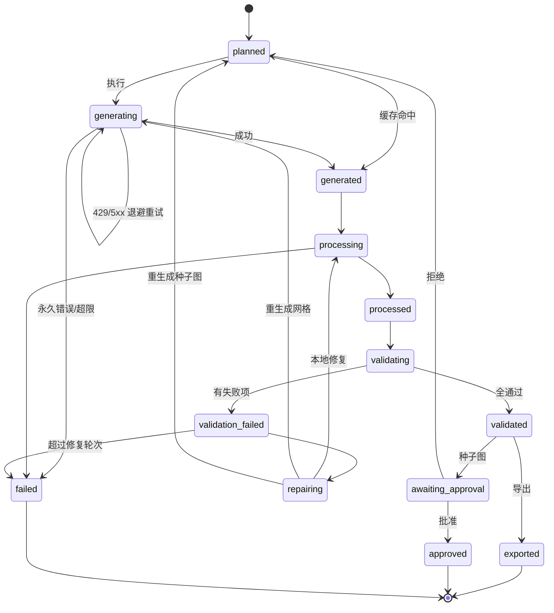

# Pixel Asset Forge — 项目规划

> 一个可安装到 Codex / Claude Code 等 Agent 环境的像素游戏资产生成 Skill，
> 通过用户自己的 `gpt-image-2` API Key，把自然语言描述编译为可直接导入游戏引擎的像素资产。

---

## TL;DR

| 项 | 结论 |
|---|---|
| **系统定位** | 不是 GPT Image API 包装器，而是 **Manifest 驱动的像素资产编译器** |
| **职责边界** | AI 只生成视觉原料；一切需要精确性的操作（切帧、抠图、对齐、量化、校验）由本地确定性代码完成 |
| **生成策略** | 种子图（canonical seed）+ **一次生成完整动作网格**，绝不逐帧独立生成 |
| **物理布局** | 因 API 尺寸约束无法直接产出 32×32 或长条，改为生成大尺寸二维网格后本地缩小 |
| **透明化** | `gpt-image-2` 不支持透明背景 → 纯色键控为主，多级降级阶梯兜底 |
| **接口面** | CLI 9 个命令（核心实现）· MCP 6 个工具（只暴露高层语义） |
| **MVP 定义** | 一个 YAML → 四方向 × `idle`/`walk`，经自动切帧、透明化、脚底对齐、调色板量化、质量验证，Godot 可直接加载 |

**第一个技术里程碑**（一切的前提）：

> 输入一段角色描述 → 生成 canonical seed → 基于它生成一个经过自动切帧、透明化、脚底对齐、
> 调色板量化和质量验证的 `walk_down_8` 动画。

这一步可靠之前，不扩展任何动作、方向或资产类型。

---

## 0. 命名与术语约定

| 层面 | 名称 |
|---|---|
| 仓库名 | `pixel-asset-forge` |
| Python 包 | `pixel_asset_forge` |
| CLI 可执行名 | `pixel-asset` |
| PyPI 包名 | `pixel-asset-forge` |
| Skill 名 | `pixel-asset-forge` |

术语：

- **seed / canonical seed** — 经批准的角色标准图，作为所有动画的身份基准。
- **动作网格 / animation grid** — 一次 API 调用产出的、含 N 个姿势的二维网格图。
- **cell / 单元格** — 网格中的一格，固定 512×512。
- **逻辑尺寸** — 缩小后的最终像素尺寸（如 32×32）。
- **物理尺寸** — 提交给 API 的实际输出尺寸（如 2048×1024）。

---

## 1. 项目目标

**第一阶段（本文档覆盖）**

- 角色标准图生成
- 角色四方向动画
- `idle` / `walk` / `attack` / `hurt` / `death` 动态帧
- 道具、武器、技能特效和环境物件
- 自动去背景和透明化
- 自动切帧、缩放和锚点统一
- 调色板约束与像素化
- Spritesheet、GIF/APNG 和单帧 PNG 输出
- Generic JSON、Godot 等引擎格式导出
- 自动质量检查
- 局部失败重试与修复

**第二阶段**

Tileset · Autotile · 地图物件包 · WFC 地图生成 · Unity / Phaser / Tiled 导出

---

## 2. 关键技术决策

### 2.1 系统定位

```text
自然语言需求
    ↓
结构化 Asset Request
    ↓
生成任务规划（DAG）
    ↓
GPT Image 2 生成或编辑
    ↓
本地确定性图像处理
    ↓
自动质量检查
    ↓
局部修复或重新生成
    ↓
游戏引擎导出
```

这个分层的核心价值在于：**模型的不确定性被限制在一个环节内**，其余全部可测试、可复现、可回归。

### 2.2 第一版直接使用 Image API

```text
POST /v1/images/generations
POST /v1/images/edits
```

Image API 更适合一次生成或编辑一个确定资产；Responses API 更适合多轮对话式图像编辑。第一版的任务编排已由 Skill 与 Manifest 负责，无需额外引入 Responses API 的对话状态。

接口分工：

```text
images.generate
├── 创建角色种子图
├── 创建道具
├── 创建环境物件
└── 创建初始 Tileset

images.edit
├── 基于种子图生成动画网格
├── 保持角色身份
├── 生成方向变体
├── 生成换装或武器变体
└── 修复存在问题的资产
```

### 2.3 尺寸约束与网格布局

`gpt-image-2` 的输出尺寸必须**同时**满足四条约束：

| 约束 | 值 |
|---|---|
| 宽高均为 16 的倍数 | ✅ |
| 长边 / 短边 ≤ 3 | ✅ |
| 总像素数 | **655,360 ≤ N ≤ 8,294,400** |
| 最大单边 | ≤ 3840 px |

因此不能直接请求 `32×32` 或极长的 `8×1` 动画条。做法是生成较大的规则网格，再在本地缩小：

| 动画帧数 | 网格 | 期望物理尺寸 | 名义单元格 | 总像素 | 长短边比 | 合规 |
|---:|---:|---:|---:|---:|---:|:---:|
| 4 | 2×2 | 1024×1024 | 512×512 | 1,048,576 | 1.00 | ✅ |
| 6 | 3×2 | 1536×1024 | 512×512 | 1,572,864 | 1.50 | ✅ |
| 8 | 4×2 | 2048×1024 | 512×512 | 2,097,152 | 2.00 | ✅ |
| 9 | 3×3 | 1536×1536 | 512×512 | 2,359,296 | 1.00 | ✅ |
| 12 | 4×3 | 2048×1536 | 512×512 | 3,145,728 | 1.33 | ✅ |

种子图固定请求 **1024×1024**（1,048,576 px，合规）。

> ⚠️ **「期望」不是修辞（[Sprint 0 / A-1](sprint-0-report.md)）。**
>
> 实测目标端点**不保证按请求尺寸返回，且不报错**：同一个 `2048×1024` 请求两次分别
> 返回 `1536×1024` 与 `1774×887`，`1024×1024` 返回 `1254×1254`。
> 返回图的总像素恒为≈ 157 万，长短边比只是**有时**跟随请求。
>
> 所以上表的"期望物理尺寸"只用于两件事：**表达期望的长短边比**、**本地合规自检**。
> **切帧必须按比例进行**（格线 = `col / cols × 实际宽度`），
> 且实际尺寸必须写入 Manifest，否则 `process` 无法离线复现。

最终逻辑尺寸支持：`16×16` · `24×24` · `32×32` · `48×48` · `64×64` · `96×96`

核心原则：

> **逻辑上一次生成完整动作，物理布局上使用满足 API 约束的二维网格，
> 切分时以实际返回图为准。**

#### 2.3.1 网格阅读顺序

帧序必须固定为 **从左到右、从上到下**（4×2 网格即 `0 1 2 3 / 4 5 6 7`）。

这一条必须写进 prompt 并单独验证，原因是：**如果模型把帧序排乱了，现有的所有验证项都会通过** —— 帧数对、尺寸对、锚点对、无空白帧、无重复帧，但 walk cycle 播放起来是错的。这是一个"静默失败"，必须有专门的检查项覆盖（见 §9.2「帧序连续性」）。

#### 2.3.2 抽帧方式与"越界"

> ⚠️ **本节已按 [ADR-003 修订 2](adr/ADR-003-fixed-grid.md) 重写。**
> 切帧不再按格线硬切，而是**按连通域定位 sprite**。

原设计假设模型会把每个姿势画在自己的格子里，跨格即判失败。实测这个判据是错的：
一次 8 个姿势**彼此完全分离、毫无损伤**的产出，只因整体相对假想格线右移，
就被判出「3 个连通域跨格 · fatal」，修复器重生成三次都是同样布局
——**在拿一个不存在的缺陷烧配额**。

跨不跨格线衡量的是「模型布局是否符合我的假设」，不是「sprite 有没有被切坏」。

现在的做法（照搬 OpenAI `hatch-pet` 的 `extract_strip_frames.py`，MIT）：

- **预防**：prompt 仍要求每个姿势四周留 **12%** 边距（实测模型打七折执行，
  写 8% 只拿到 0.0%，写 12% 拿到 7.9%）。
- **抽帧**：色键 → 连通域标注 → 按面积取正好 N 个 seed → 碎片就近吸附 →
  放进共用视口（保住帧间相对缩放与站位）。**帧数已知**是这个算法成立的前提。
- **判失败**：分不出 N 个 sprite 才是真的坏了（姿势粘连成一片、或数量不对），
  此时本地补不回被切掉的像素，只能重生成整个动作网格。
- **兜底**：连通域失败时退回 `stable_slots`（等分切格 + 共用视口），
  而不是退回逐帧各自 fit-to-cell —— 后者会造成尺寸跳动与基线抖动。

### 2.4 背景与透明化策略

`gpt-image-2` **不支持** `background: "transparent"`（传入该值会直接报错），因此必须采用可确定性移除的纯色背景。

默认键控色：`#FF00FF`（洋红）

处理链：

```text
纯色背景
→ 自适应阈值求解（Otsu）        ← 不能写死常数，见下
→ 颜色距离阈值检测
→ 与画布外缘连通性过滤          ← 防止角色内部被抠出洞
→ Alpha 透明化
→ Despill 去除彩边
→ 清零透明像素的 RGB
→ 保存 RGBA PNG
```

> ⚠️ **模型画不出精确的键控色（[Sprint 0 / A-5](sprint-0-report.md)）。**
> 实测背景是 `#F204EA` 这类近洋红，精确 `#FF00FF` 命中率 **0.00%**。
> 因此不存在"精确色键"这一档，主路径直接就是自适应阈值键控。
> 好在背景簇（距离 20–30）与前景簇（200+）之间有极宽空谷，
> 仅 0.76% 的像素落在中间，Otsu 求解非常稳。求解出的阈值必须写入 Manifest。

#### 2.4.1 背景色冲突检测

把键控色写死为 `#FF00FF` 会在遇到**粉/紫/洋红系角色**时把角色本体一起抠掉 —— 史莱姆、法师袍、魔法特效、粉色头发都会触发。这不是边缘情况，第一批测试角色里就会遇到。

方案：

1. 生成**前**从角色描述与目标调色板做冲突预检。
2. 冲突时按序切换备用键控色：`#FF00FF` → `#00FF00` → `#00FFFF`。
3. 三者都冲突时（极罕见）报错并要求用户显式指定。
4. **将实际使用的键控色写入 Manifest 的 `background.color_used`**，使处理与验证阶段可脱离原始请求独立复现。

#### 2.4.2 降级阶梯

档位用**具名标识**而非序号 —— 增删档位时序号会整体平移，已落盘的 Manifest 会被静默误读。

| 标识 | 含义 | 何时触发 |
|---|---|---|
| `tolerant_key` | 默认键控色 + 逐图自适应阈值 + Despill | 主路径 |
| `alt_key_color` | 切换备用键控色（`#00FF00` → `#00FFFF`） | 生成**前**冲突预检命中 |
| `transparent_model` | 改用 `gpt-image-1.5` 重生成，直接请求 `background: transparent` | 键控结果不合格 |
| `rembg` | 语义抠图 | 上一档仍不合格 |
| `manual` | 人工审核 | 兜底 |

前两档在**生成前**确定；后三档是**生成后**的逐级升级。

> `transparent_model` 档：同代的 `gpt-image-1.5` **支持**透明背景，产出的是**原生 alpha 通道**，
> 质量显著高于 `rembg` 的语义抠图（后者在像素画的硬边缘与细小肢体上表现很差）。
> 代价是需要维护双模型路径，且 1.5 的生成质量与 2 有差异 —— 因此定位为兜底而非主路径。
>
> 初版的「精确色键」档已按 [Sprint 0 / A-5](sprint-0-report.md) 的实测数据删除：
> 它的命中率是零，不是"很少成功"而是"永远不成功"。
> 详见 [ADR-004](adr/ADR-004-chroma-key.md)。

### 2.5 种子图 + 完整动作网格

```text
角色描述
    ↓
生成 canonical seed
    ↓
人工或自动批准        ← 唯一的人工闸门
    ↓
创建动画编辑画布
    ↓
将 seed 作为参考图传入
    ↓
一次生成完整动作网格
    ↓
连通域抽帧（格线仅作兜底）
    ↓
统一缩放和脚底对齐
```

**绝不采用**：

```text
第 1 次调用生成 walk_01
第 2 次调用生成 walk_02
第 3 次调用生成 walk_03
```

逐帧生成极易造成服装、武器、比例和朝向漂移。

### 2.6 编辑画布的构造方式

**不使用 mask。**

```text
base image  : 一张纯键控色的空白网格画布（如 2048×1024）
reference   : canonical seed（1024×1024）作为参考图一并传入
mask        : 不传
约束手段     : 全部由 prompt 承担
```

理由：GPT Image 的 mask 是**提示性约束**，不保证精确遵循边界。用 mask 保护"第一格已画好的 seed"既不可靠，又会让模型把注意力放在边界而非身份一致性上。把 seed 作为纯参考图传入，模型对身份的保持效果更稳定。

代价是第一格也是重新生成的（而非原样保留），因此第一格同样要参与身份漂移校验。

详见 [ADR-003](adr/ADR-003-fixed-grid.md)。

### 2.7 确定性边界

必须明确哪些环节可复现，否则测试策略会建立在错误假设上：

| 环节 | 是否确定性 | 复现手段 |
|---|:---:|---|
| Prompt 编译 | ✅ | 纯函数，输入相同则输出相同 |
| 图像生成 | ❌ | **不可复现**。无 seed 参数，同一 prompt 每次结果不同 |
| 切帧 / 键控 / 裁剪 / 缩放 / 对齐 / 量化 | ✅ | 纯像素运算，golden image 测试可完全覆盖 |
| 验证 | ✅ | 纯函数 |
| 导出 | ✅ | 纯函数 |

推论：

- **Golden image 测试只能覆盖处理层，覆盖不了生成层。** 生成层只能靠评测集统计指标衡量。
- **Prompt hash + 输入图 hash 缓存是唯一的"生成层复现"手段。**
- 任何"重跑一遍就一致"的假设都只在 `pixel-asset process` 及其之后成立。

---

## 3. 系统架构

```text
┌──────────────────────────────┐
│ Codex / Claude Code / CLI    │
└───────────────┬──────────────┘
                ▼
┌──────────────────────────────┐
│ SKILL.md                     │
│ 意图识别、参数补全、工作流规则  │
└───────────────┬──────────────┘
                ▼
┌──────────────────────────────┐
│ Asset Request Parser         │
│ Pydantic + JSON Schema       │
└───────────────┬──────────────┘
                ▼
┌──────────────────────────────┐
│ Planner / Manifest Engine    │
│ 角色、动作、方向、任务依赖      │
└───────┬─────────────┬────────┘
        ▼             ▼
 Prompt Compiler   Provider Adapter
        └──────┬──────┘
               ▼
      OpenAI GPT Image 2
               ▼
┌──────────────────────────────┐
│ Raw Artifact Store           │
│ 原图、请求、响应、哈希、日志    │
└───────────────┬──────────────┘
                ▼
┌──────────────────────────────┐
│ Deterministic Processing     │
├──────────────────────────────┤
│ 越界检测 → 固定网格切分        │
│ 色键去背景 → Despill          │
│ 自动裁剪 → 统一缩放            │
│ Bottom-center 对齐            │
│ 调色板量化 → 像素清理          │
│ Spritesheet 重组              │
└───────────────┬──────────────┘
                ▼
┌──────────────────────────────┐
│ Validation Engine            │
├──────────────────────────────┤
│ 帧数、尺寸、Alpha、锚点        │
│ 调色板、轮廓、重复帧、越界      │
│ 帧序连续性                    │
└───────┬──────────────────────┘
   ┌────┴────┐
   ▼         ▼
 Passed    Repair Planner
   │         ├── 本地重新处理（不调 API）
   │         ├── 重生成动作网格
   │         └── 重生成种子图
   ▼
┌──────────────────────────────┐
│ Exporters                    │
│ PNG / GIF / JSON / Godot     │
└──────────────────────────────┘
```

---

## 4. 仓库结构

```text
pixel-asset-forge/
├── SKILL.md
├── README.md
├── LICENSE
├── pyproject.toml
├── uv.lock
│
├── pixel_asset_forge/
│   ├── cli.py
│   ├── config.py
│   ├── errors.py
│   ├── constants.py
│   │
│   ├── models/          request · character · animation · manifest · job · validation
│   ├── providers/       base · openai_image · mock
│   ├── prompts/         compiler · character · animation · prop · tileset · negative_rules
│   ├── planning/        planner · grid_layout · dependencies
│   ├── pipelines/       character · animation · prop · tileset
│   ├── processing/      chroma_key · despill · background · frame_split · crop ·
│   │                    resize · anchor · palette · dithering · pixel_cleanup ·
│   │                    contact_sheet · spritesheet
│   ├── validation/      dimensions · transparency · bounds · anchor_drift ·
│   │                    silhouette · palette · duplicates · frame_order · report
│   ├── repair/          planner · local_actions · regeneration
│   ├── exporters/       base · generic_json · godot · phaser · tiled
│   └── storage/         artifacts · cache · hashes
│
├── docs/
│   ├── PLAN.md          ← 本文档
│   ├── architecture.md
│   └── adr/             ADR-001 … ADR-006
│
├── schemas/             asset-request · asset-manifest · validation-report
├── presets/             animation · palette · style · engine
├── examples/            knight.yaml · slime.yaml · fireball.yaml
├── tests/               unit · integration · golden · fixtures
└── outputs/
```

---

## 5. 核心数据模型

### 5.1 Asset Request

```yaml
asset_id: knight_01
asset_type: character

description: >
  Young forest knight, short brown hair,
  green cloak, leather armor, short sword.

style:
  perspective: top_down_3_4
  target_size: [32, 32]
  max_colors: 24
  outline: single_pixel_dark
  shading: two_tone
  antialiasing: false
  lighting: fixed_top_left

background:
  mode: chroma_key
  color: "#FF00FF"        # 期望值；实际使用值见 manifest.background.color_used

mirroring:
  enabled: false          # 带剑非对称角色不可镜像，见 §9.4
  reason: "handheld sword breaks left/right symmetry"

animations:
  - name: idle
    directions: [down, left, right, up]
    frames: 4
    fps: 6
    loop: true

  - name: walk
    directions: [down, left, right, up]
    frames: 8
    fps: 10
    loop: true

export:
  targets:
    - generic-json
    - godot
```

完整定义见 [`schemas/asset-request.schema.json`](../schemas/asset-request.schema.json)。

### 5.2 Asset Manifest

```json
{
  "schema_version": "2.0",
  "asset_id": "knight_01",
  "asset_type": "character",
  "pipeline_version": "0.1.0",
  "provider": {
    "name": "openai",
    "model": "gpt-image-2"
  },
  "canvas": { "width": 32, "height": 32 },
  "anchor": { "type": "bottom_center", "x": 0.5, "y": 1.0 },
  "background": {
    "mode": "chroma_key",
    "color_requested": "#FF00FF",
    "color_used": "#FF00FF",
    "fallback_stage": "tolerant_key",
    "key_threshold": 165.0
  },
  "palette": { "max_colors": 24, "colors": [] },
  "animations": {
    "walk_down": {
      "fps": 10,
      "loop": true,
      "grid": {
        "cols": 4,
        "rows": 2,
        "cell": [444, 444],
        "requested_size": [2048, 1024],
        "actual_size": [1774, 887]
      },
      "frames": [
        "frames/walk_down_00.png",
        "frames/walk_down_01.png"
      ]
    },
    "walk_right": {
      "derived_from": "walk_left",
      "transform": "flip_horizontal"
    }
  },
  "status": "validated"
}
```

Manifest 是**唯一的真实来源**：所有导出文件都必须能仅凭 Manifest + `frames/` 重建。

三个字段值得单独说明，它们都是 [Sprint 0](sprint-0-report.md) 的产物：

- `grid.actual_size` —— 端点不保证按请求尺寸返回（A-1）。没有它，`process` 重跑时
  无法知道当初是按什么比例切的格。`cell` 记录的也是**实际**格子尺寸，不是名义 512。
- `grid.requested_size` —— 与 `actual_size` 不同即说明发生了尺寸吸附，供排障与统计。
- `background.key_threshold` —— 自适应阈值的求解结果（A-5）。不持久化的话，
  `process` 重跑会重新求解，可能得到不同阈值，离线复现就不成立了。

完整定义见 [`schemas/asset-manifest.schema.json`](../schemas/asset-manifest.schema.json)。

### 5.3 Job 状态机

每个 `(asset, action, direction)` 三元组是一个独立任务：

```text
knight_01 / walk / down
knight_01 / walk / left
knight_01 / attack / down
```

这样可以只重新执行失败部分。

#### 状态转移表

| 当前态 | 事件 | 目标态 | 副作用 |
|---|---|---|---|
| `planned` | 开始执行 | `generating` | 写 job 记录 |
| `planned` | **缓存命中** | `generated` | 复用既有 artifact，**跳过 API 调用** |
| `generating` | Provider 成功 | `generated` | 落盘原图 + request id + prompt hash |
| `generating` | 瞬态错误（429 / 5xx） | `generating` | 指数退避重试，计数 +1（自环） |
| `generating` | 永久错误（参数 / moderation） | `failed` | 写可操作错误信息 |
| `generating` | 超过重试上限 | `failed` | |
| `generated` | 启动处理 | `processing` | |
| `processing` | 处理完成 | `processed` | 写 `frames/` |
| `processing` | 处理异常 | `failed` | |
| `processed` | 启动验证 | `validating` | |
| `validating` | 全部通过 | `validated` | 写 `validation-report.json` |
| `validating` | 存在失败项 | `validation_failed` | 写 `validation-report.json` |
| `validation_failed` | 生成修复计划 | `repairing` | 写 `repair-plan.json` |
| `validation_failed` | 超过 `max_repair_rounds` | `failed` | |
| `repairing` | 本地修复动作 | `processing` | **不调用 API** |
| `repairing` | 重生成动作网格 | `generating` | 调用 API |
| `repairing` | 重生成种子图 | `planned` | **级联作废全部下游任务** |
| `validated` | 种子图任务 + 开启人工审核 | `awaiting_approval` | 输出 contact sheet |
| `awaiting_approval` | 批准 | `approved` | 解锁下游动画任务 |
| `awaiting_approval` | 拒绝 | `planned` | 重新生成种子图 |
| `validated` | 导出（非种子图任务） | `exported` | 写 `exports/` |

**终态**：`exported` · `approved`（仅种子图）· `failed`

**重入边**：`repairing → {processing, generating, planned}` —— 这三条边是整个修复机制的核心，
分别对应"本地可修"、"这次生成废了"、"身份基准废了"三种严重程度。



### 5.4 Schema 版本策略

`schema_version` 采用 `MAJOR.MINOR`：

| 变更类型 | 版本 | 读取行为 |
|---|---|---|
| 新增可选字段 | MINOR +1 | 旧版本读取器忽略未知字段，正常工作 |
| 新增必填字段 / 删除字段 / 改变字段语义 | MAJOR +1 | 旧 Manifest 需迁移，读取器报错并提示 `pixel-asset migrate` |

规则：

- 读取器遇到 **更高 MAJOR** 的 Manifest → 拒绝并明确报错。
- 读取器遇到 **更高 MINOR** → 正常读取，忽略未知字段。
- 每次 MAJOR 升级必须附带迁移脚本，且**保留至少一个历史版本的迁移路径**。
- `pipeline_version` 独立于 `schema_version`，记录产出该资产的代码版本，用于回归排查。

---

## 6. 对外接口

CLI 与 MCP 是**两套不同的接口面**，两者规模不同是设计意图：

### 6.1 CLI（9 个命令，核心实现）

| 命令 | 用途 | 是否调用 API |
|---|---|:---:|
| `pixel-asset init` | 初始化配置与目录 | ❌ |
| `pixel-asset doctor` | 检测配置、依赖、API 连通性 | 仅探测 |
| `pixel-asset plan <request.yaml>` | 解析请求并输出任务 DAG，不执行 | ❌ |
| `pixel-asset create-character <request.yaml>` | 生成 canonical seed | ✅ |
| `pixel-asset create-animation --asset A --action X --direction D` | 生成动作网格 | ✅ |
| `pixel-asset process <outputs/A>` | **仅重跑本地处理** | ❌ |
| `pixel-asset validate <outputs/A>` | 运行验证引擎 | ❌ |
| `pixel-asset repair <outputs/A/walk_down>` | 执行修复计划 | 视修复类型 |
| `pixel-asset export <outputs/A> --target godot` | 导出引擎格式 | ❌ |

`create-character` 输出：

```text
seed-original.png · seed-transparent.png · seed-pixel.png
character-reference.json · palette.png
```

**9 个命令中有 5 个完全不调用 API** —— 这是刻意设计：调试与迭代应尽量在离线侧完成。

### 6.2 MCP（6 个工具，适配层）

```text
create_character · create_animation · create_asset_pack
validate_asset   · repair_asset     · export_asset
```

**为什么 MCP 只暴露 6 个而非 9 个**：`init` / `doctor` / `plan` 是运维与调试命令，对模型没有语义价值。
更重要的是，不要向模型暴露几十个像素级工具 —— 工具数量增加会显著推高上下文开销与选错工具的概率。
MCP 层的职责是**收敛**，不是镜像 CLI。详见 [ADR-005](adr/ADR-005-cli-core-mcp-adapter.md)。

`SKILL.md` 的职责是把用户自然语言映射到这些稳定命令，而**不是**让 Agent 自由组合底层脚本。

---

## 7. 待验证假设清单

这是 **Sprint 0 的验收物**。每条假设配"验证方法"与"证伪后的应对"。

| # | 假设 | 验证方法 | 证伪后的应对 |
|---|---|---|---|
| A-1 | API 接受任意合规尺寸（非固定档位） | 直接请求 2048×1024 与 1536×1024 | 网格表退回到官方支持的档位，重排帧数方案 |
| A-2 | 模型能在一次调用中产出 N 个**姿势不同**的格子 | 生成 4 格与 8 格网格各 5 次，人工计数 | 降低单次帧数上限（8 → 4） |
| A-3 | 模型遵守"从左到右、从上到下"的帧序 | 同上样本，人工核对播放顺序 | 改为每行一个完整周期，或引入帧序自动重排 |
| A-4 | 姿势不会跨越格线 | 同上样本，检测跨格连通域 | 加大 prompt 边距要求；仍失败则改为逐行生成 |
| A-5 | 纯洋红键控在像素画硬边缘上干净可用 | 对 3 个测试角色跑完整键控链 | 提前启用 §2.4.2 的第 4 档（gpt-image-1.5） |
| A-6 | seed 作为参考图（不用 mask）足以保持身份 | 同一 seed 生成 4 个方向，比对身份漂移 | 重新评估 §2.6 的 mask 决策 |
| A-7 | `up`（背面）方向的身份一致性可接受 | 单独生成 5 次背面动作网格 | 背面改为从 seed 单独派生一张背面 seed |

**三套测试角色**（覆盖不同风险）：

| 角色 | 覆盖风险 |
|---|---|
| 对称 Slime（粉紫色） | 背景色冲突（§2.4.1）+ 镜像可行性 |
| 带剑 Knight | 非对称、不可镜像、武器身份漂移 |
| 带盾 Warrior | 强非对称、大面积遮挡、轮廓变化剧烈 |

---

## 8. 开发计划

核心排期原则：**不确定性前移，确定性工作后置**。

---

### Sprint 0：垂直切片与技术验证 · **1 周**

真正的未知数不是"能不能调通 API"，而是"**生成质量有多差、以什么方式差**" ——
后者直接决定了验证器和修复器该怎么设计。因此本 Sprint 用手工脚本跑通全链路，
在设计 Manifest / 验证器 / 修复器**之前**暴露模型的真实失败模式。

**任务**

- 建立仓库、Python 3.12+、`uv` 依赖管理
- 编写 6 份 ADR（见 `docs/adr/`）
- 准备三套测试角色（§7）
- **手工脚本跑通垂直切片**：`seed → walk_down_8 → 切帧 → 键控 → 缩放 → 对齐 → 8 张透明 PNG`
  - 不写任何架构代码，允许全是一次性脚本
- 逐条验证 §7 的 7 个假设，产出验证报告

**退出门槛**

- ✅ 能保存 GPT Image 2 原始 PNG，API Key 不进仓库
- ✅ §7 的 A-1 ~ A-7 全部有明确结论（通过 / 证伪 / 部分成立）
- ✅ 至少记录 3 类模型失败模式，并附样本图
- ✅ 手工产出至少一组可用的 `walk_down_8` 透明帧

**可砍范围**：无。Sprint 0 全部内容都是后续设计的输入。

---

### Sprint 1：项目骨架与 Schema · **第 1 周**

**任务**

- Python 包结构 + Typer CLI
- Pydantic 数据模型 + 三份 JSON Schema
- Job 状态机（按 §5.3 状态转移表实现）
- 配置读取：环境变量 → 项目级 YAML → 用户级配置
- Artifact Store + 结构化日志
- Mock Provider

**CLI 交付**：`init` · `plan` · `doctor`

**退出门槛**

- ✅ 不调用真实 API 即可走完整工作流（Mock Provider）
- ✅ 请求可转换为任务 DAG，每个任务有唯一 ID
- ✅ 同一请求重复执行不创建重复任务（幂等）
- ✅ Schema 错误能准确指出字段路径
- ✅ `plan` 能输出预计调用次数与任务依赖关系

**可砍范围**：用户级配置（可先只支持环境变量 + 项目级）

---

### Sprint 2：OpenAI Provider · **第 2 周**

**任务**

- `OpenAIImageProvider`：generation / edit / 多参考图
- 保存原始请求摘要与 request ID
- 超时与取消、指数退避
- **并发上限与速率限制** —— Sprint 4 单角色就有 21 次调用，不能等到后期才做
- Prompt hash + 输入图 hash 缓存

**错误分类与重试规则**

```text
429 / 5xx              → 自动指数退避重试
参数错误                → 不重试，直接 failed
Moderation blocked     → 不重试，返回可操作错误
构图 / 帧数错误         → 不在此层处理，交 Repair Planner
```

只对 429 / 5xx 等瞬态错误重试；不应在未修改请求的情况下反复重试用户错误。

**退出门槛**

- ✅ generate 与 edit 均可保存图像
- ✅ API Key 不出现在任何日志或错误信息中
- ✅ 重复任务命中缓存
- ✅ 错误被转换为项目内部错误类型
- ✅ 单次任务失败不中止整个资产包
- ✅ 并发上限可配置且生效

**可砍范围**：多参考图（MVP 只需 seed 单张）

---

### Sprint 3：确定性图像处理 · **第 3 周**

**任务**

| 模块 | 优先级 |
|---|:---:|
| `frame_split`（固定网格切分） | P0 |
| `bounds`（越界检测，§2.3.2） | P0 |
| `chroma_key` + `despill` + `alpha_cleanup` | P0 |
| `background`（冲突预检与降级阶梯，§2.4） | P0 |
| `content_bounds` + `crop` | P0 |
| `nearest_resize` | P0 |
| `bottom_center_align` | P0 |
| `palette_quantize` | P0 |
| `isolated_pixel_cleanup` | P0 |
| `spritesheet_compose` | P0 |
| `gif_preview` | P1 |
| `dithering` | P2 |
| `contact_sheet` | P2 |

`dithering` 与 `contact_sheet` 不在 MVP 关键路径上，降到 P2 以给 P0 模块留出充分的测试时间。

**退出门槛**

- ✅ 固定网格切帧像素级准确（golden test）
- ✅ 所有输出帧尺寸完全一致
- ✅ 完全透明像素的 RGB 均为 0
- ✅ 最近邻缩放不引入任何中间色
- ✅ 锚点写入 Manifest
- ✅ 背景色冲突预检对 Slime 用例生效

**可砍范围**：`dithering` · `contact_sheet` · `gif_preview`

---

### Sprint 4：角色种子图与动画流水线 · **1.5–2 周**

Sprint 4 是全计划**唯一不可预估**的环节。其余 Sprint 都是确定性代码（可测试、工作量可估），
而 prompt 调优是与模型对抗的迭代过程，没有收敛保证。因此排期给足两周。

**任务**：实现 `CharacterSeedPipeline` 与 `AnimationGridPipeline`

```text
CharacterSeedPipeline
角色描述 → Prompt Compiler → GPT Image 2 → 背景冲突预检 → 去背景
        → 自动裁剪 → 统一构图 → 调色板量化 → seed.png

AnimationGridPipeline
seed.png → 创建空白网格画布 → seed 作为参考图 → 生成完整动作网格
        → 越界检测 → 固定切帧 → 对齐 → 缩小 → 透明化 → 预览
```

**Prompt Compiler 必须固定的约束**

```text
same character in every cell
same outfit, weapon and proportions
frames ordered left to right, top to bottom     ← §2.3.1
each pose fully inside its own cell             ← §2.3.2
at least 12% margin around each pose            ← §2.3.2，写 12 判 8
full body visible
feet aligned to a common baseline
no text · no labels · no scenery
no shadows · no glow
solid <keying_color> background                 ← §2.4.1，非硬编码
逐帧姿势描述（见下）                              ← Sprint 0 / A-2 新增
```

**逐帧姿势模板 —— Sprint 0 追加的范围**

初版只写 `one complete animation cycle` + `exactly N distinct poses`。
实测（[A-2](sprint-0-report.md)）模型给出的是**八张几乎一样的站立姿势**，腿基本不动 ——
"一个完整循环"这种整体描述，模型不会自己拆解成具体姿势。

把每一格该画什么写死之后（`CONTACT` / `DOWN` / `PASSING` / `UP` 各自的腿部与重心描述，
外加一句"这是走路动画，不是八张站立肖像"），才拿到真正的循环：

| | 相邻帧差异序列 | max/min |
|---|---|---:|
| 整体描述 | 8% · 24% · 26% · 8% · 3% · 30% · 26% · 7% | 9.2 |
| 逐帧描述 | 26% · 13% · 25% · 9% · 25% · 12% · 23% · 9% | 3.0 |

因此 `prompts/` 下必须为**每个动作 × 每个帧数档位**准备一套姿势序列文本
（`idle` / `walk` / `attack` / `hurt` / `death` × `4/6/8/9/12`）。
这是相对初版的实质性范围增加，已计入本 Sprint 的 1.5–2 周排期。

> 模型仍可能在角色一致性和精确构图上失败。**不能仅凭 API 返回 200 就认为资产合格** ——
> 这正是 Sprint 5 验证引擎存在的理由。

**优先试错顺序**：`down` → `left` → `up` → `right`
`up`（背面）是身份一致性最难的方向（看不到脸与正面细节），应尽早试错而非留到最后（假设 A-7）。

**退出门槛**

- ✅ 能创建 canonical seed 并通过人工审核闸门
- ✅ 能生成 `idle_down_4` 与 `walk_down_8`
- ✅ 能输出透明单帧与动画预览
- ✅ 失败的动作可单独重新生成
- ✅ 四个方向均有可用产出（`up` 允许质量略低）

**可砍范围**：`up` 方向

---

### Sprint 5：验证引擎与 Repair Planner · **第 6 周**

详见 §9。

**输出**：`validation-report.json` · `contact-sheet.png` · `animation-preview.gif` · `repair-plan.json`

**退出门槛**

- ✅ 验证失败时绝不标记为成功
- ✅ 本地可修复的问题不重新调用 API
- ✅ 只重生成最小失败单元
- ✅ 所有修复操作有日志
- ✅ 最大修复次数可配置
- ✅ per-action 阈值表已用 Sprint 4 的真实数据校准

**可砍范围**：近似重复帧检测（可先只做完全重复）

---

### Sprint 6：MVP 完成与 Godot 导出 · **第 7 周**

MVP 范围定为"**四方向 × idle/walk**"而非五动作。
理由：动作越激烈，身份漂移与单元格越界越严重 —— `attack`（挥剑前冲）、`death`（倒地）
是质量风险最高的动作，不应压在 MVP 门槛上。**idle/walk 跑通即证明了整条流水线**，
剩下三个动作是同一套机制的重复应用，属于产能问题而非可行性问题。

```text
动作：idle · walk
方向：down · left · right · up
导出：单帧 PNG · 动作 Spritesheet · 角色总 Spritesheet ·
      GIF/APNG · Generic JSON · Godot SpriteFrames
```

**MVP 退出门槛**

- ✅ 从一个 YAML 生成完整四方向角色（idle + walk）
- ✅ 每个动作有独立状态，失败动作可续跑
- ✅ **Godot 能直接加载生成的资源**（用真实 Godot 工程验证，不是"理论上兼容"）
- ✅ Contact Sheet 可供一次性人工审核
- ✅ Manifest 能完整重建全部导出文件

---

### Sprint 6.5：补齐剩余动作 · **第 8 周前半**

`attack` · `hurt` · `death` 三个动作 —— 从 MVP 移出的部分。

**退出门槛**：五个动作全部可用，per-action 阈值对激烈动作不误报。

---

### Sprint 6.8：自有素材导入与补帧 · **第 8 周后半**

用户手上已经有角色了，只是缺动画；或者只有两三张关键帧，缺的是中间帧。
这个 Sprint 让流水线的入口从"只能从零生成"扩展到"能接住用户已有的东西"。

它排在 Sprint 7 之前，因为它建立在动画流水线之上、不依赖道具与 Tileset。

#### 6.8.0 入口消歧 —— 先问，不猜

用户丢过来几张图，**同一批文件对应两种完全不同的意图**：

| 意图 | 输入 | 产出 | 命令 |
|---|---|---|---|
| **A. 静态图 → 动态资产** | 一张（或多张变体）立绘 | 用它当身份基准，生成整套动作 | `import --as seed` |
| **B. 关键帧 → 补到正常帧率** | 同一段动作的若干张 | 保留原帧，补出中间帧 | `import --as keyframes` |

**光看文件数量分不出来。** 三张图可能是"笑 / 平 / 晕"三个独立状态（意图 A 的变体），
也可能是一段动作的三个关键帧（意图 B）。猜错的代价不对称：

- 把关键帧当成 seed → 白白花掉整套动作的生成调用，而且用户原本要保留的帧全丢了
- 把变体当成关键帧 → 补出一堆"半笑半晕"的中间帧，全是废的

所以 CLI **不做猜测**：不给 `--as` 就报错，把两条路和各自的产出列出来。
这与 `pose_sequence` 对未知动作抛错而不是退回泛泛描述是同一条原则 ——
静默选一条路等于把已知失败模式请回来。

**询问发生在 Skill 层**：`SKILL.md` 规定 Agent 在调用前必须先问清意图，
问法与判据写在那里。CLI 只负责"意图不明就拒绝执行"。

**退出门槛**：不带 `--as` 调用必然失败且错误信息里含两种意图各自的产出；
Skill 文档里有可照做的提问脚本。

#### 6.8.1 素材导入 —— ✅ 已完成

`import-seed`：把用户自己的像素资产导入为 canonical seed。不调用 API。

三处与生成路径不同：

- **透明背景合成到键控色上**。整条链的前提是"背景是一片纯键控色"，
  而导出的素材通常带 alpha。不合成的话去背景那一步无事可做。
  alpha 非 0 即 255 时无损；抗锯齿边缘会有粉边，这条往返就是有损的。
- **不写生成日志**。没有 prompt、没有 request_id，硬凑一条只会让溯源记录里
  出现查无此物的调用。
- **块检测必须先验证再采用**。检测器的搜索范围从 `MIN_BLOCK = 3` 起步，
  对 1:1 素材必然报一个 ≥3 的假块 —— 实测把 256×256 压成 30×30，资产当场被毁。
  按候选块下采样再放回原尺寸量还原误差：用户 1:1 素材 46~63，
  `gpt-image-2` 真实块状产出 6.7，阈值 20 有充分余量。

`LOGICAL_SIZES` 加了 128：导入素材常比模型产出大得多（实测角色 205px 高），
封在 96 会白白丢掉一半。

#### 6.8.2 关键帧序列导入与帧率重采样 —— 不调用 API

补间的前置。两件事：

**导入一段关键帧。** 与 6.8.1 的单张导入不同，这里进来的是同一动作的
若干张图，要按文件名顺序排好、统一画布与锚点、**共用一套调色板**。
调色板必须在这一步统一 —— 各帧各自量化会让播放时整个角色闪色。

**算清楚要补几帧。** `(现有帧数, 现有 fps) → (目标 fps, 目标帧数)` 是纯计算，
结果落进 Manifest。补间要知道每两张关键帧之间插几张，这里给出答案。

节拍数与帧数的关系已有现成规则（见 `prompts/poses.py::_sample`）：
关键帧就是节拍，中间帧就是过渡帧。

**退出门槛**：各帧的颜色都是**同一套调色板的子集**（不是"完全一致" ——
某一帧没有漩涡眼的红色，只说明它不用那个色号，不说明调色板不同）；
锚点漂移不超过内置动作阈值；帧率换算在 Manifest 里可追溯。

#### 6.8.3 生成式补间

输入是 6.8.2 导入好的关键帧，输出是补到目标帧数的完整序列。

算法插值（光流 / morph）**不适用**：对像素画会产出调色板外的新颜色和糊边。
做法是生成式补间 —— 相邻两关键帧一起作为参考图，让模型画中间的 M 帧，
再用现成的确定性链锁死调色板与锚点。

两条硬约束：

- **调色板锁死到关键帧的调色板**，不是重新量化。补出来的帧颜色对不上，
  播放时整个角色会闪色。
- **关键帧原样保留**，只有中间帧是生成的。用户给的帧是基准，不能被"顺手优化"。

**退出门槛**：补出的序列里，关键帧与原图逐字节一致；中间帧的调色板是关键帧
调色板的子集；锚点漂移不超过内置动作的阈值。

#### 6.8.4 任意动作 —— ✅ 已完成

当前 `pose_sequence` 对模板外的动作**抛错**，这是刻意的 ——
静默退回泛泛描述会产出 N 张几乎一样的站姿（Sprint 0 / A-2）。

要支持用户自描述的动作，就得让"逐帧姿势写死"这条约束在自定义动作上同样成立：

```text
用户描述动作 → 编译成节拍序列 → 走同一条 numbered_poses 链
```

节拍序列由调用方（Agent / CLI 参数）给出，**不是**由代码猜。
`PoseCycle` 已有的 `half_cycle` / `linear` / `frontal_beats` 三个开关全部适用，
正面与侧面仍然要分两套（见 `references/animation-rules.md` 第 1 条）。

排在补间之后是因为它复用同一套"节拍 → 逐帧描述"的编译链：
补间先把这条链跑通，任意动作只是换一个节拍来源。

请求里新增三个字段：``beats``（每一拍身体在做什么）、``cycle``
（``one_shot`` / ``loop`` / ``gait``，对应 ``PoseCycle`` 的三个开关）。
``name`` 的枚举放宽成 ``^[a-z][a-z0-9_]*$`` —— 不能带 ``_`` 之外的分隔符，
动作键是 ``{action}_{direction}``，名字里再有分隔符就反解不出方向了。

四条拒绝（都是"拿不准就报错，不要猜"的同一条原则）：

- 模板外的动作没给 ``beats`` → 报错，不退回泛泛描述
- 内置动作又给 ``beats`` → 报错，否则"walk 是哪套节拍"成了薛定谔的
- ``cycle: gait`` 但某一拍不含 left/right → 报错，互换后与原文一字不差
- 只给一拍 → 报错，动画至少要两拍才有变化

验证阈值那边**新增了一种 skip 理由**。原先 ``death``（刻意豁免）与自定义动作
（根本没有阈值）共用 ``action_exempt``，混在一起会让用户以为后者也是
"设计上不必查"。现在分成 ``action_exempt`` 与 ``custom_action_unthresholded``。

**退出门槛**：自定义动作产出的相邻帧差异与内置动作同量级，不出现"一排站姿"。

实测（相邻帧轮廓差异均值）：

```text
walk        181
dodge_roll  388   ← 自定义
attack      690
```

落在内置动作之间，同量级。产出确实是翻滚：蹲伏 → 缩身 → 完全蜷成球
（脚在头顶上方）→ 落地 → 起身。

---

### Sprint 7：道具、特效与批量任务 · **第 9 周**

**新资产类型**：`prop` · `weapon` · `projectile` · `impact` · `spell` · `pickup` · `ui_icon` · `environment_object`

**批量包**：`weapon_pack` · `potion_pack` · `spell_bundle` · `combat_bundle` · `environment_pack`

**任务调度**：`asyncio` 并发（复用 Sprint 2 的并发控制）· 每资产独立失败 · 暂停与恢复 · 任务去重 · 失败汇总

**退出门槛**

- ✅ 单个失败不导致整包失败
- ✅ 可断点续跑
- ✅ 可重新处理而不重新生成
- ✅ 可按 `asset_id` 单独导出
- ✅ 同批资产共享风格与调色板定义

---

### Sprint 8：Tileset 与地图 · **第 10 周**

**Tile 类型**：`floor` · `wall` · `water` · `grass` · `cliff` · `path` · `transition` · `corner` · `edge` · `decorative_tile`

```text
生成基础 Tile 候选 → 固定 Tile 网格切分 → 检测边缘颜色与结构
→ 计算邻接关系 → 验证无缝平铺 → 生成 Autotile Manifest → WFC 或规则地图生成
```

> ⚠️ Tileset 阶段的大图尺寸必须重新校验 §2.3 的**上界** 8,294,400 像素。

WFC 的 Simple Tiled Model 适合作为可选地图生成后端。

**导出**：Tiled JSON · TMX · Godot TileSet · Godot TileMapLayer · Generic adjacency JSON

**退出门槛**：Tile 尺寸完全一致 · 基本地面无缝重复 · 邻接规则可验证 · 至少一张可玩示例地图 · Godot 与 Tiled 均可打开

---

### Sprint 9：Skill、MCP、CI 与发布

**Skill**：`SKILL.md` + `references/prompt-rules.md` · `references/animation-rules.md` · `references/tileset-rules.md`
Skill 只负责任务理解与调度，CLI 才是核心实现。

**MCP**：只暴露 §6.2 的 6 个高层工具。

**CI**：`ruff` · `mypy` · `pytest` · JSON Schema 校验 · golden image 测试 · 包构建 · Windows / Linux / macOS

**发布**：PyPI · GitHub Release · Codex Skill 安装脚本 · Claude Code Skill 安装脚本 · 可选 Docker 镜像

**退出门槛**

- ✅ 全新环境可按文档安装
- ✅ `pixel-asset doctor` 能检测配置
- ✅ Mock 测试完全离线
- ✅ Live API 测试默认关闭
- ✅ 所有产出物都有可追溯 Manifest
- ✅ 示例 Godot 工程可直接运行

---

### Sprint 10：Godot 2D 工作站 · **第 11 周**

把资产生成与 Godot 开发合成一个工作台。发布仓库：
[`sweetcornna/Pixel_Godot`](https://github.com/sweetcornna/Pixel_Godot)。

本项目只解决"资产从哪来"。用户拿到 `.tres` 之后还要建场景、挂节点、连信号、
写 GDScript —— 那一段目前是空白，而这两件事之间的衔接正是最容易卡住的地方。

#### 10.1 三块拼图

| 组件 | 提供什么 | 许可 | 形态 |
|---|---|---|---|
| **pixel-asset-forge**（本项目） | 资产生成、处理、验证、导出 | 本仓库 | Skill + CLI |
| **[godot-ai](https://github.com/hi-godot/godot-ai)** | 操作**运行中的** Godot 编辑器：建场景、改节点、写脚本、连信号 | MIT | MCP（HTTP） |
| **[GodotPrompter](https://github.com/jame581/GodotPrompter)** | 55 个 Godot 领域 Skill + 9 个 Agent（GDScript / C# / 着色器 / 状态机…） | MIT | Skill 集 |

三者互补且不重叠：我们产资产，godot-ai 动编辑器，GodotPrompter 供领域知识。

#### 10.2 集成方式：内置并融合

两个上游**复制进本仓库**（`vendor/`），不做机械引用。

引用的好处是不会过期，代价是三个 plugin 各管各的 —— 用户装完还是三样东西，
"工作站"只是个说法。内置之后才谈得上**融合**：把 GodotPrompter 的领域知识
与我们的资产链写到同一条工作流里，把 godot-ai 的编辑器操作接进我们的导出后一步。

内置换来的能力，也换来必须履行的义务：

| 义务 | 做法 |
|---|---|
| 保留许可与版权 | `vendor/<name>/LICENSE` 原样保留，`NOTICE.md` 汇总三方声明 |
| 记录来源 | `vendor/<name>/UPSTREAM.md` 写死 fork 时的 commit SHA 与日期 |
| 注明改动 | 同一份 `UPSTREAM.md` 列出我们改了什么、为什么 |
| 定同步节奏 | 每次动 `vendor/` 前先拉上游 diff；改动只做**加法**，不改上游既有文件 |

两个上游都是 MIT，复制合法，前提是保留 LICENSE 与版权声明。

**`godot-ai` 内置的边界**：它的 MCP 是 **HTTP 服务**（`127.0.0.1:8000/mcp`），
由 Godot 编辑器插件拉起，不是能被 `.mcp.json` spawn 的 stdio 命令。
所以内置的是**它的 Godot addon 与配置**，运行时仍然是"用户在 Godot 里启动、
我们连上去"—— 这一条不是选择，是它的架构决定的。

#### 10.3 仓库形态：marketplace + 三个 plugin

```text
.claude-plugin/marketplace.json     列出三个 plugin
plugins/
  pixel-asset-forge/                本项目
    ├── .claude-plugin/plugin.json
    └── skills/pixel-asset-forge/   SKILL.md + references/
  godot-ai/                         内置：Godot addon
    ├── .claude-plugin/plugin.json
    ├── .mcp.json                   HTTP 连接声明（归它自己，不归我们）
    ├── addons/godot_ai/            原样复制自上游
    ├── LICENSE  UPSTREAM.md
  godot-prompter/                   内置：55 skills + 9 agents
    ├── .claude-plugin/plugin.json
    ├── skills/  agents/            原样复制自上游
    └── LICENSE  UPSTREAM.md
NOTICE.md                           三方声明汇总
LICENSE                             本仓库自有部分
```

> `.mcp.json` 归 `godot-ai` 而不是我们 —— 谁提供 MCP 谁声明。
> 衔接层（10.4）需要它时，前提是用户也装了 godot-ai plugin，
> 这个依赖写在衔接 Skill 里，不靠清单表达（plugin 之间没有依赖机制）。
> 上游副本直接放在各自的 plugin 目录下，不另设 `vendor/` —— 
> 多一层目录只会让"哪份是要分发的"变得不清楚。

三个 plugin 的内容都在本仓库里，用户可以只装其中一个。
`godot-ai` 的 Python MCP server 仍从上游安装（见 10.2 的边界说明），
本仓库内置的是它的 Godot addon 与连接配置。

> 机制已在本机实测确认：plugin 通过根目录 `.mcp.json` 声明 MCP
> （`context7` 用 `npx`，我们用 HTTP），marketplace 通过
> `.claude-plugin/marketplace.json` 的 `plugins[].source` 引用其他仓库。

#### 10.4 衔接层 —— 这才是本 Sprint 的真正产出

前三节都只是"把东西摆在一起"。真正没人做过的是**两端之间的衔接**：

```text
描述角色 → 生成资产 → 验证 → 导出 .tres
                                  ↓
                          godot-ai 建场景、挂 AnimatedSprite2D、
                          设 Nearest 过滤、设 offset 对齐脚底、
                          连 AnimationFinished 信号
```

衔接层要写死几件我们已经实测出来、而 godot-ai 无从知道的事：

- **纹理 Filter 必须设 Nearest**，否则 Godot 默认的线性过滤把像素糊掉
- **`AnimatedSprite2D.offset` 要设 `(0, -canvas_height/2)`**，
  锚点是 bottom-center，不设脚底对不上节点原点
- **一次性动作要连 `animation_finished`**，循环动作不要
- **`.tres` 与 png 必须整目录复制**，`ext_resource` 是 `res://` 相对路径

**退出门槛**

- ✅ 一句自然语言 → 资产生成 → 导出 → 在**运行中的 Godot** 里出现一个能播放的节点
- ✅ 三个 plugin 可独立安装，装其一不依赖其二
- ✅ 上游 LICENSE 原样保留，`NOTICE.md` 汇总声明，`UPSTREAM.md` 记录
  fork 的 commit SHA 与我们的改动点
- ✅ 衔接层写死的四条设置有测试或真机验证背书

---

## 9. 验证与质量标准

### 9.1 per-action 阈值表

**阈值必须按动作区分。** 统一阈值（如 `高度变化 ≤12%`）对 `walk` 合理，
但对 `attack`（挥剑前冲）、`death`（倒地）**必然误报** ——
而一个天天误报的验证器，最终一定会被开发者关掉，等于白做。

| 动作 | 高度变化 | 轮廓面积变化 | 锚点漂移 | 说明 |
|---|---:|---:|---:|---|
| `idle` | ≤ 6% | ≤ 10% | ≤ 1 px | 呼吸起伏，变化最小 |
| `walk` | ≤ 12% | ≤ 20% | ≤ 1 px | 基准值 |
| `attack` | ≤ 30% | ≤ 45% | ≤ 3 px | 前冲/挥击导致大幅形变 |
| `hurt` | ≤ 25% | ≤ 35% | ≤ 2 px | 后仰硬直 |
| `death` | **不检查** | **不检查** | **不检查** | 倒地是形变的极端情况，几何检查无意义，只做人工审核 |

**方向修正**：`up`（背面）方向的轮廓类阈值统一 **× 1.3** —— 背面缺少正面细节，
轮廓天然更不稳定（假设 A-7）。

> ⚠️ 上表是**初始值，非最终值**。必须在 Sprint 4 结束后用真实生成数据重新校准。
> 校准方法：对人工判定为"合格"的样本统计各指标分布，取 P95 作为阈值。

### 9.2 验证项清单

| 检查项 | 判据 | 严重度 |
|---|---|:---:|
| 帧数 | 必须完全匹配 | 致命 |
| 帧尺寸 | 必须完全一致 | 致命 |
| 空白帧 | 0 | 致命 |
| **单元格越界** | 切帧前检测跨格线连通域，0 | 致命 |
| 透明 RGB 残留 | alpha=0 的像素 RGB 必须为 0 | 致命 |
| **帧序连续性** | 相邻帧差异应平滑；突变点数 ≤ 1 | 高 |
| 锚点漂移 | 见 §9.1 per-action | 高 |
| 高度变化 | 见 §9.1 per-action | 中 |
| 轮廓面积变化 | 见 §9.1 per-action | 中 |
| 调色板越界率 | ≤ 2% | 中 |
| 完全重复帧 | 0 | 中 |
| 近似重复帧 | 警告 | 低 |
| 相邻帧变化 | 不得全部近似静止 | 中 |

**帧序连续性检查的原理**：若模型把帧序打乱，会出现"差异突变点"。
用感知哈希（`imagehash`）计算相邻帧距离序列并检测突变点。
这是捕捉 §2.3.1 所述"静默失败"的唯一自动手段。

> ⚠️ **判据已按 [Sprint 0 / A-3](sprint-0-report.md) 修正。**
>
> 初版的判据是"相邻帧差异应**大致均匀**"。这是错的。实测一个**完全正确**的走路循环，
> 差异序列是 `26 / 13 / 25 / 9 / 25 / 12 / 23 / 9` —— **规整地交替**，而非均匀。
> 原因很直白：`CONTACT → DOWN` 是大幅形变，`DOWN → PASSING` 是小幅过渡，
> 本来就该一大一小。
>
> 按"均匀"判，这个正确的循环会被判出多个突变点。**而一个天天误报的验证器，
> 最终一定会被开发者关掉，等于白做**（同 §9.1 的论证）。
>
> 修正后的判据取二者之一：
> - **单点离群**：某个差异显著大于其左右邻居的均值（而非大于全局均值）；
> - **周期性**：相邻同奇偶位置的差异应彼此接近（`d[0]≈d[2]≈d[4]`，`d[1]≈d[3]≈d[5]`）。
>
> 两种判据都对"一大一小交替"免疫，但对真正的乱序敏感。

> 该检查另有误报风险（`attack` 这类非循环动作本身就有突变）。因此：
> **仅对 `loop: true` 的动作启用**。

### 9.3 Repair Planner

按"最小失败单元"原则选择修复动作，优先选择不调用 API 的本地修复：

| 症状 | 修复动作 | 是否调 API |
|---|---|:---:|
| 背景残留 | 重跑 chroma key（或降一档背景策略） | ❌ |
| 颜色过多 | 重新量化 | ❌ |
| 锚点漂移 | 重新对齐 | ❌ |
| 透明 RGB 残留 | 重跑 alpha cleanup | ❌ |
| 尺寸错误 | 重新切帧 | ❌ |
| **单元格越界** | 重生成当前动作网格 | ✅ |
| 帧序乱序 | 重生成当前动作网格 | ✅ |
| 动作不连续 | 重生成当前动作网格 | ✅ |
| 角色身份严重漂移 | 重生成当前方向 | ✅ |
| 所有方向均漂移 | 重生成 canonical seed（级联作废下游） | ✅ |

> **不使用蒙版局部编辑作为主要保障手段**。GPT Image 的蒙版是提示性约束，
> 不保证精确遵循边界 —— 这与 §2.6 的决策一致。

### 9.4 镜像规则与光照冲突

`style.lighting: fixed_top_left`（光源固定左上）与左右方向镜像 derive **存在冲突** ——
水平翻转会把光源翻到右上角。这个矛盾必须在设计阶段解决，否则会产出
"通过了全部验证但看起来不对"的资产：几何类验证项（帧数、尺寸、锚点、轮廓）
对光照方向完全不敏感。

**决策：接受该不一致，默认启用镜像。**

主要理由是**镜像方向的身份一致性是 100% 的** —— 服装、武器、比例、配色与源方向完全相同，
不存在任何漂移。而独立生成的 `right` 方向必然引入身份漂移风险，
**而身份漂移是本项目最难解决的问题**。镜像用一个在 32×32 下几乎不可察觉的光照瑕疵，
换掉了一个真实存在的严重风险。

提供 `style.strict_lighting: true` 开关，开启后禁用一切镜像，四方向全部独立生成。

**镜像的前置条件**（全部满足才可镜像）：

- 没有固定手持武器
- 没有盾牌
- 没有单侧饰品
- 服装左右基本对称

Manifest 记法：

```json
{
  "walk_right": {
    "derived_from": "walk_left",
    "transform": "flip_horizontal"
  }
}
```

完整论证见 [ADR-006](adr/ADR-006-mirroring-and-lighting.md)。

---

## 10. 测试策略

### 10.1 单元测试

重点覆盖**确定性模块**（§2.7 的确定性边界决定了这份清单）：

```text
色键去背景 · Despill · 透明 RGB 清零 · 固定网格切分 · 越界检测
内容边界检测 · Bottom-center 对齐 · 最近邻缩放 · 调色板量化
Spritesheet 重组 · 帧序连续性 · Manifest 序列化与版本迁移
```

### 10.2 Golden Image 测试

每个处理器保存 `input.png` / `expected.png`，断言像素完全一致或在指定容差内一致。

> ⚠️ Golden 测试对 Pillow / NumPy 版本敏感。必须在 `uv.lock` 中锁定版本，
> 并对量化类测试使用容差而非严格相等 —— 否则会在依赖升级时大面积假失败。
>
> 再次强调（§2.7）：**Golden 测试只覆盖处理层，覆盖不了生成层。**

### 10.3 Provider 测试

```text
Mock Provider（默认，完全离线）
录制响应 Provider（回放真实响应）
真实 OpenAI Provider（需 RUN_LIVE_IMAGE_TESTS=1）
```

### 10.4 评测集

20 个角色 × 5 个动作 = 100 个动作任务：

```text
5 个简单对称角色 · 5 个持武器角色 · 5 个非对称角色 · 5 个大型怪物
每角色测试：idle_down · walk_down · walk_left · attack_down · hurt_down
```

评测集**绝不进入 CI 默认流程** —— 需显式 `RUN_LIVE_IMAGE_TESTS=1` 开启，
默认只跑 5 角色子集，完整集需追加 `--full`。

### 10.5 目标指标

| 指标 | 目标 | 状态 |
|---|---:|---|
| 正确帧数率 | ≥ 98% | 🔶 待基线校准 |
| 自动切帧成功率 | 100% | ✅ 确定性，可保证 |
| 透明背景成功率 | ≥ 98% | 🔶 待基线校准 |
| 锚点合格率 | ≥ 95% | 🔶 待基线校准 |
| 无需重新生成通过率 | ≥ 70% | 🔶 待基线校准 |
| 一次修复后通过率 | ≥ 90% | 🔶 待基线校准 |
| Godot 导入成功率 | 100% | ✅ 确定性，可保证 |

> 🔶 **待基线校准**：这些数字目前没有基线支撑。正确做法是
> **Sprint 0 测出基线 → Sprint 4 后确定正式目标**。在此之前只作为方向性期望，
> **不作为 Sprint 退出门槛**。标注 ✅ 的两项是确定性环节，可以现在就作为硬性要求。

---

## 10.5 参考开源项目

> 原始规划稿有这一节，修订稿把它整节删掉了 —— 结果是实现阶段找不到参考，
> 走了一段本可避免的弯路（见 [ADR-003 修订 2](adr/ADR-003-fixed-grid.md)）。补回。

### 实际已采用

| 项目 | 许可证 | 采用了什么 |
|---|---|---|
| OpenAI [`hatch-pet`](https://github.com/openai/skills/tree/main/skills/.curated/hatch-pet) | MIT | **连通域抽帧算法**（seed 按面积选取 + 碎片就近吸附 + 共用视口），四种抽帧方式的分级；「抽帧导致的抖动不要先重生成图」这条修复判据；「修坏的那一行，不是整张表」的修复范围原则 |
| OpenAI `sprite-pipeline` | — | 种子图 + 一次生成完整动作、统一缩放与锚点的整体策略（已体现在 §2.5） |

### 待评估

| 项目 | 许可证 | 用途 |
|---|---|---|
| [`0x0funky/agent-sprite-forge`](https://github.com/0x0funky/agent-sprite-forge) | MIT | Skill 目录设计 · 处理流水线分层 · Godot 导出思路 |
| [`danielgatis/rembg`](https://github.com/danielgatis/rembg) | MIT | 色键失败时的语义抠图兜底（ADR-004 第 4 档，可选依赖） |
| [`Tezumie/Image-to-Pixel`](https://github.com/Tezumie/Image-to-Pixel) | MIT / Apache-2.0 | 调色板映射与抖动算法 |
| [`odrick/free-tex-packer-core`](https://github.com/odrick/free-tex-packer-core) | MIT | Spritesheet 打包与多引擎导出格式 |
| [`mxgmn/WaveFunctionCollapse`](https://github.com/mxgmn/WaveFunctionCollapse) | MIT | 第二阶段的 Tileset 地图生成 |

### 仅作架构参考，不复制源码

`willibrandon/pixel-mcp`（MIT，MCP 工具粒度）·
`lovisdotio/falsprite`（MIT，端到端产品流程）·
`Pixelorama`（MIT，人工修帧与命令行导出）·
`LibreSprite`（GPL-2.0）· `mapeditor/tiled`（GPL）· `GAlbanese09/spritebrew`（AGPL-3.0）

> **许可证策略**：核心代码只直接复用 MIT / BSD / Apache-2.0。
> 对 GPL / AGPL 项目采用「研究架构 · 调用外部 CLI · 支持开放文件格式」，
> 不复制核心源码、不静态链接。需补 `THIRD_PARTY_NOTICES.md`。

---

## 11. 输出目录设计

```text
outputs/knight_01/
├── request.yaml
├── asset-manifest.json
├── generation-log.json
├── validation-report.json
├── repair-plan.json
│
├── source/                      ← 原始生成图，永不覆盖
│   ├── seed-original.png
│   ├── idle-down-original.png
│   └── walk-down-original.png
│
├── intermediate/
│   ├── keyed/ · split/ · cropped/ · normalized/ · quantized/
│
├── frames/
│   ├── idle_down/ · walk_down/ · attack_down/
│
├── sheets/
│   ├── idle_down.png · walk_down.png · character.png
│
├── previews/
│   ├── contact-sheet.png · idle_down.gif · walk_down.gif
│
└── exports/
    ├── generic-json/ · godot/ · tiled/
```

**原始生成图永不覆盖** —— 这是 `process` 命令能离线重跑的前提。

---

## 12. 推荐依赖

**MVP 核心**

```text
Python 3.12+ · OpenAI Python SDK · Pydantic · Typer
Pillow · NumPy · PyYAML · jsonschema · imagehash
pytest · ruff · mypy
```

**可选依赖**

```text
rembg · onnxruntime · FastMCP · APNG · libimagequant
```

**外部工具**

```text
Pixelorama · Godot · Tiled · LibreSprite
```

---

## 13. 第一版明确不做

```text
八方向动画 · 视频补帧 · 自定义模型训练 · 完整 Web 编辑器
多租户 SaaS · 素材市场 · 3D 转像素 · 大型地图直接生成
Unity 编辑器插件 · 逐像素 Agent 自主绘制
```

---

## 14. 优先级 ↔ Sprint 对照

| 优先级 | 内容 | Sprint | 退出门槛 |
|:---:|---|:---:|---|
| **P0** | Manifest 与任务状态机 | 1 | 任务 DAG 可生成，幂等 |
| **P0** | GPT Image 2 Provider + 并发控制 | 2 | generate/edit 可用，缓存生效 |
| **P0** | 固定网格切分 · Chroma key · 透明处理 · Bottom-center 对齐 | 3 | golden test 全绿 |
| **P0** | 种子图 + `walk_down_8` | 4 | **第一个技术里程碑达成** |
| **P0** | Validation Report | 5 | 验证失败绝不标记成功 |
| **P1** | 四方向 + idle/walk · Repair Planner · Generic JSON · Godot 导出 | 6 | **MVP 达成**，Godot 可加载 |
| **P1** | attack · hurt · death | 6.5 | 五动作全部可用 |
| **P2** | 道具与特效包 · 批量生成 · MCP · Phaser 导出 | 7, 9 | 单点失败不影响整包 |
| **P2** | `dithering` · `contact_sheet` | 机动 | 从 Sprint 3 降级而来 |
| **P3** | Tileset · Autotile · WFC · Tiled · Unity | 8 | 示例地图可玩 |
