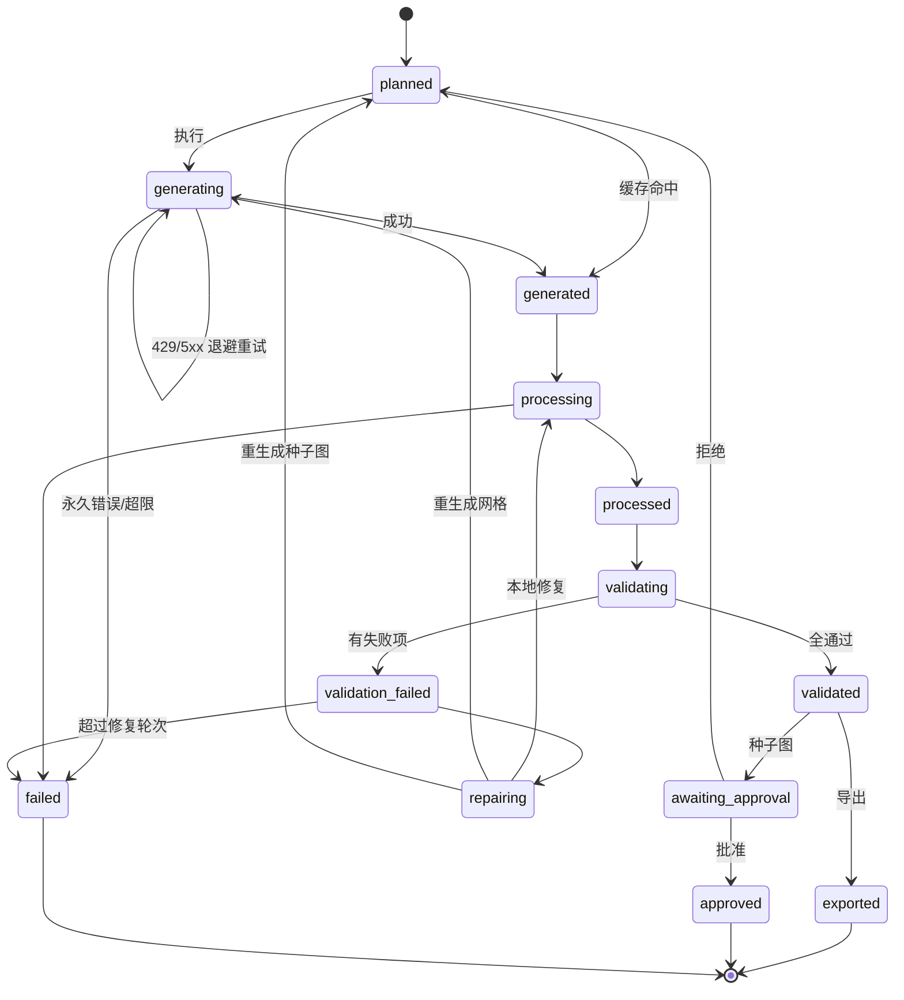

# Pixel Asset Forge — 项目规划

> 一个可安装到 Codex / Claude Code 等 Agent 环境的像素游戏资产生成 Skill，
> 通过用户自己的 `gpt-image-2` API Key，把自然语言描述编译为可直接导入游戏引擎的像素资产。

---

## TL;DR

| 项 | 结论 |
|---|---|
| **系统定位** | 不是 GPT Image API 包装器，而是 **Manifest 驱动的像素资产编译器** |
| **职责边界** | AI 只生成视觉原料；一切需要精确性的操作（切帧、抠图、对齐、量化、校验）由本地确定性代码完成 |
| **生成策略** | 种子图（canonical seed）+ **一次生成完整动作网格**，绝不逐帧独立生成 |
| **物理布局** | 因 API 尺寸约束无法直接产出 32×32 或长条，改为生成大尺寸二维网格后本地缩小 |
| **透明化** | `gpt-image-2` 不支持透明背景 → 纯色键控为主，多级降级阶梯兜底 |
| **接口面** | CLI 按完整业务动作演进（核心实现）· MCP 6 个高层工具（适配层、刻意收敛） |
| **MVP 定义** | 一个 YAML → 四方向 × `idle`/`walk`，经自动切帧、透明化、脚底对齐、调色板量化、质量验证，Godot 可直接加载 |

**第一个技术里程碑**（一切的前提）：

> 输入一段角色描述 → 生成 canonical seed → 基于它生成一个经过自动切帧、透明化、脚底对齐、
> 调色板量化和质量验证的 `walk_down_8` 动画。

这一步可靠之前，不扩展任何动作、方向或资产类型。

---

## 0. 命名与术语约定

| 层面 | 名称 |
|---|---|
| 仓库名 | `pixel-asset-forge` |
| Python 包 | `pixel_asset_forge` |
| CLI 可执行名 | `pixel-asset` |
| PyPI 包名 | `pixel-asset-forge` |
| Skill 名 | `pixel-asset-forge` |

术语：

- **seed / canonical seed** — 经批准的角色标准图，作为所有动画的身份基准。
- **动作网格 / animation grid** — 一次 API 调用产出的、含 N 个姿势的二维网格图。
- **cell / 单元格** — 网格中的一格，固定 512×512。
- **逻辑尺寸** — 缩小后的最终像素尺寸（如 32×32）。
- **物理尺寸** — 提交给 API 的实际输出尺寸（如 2048×1024）。

---

## 1. 项目目标

**第一阶段（本文档覆盖）**

- 角色标准图生成
- 角色四方向动画
- `idle` / `walk` / `attack` / `hurt` / `death` 动态帧
- 道具、武器、技能特效和环境物件
- 自动去背景和透明化
- 自动切帧、缩放和锚点统一
- 调色板约束与像素化
- Spritesheet、GIF/APNG 和单帧 PNG 输出
- Generic JSON、Godot 等引擎格式导出
- 自动质量检查
- 局部失败重试与修复

**第二阶段**

Tileset · Autotile · 地图物件包 · WFC 地图生成 · Unity / Phaser / Tiled 导出

---

## 2. 关键技术决策

### 2.1 系统定位

```text
自然语言需求
    ↓
结构化 Asset Request
    ↓
生成任务规划（DAG）
    ↓
GPT Image 2 生成或编辑
    ↓
本地确定性图像处理
    ↓
自动质量检查
    ↓
局部修复或重新生成
    ↓
游戏引擎导出
```

这个分层的核心价值在于：**模型的不确定性被限制在一个环节内**，其余全部可测试、可复现、可回归。

### 2.2 第一版直接使用 Image API

```text
POST /v1/images/generations
POST /v1/images/edits
```

Image API 更适合一次生成或编辑一个确定资产；Responses API 更适合多轮对话式图像编辑。第一版的任务编排已由 Skill 与 Manifest 负责，无需额外引入 Responses API 的对话状态。

接口分工：

```text
images.generate
├── 创建角色种子图
├── 创建道具
├── 创建环境物件
└── 创建初始 Tileset

images.edit
├── 基于种子图生成动画网格
├── 保持角色身份
├── 生成方向变体
├── 生成换装或武器变体
└── 修复存在问题的资产
```

### 2.3 尺寸约束与网格布局

`gpt-image-2` 的输出尺寸必须**同时**满足四条约束：

| 约束 | 值 |
|---|---|
| 宽高均为 16 的倍数 | ✅ |
| 长边 / 短边 ≤ 3 | ✅ |
| 总像素数 | **655,360 ≤ N ≤ 8,294,400** |
| 最大单边 | ≤ 3840 px |

因此不能直接请求 `32×32` 或极长的 `8×1` 动画条。做法是生成较大的规则网格，再在本地缩小：

| 动画帧数 | 网格 | 期望物理尺寸 | 名义单元格 | 总像素 | 长短边比 | 合规 |
|---:|---:|---:|---:|---:|---:|:---:|
| 4 | 2×2 | 1024×1024 | 512×512 | 1,048,576 | 1.00 | ✅ |
| 6 | 3×2 | 1536×1024 | 512×512 | 1,572,864 | 1.50 | ✅ |
| 8 | 4×2 | 2048×1024 | 512×512 | 2,097,152 | 2.00 | ✅ |
| 9 | 3×3 | 1536×1536 | 512×512 | 2,359,296 | 1.00 | ✅ |
| 12 | 4×3 | 2048×1536 | 512×512 | 3,145,728 | 1.33 | ✅ |

种子图固定请求 **1024×1024**（1,048,576 px，合规）。

> ⚠️ **「期望」不是修辞（[Sprint 0 / A-1](sprint-0-report.md)）。**
>
> 实测目标端点**不保证按请求尺寸返回，且不报错**：同一个 `2048×1024` 请求两次分别
> 返回 `1536×1024` 与 `1774×887`，`1024×1024` 返回 `1254×1254`。
> 返回图的总像素恒为≈ 157 万，长短边比只是**有时**跟随请求。
>
> 所以上表的"期望物理尺寸"只用于两件事：**表达期望的长短边比**、**本地合规自检**。
> **切帧必须按比例进行**（格线 = `col / cols × 实际宽度`），
> 且实际尺寸必须写入 Manifest，否则 `process` 无法离线复现。

最终逻辑尺寸支持：`16×16` · `24×24` · `32×32` · `48×48` · `64×64` · `96×96`

核心原则：

> **逻辑上一次生成完整动作，物理布局上使用满足 API 约束的二维网格，
> 切分时以实际返回图为准。**

#### 2.3.1 网格阅读顺序

帧序必须固定为 **从左到右、从上到下**（4×2 网格即 `0 1 2 3 / 4 5 6 7`）。

这一条必须写进 prompt 并单独验证，原因是：**如果模型把帧序排乱了，现有的所有验证项都会通过** —— 帧数对、尺寸对、锚点对、无空白帧、无重复帧，但 walk cycle 播放起来是错的。这是一个"静默失败"，必须有专门的检查项覆盖（见 §9.2「帧序连续性」）。

#### 2.3.2 抽帧方式与"越界"

> ⚠️ **本节已按 [ADR-003 修订 2](adr/ADR-003-fixed-grid.md) 重写。**
> 切帧不再按格线硬切，而是**按连通域定位 sprite**。

原设计假设模型会把每个姿势画在自己的格子里，跨格即判失败。实测这个判据是错的：
一次 8 个姿势**彼此完全分离、毫无损伤**的产出，只因整体相对假想格线右移，
就被判出「3 个连通域跨格 · fatal」，修复器重生成三次都是同样布局
——**在拿一个不存在的缺陷烧配额**。

跨不跨格线衡量的是「模型布局是否符合我的假设」，不是「sprite 有没有被切坏」。

现在的做法（照搬 OpenAI `hatch-pet` 的 `extract_strip_frames.py`，MIT）：

- **预防**：prompt 仍要求每个姿势四周留 **12%** 边距（实测模型打七折执行，
  写 8% 只拿到 0.0%，写 12% 拿到 7.9%）。
- **抽帧**：色键 → 连通域标注 → 按面积取正好 N 个 seed → 碎片就近吸附 →
  放进共用视口（保住帧间相对缩放与站位）。**帧数已知**是这个算法成立的前提。
- **判失败**：分不出 N 个 sprite 才是真的坏了（姿势粘连成一片、或数量不对），
  此时本地补不回被切掉的像素，只能重生成整个动作网格。
- **兜底**：连通域失败时退回 `stable_slots`（等分切格 + 共用视口），
  而不是退回逐帧各自 fit-to-cell —— 后者会造成尺寸跳动与基线抖动。

### 2.4 背景与透明化策略

`gpt-image-2` **不支持** `background: "transparent"`（传入该值会直接报错），因此必须采用可确定性移除的纯色背景。

默认键控色：`#FF00FF`（洋红）

处理链：

```text
纯色背景
→ 自适应阈值求解（Otsu）        ← 不能写死常数，见下
→ 颜色距离阈值检测
→ 与画布外缘连通性过滤          ← 防止角色内部被抠出洞
→ Alpha 透明化
→ Despill 去除彩边
→ 清零透明像素的 RGB
→ 保存 RGBA PNG
```

> ⚠️ **模型画不出精确的键控色（[Sprint 0 / A-5](sprint-0-report.md)）。**
> 实测背景是 `#F204EA` 这类近洋红，精确 `#FF00FF` 命中率 **0.00%**。
> 因此不存在"精确色键"这一档，主路径直接就是自适应阈值键控。
> 好在背景簇（距离 20–30）与前景簇（200+）之间有极宽空谷，
> 仅 0.76% 的像素落在中间，Otsu 求解非常稳。求解出的阈值必须写入 Manifest。

#### 2.4.1 背景色冲突检测

把键控色写死为 `#FF00FF` 会在遇到**粉/紫/洋红系角色**时把角色本体一起抠掉 —— 史莱姆、法师袍、魔法特效、粉色头发都会触发。这不是边缘情况，第一批测试角色里就会遇到。

方案：

1. 生成**前**从角色描述与目标调色板做冲突预检。
2. 冲突时按序切换备用键控色：`#FF00FF` → `#00FF00` → `#00FFFF`。
3. 三者都冲突时（极罕见）报错并要求用户显式指定。
4. **将实际使用的键控色写入 Manifest 的 `background.color_used`**，使处理与验证阶段可脱离原始请求独立复现。

#### 2.4.2 降级阶梯

档位用**具名标识**而非序号 —— 增删档位时序号会整体平移，已落盘的 Manifest 会被静默误读。

| 标识 | 含义 | 何时触发 |
|---|---|---|
| `tolerant_key` | 默认键控色 + 逐图自适应阈值 + Despill | 主路径 |
| `alt_key_color` | 切换备用键控色（`#00FF00` → `#00FFFF`） | 生成**前**冲突预检命中 |
| `transparent_model` | 改用 `gpt-image-1.5` 重生成，直接请求 `background: transparent` | 键控结果不合格 |
| `rembg` | 语义抠图 | 上一档仍不合格 |
| `manual` | 人工审核 | 兜底 |

前两档在**生成前**确定；后三档是**生成后**的逐级升级。

> `transparent_model` 档：同代的 `gpt-image-1.5` **支持**透明背景，产出的是**原生 alpha 通道**，
> 质量显著高于 `rembg` 的语义抠图（后者在像素画的硬边缘与细小肢体上表现很差）。
> 代价是需要维护双模型路径，且 1.5 的生成质量与 2 有差异 —— 因此定位为兜底而非主路径。
>
> 初版的「精确色键」档已按 [Sprint 0 / A-5](sprint-0-report.md) 的实测数据删除：
> 它的命中率是零，不是"很少成功"而是"永远不成功"。
> 详见 [ADR-004](adr/ADR-004-chroma-key.md)。

### 2.5 种子图 + 完整动作网格

```text
角色描述
    ↓
生成 canonical seed
    ↓
人工或自动批准        ← 唯一的人工闸门
    ↓
创建动画编辑画布
    ↓
将 seed 作为参考图传入
    ↓
一次生成完整动作网格
    ↓
连通域抽帧（格线仅作兜底）
    ↓
统一缩放和脚底对齐
```

**绝不采用**：

```text
第 1 次调用生成 walk_01
第 2 次调用生成 walk_02
第 3 次调用生成 walk_03
```

逐帧生成极易造成服装、武器、比例和朝向漂移。

### 2.6 编辑画布的构造方式

**不使用 mask。**

```text
base image  : 一张纯键控色的空白网格画布（如 2048×1024）
reference   : canonical seed（1024×1024）作为参考图一并传入
mask        : 不传
约束手段     : 全部由 prompt 承担
```

理由：GPT Image 的 mask 是**提示性约束**，不保证精确遵循边界。用 mask 保护"第一格已画好的 seed"既不可靠，又会让模型把注意力放在边界而非身份一致性上。把 seed 作为纯参考图传入，模型对身份的保持效果更稳定。

代价是第一格也是重新生成的（而非原样保留），因此第一格同样要参与身份漂移校验。

详见 [ADR-003](adr/ADR-003-fixed-grid.md)。

### 2.7 确定性边界

必须明确哪些环节可复现，否则测试策略会建立在错误假设上：

| 环节 | 是否确定性 | 复现手段 |
|---|:---:|---|
| Prompt 编译 | ✅ | 纯函数，输入相同则输出相同 |
| 图像生成 | ❌ | **不可复现**。无 seed 参数，同一 prompt 每次结果不同 |
| 切帧 / 键控 / 裁剪 / 缩放 / 对齐 / 量化 | ✅ | 纯像素运算，golden image 测试可完全覆盖 |
| 验证 | ✅ | 纯函数 |
| 导出 | ✅ | 纯函数 |

推论：

- **Golden image 测试只能覆盖处理层，覆盖不了生成层。** 生成层只能靠评测集统计指标衡量。
- **Prompt hash + 输入图 hash 缓存是唯一的"生成层复现"手段。**
- 任何"重跑一遍就一致"的假设都只在 `pixel-asset process` 及其之后成立。

---

## 3. 系统架构

```text
┌──────────────────────────────┐
│ Codex / Claude Code / CLI    │
└───────────────┬──────────────┘
                ▼
┌──────────────────────────────┐
│ SKILL.md                     │
│ 意图识别、参数补全、工作流规则  │
└───────────────┬──────────────┘
                ▼
┌──────────────────────────────┐
│ Asset Request Parser         │
│ Pydantic + JSON Schema       │
└───────────────┬──────────────┘
                ▼
┌──────────────────────────────┐
│ Planner / Manifest Engine    │
│ 角色、动作、方向、任务依赖      │
└───────┬─────────────┬────────┘
        ▼             ▼
 Prompt Compiler   Provider Adapter
        └──────┬──────┘
               ▼
      OpenAI GPT Image 2
               ▼
┌──────────────────────────────┐
│ Raw Artifact Store           │
│ 原图、请求、响应、哈希、日志    │
└───────────────┬──────────────┘
                ▼
┌──────────────────────────────┐
│ Deterministic Processing     │
├──────────────────────────────┤
│ 越界检测 → 固定网格切分        │
│ 色键去背景 → Despill          │
│ 自动裁剪 → 统一缩放            │
│ Bottom-center 对齐            │
│ 调色板量化 → 像素清理          │
│ Spritesheet 重组              │
└───────────────┬──────────────┘
                ▼
┌──────────────────────────────┐
│ Validation Engine            │
├──────────────────────────────┤
│ 帧数、尺寸、Alpha、锚点        │
│ 调色板、轮廓、重复帧、越界      │
│ 帧序连续性                    │
└───────┬──────────────────────┘
   ┌────┴────┐
   ▼         ▼
 Passed    Repair Planner
   │         ├── 本地重新处理（不调 API）
   │         ├── 重生成动作网格
   │         └── 重生成种子图
   ▼
┌──────────────────────────────┐
│ Exporters                    │
│ PNG / GIF / JSON / Godot     │
└──────────────────────────────┘
```

---

## 4. 仓库结构

```text
pixel-asset-forge/
├── SKILL.md
├── README.md
├── LICENSE
├── pyproject.toml
├── uv.lock
│
├── pixel_asset_forge/
│   ├── cli.py
│   ├── config.py
│   ├── errors.py
│   ├── constants.py
│   │
│   ├── models/          request · character · animation · manifest · job · validation
│   ├── providers/       base · openai_image · mock
│   ├── prompts/         compiler · character · animation · prop · tileset · negative_rules
│   ├── planning/        planner · grid_layout · dependencies
│   ├── pipelines/       character · animation · prop · tileset
│   ├── processing/      chroma_key · despill · background · frame_split · crop ·
│   │                    resize · anchor · palette · dithering · pixel_cleanup ·
│   │                    contact_sheet · spritesheet
│   ├── validation/      dimensions · transparency · bounds · anchor_drift ·
│   │                    silhouette · palette · duplicates · frame_order · report
│   ├── repair/          planner · local_actions · regeneration
│   ├── exporters/       base · generic_json · godot · phaser · tiled
│   └── storage/         artifacts · cache · hashes
│
├── docs/
│   ├── PLAN.md          ← 本文档
│   ├── architecture.md
│   └── adr/             ADR-001 … ADR-006
│
├── schemas/             asset-request · asset-manifest · validation-report
├── presets/             animation · palette · style · engine
├── examples/            knight.yaml · slime.yaml · fireball.yaml
├── tests/               unit · integration · golden · fixtures
└── outputs/
```

---

## 5. 核心数据模型

### 5.1 Asset Request

```yaml
asset_id: knight_01
asset_type: character

description: >
  Young forest knight, short brown hair,
  green cloak, leather armor, short sword.

style:
  perspective: top_down_3_4
  target_size: [32, 32]
  max_colors: 24
  outline: single_pixel_dark
  shading: two_tone
  antialiasing: false
  lighting: fixed_top_left

background:
  mode: chroma_key
  color: "#FF00FF"        # 期望值；实际使用值见 manifest.background.color_used

mirroring:
  enabled: false          # 带剑非对称角色不可镜像，见 §9.4
  reason: "handheld sword breaks left/right symmetry"

animations:
  - name: idle
    directions: [down, left, right, up]
    frames: 4
    fps: 6
    loop: true

  - name: walk
    directions: [down, left, right, up]
    frames: 8
    fps: 10
    loop: true

export:
  targets:
    - generic-json
    - godot
```

完整定义见 [`schemas/asset-request.schema.json`](../schemas/asset-request.schema.json)。

### 5.2 Asset Manifest

```json
{
  "schema_version": "2.0",
  "asset_id": "knight_01",
  "asset_type": "character",
  "pipeline_version": "0.1.0",
  "provider": {
    "name": "openai",
    "model": "gpt-image-2"
  },
  "canvas": { "width": 32, "height": 32 },
  "anchor": { "type": "bottom_center", "x": 0.5, "y": 1.0 },
  "background": {
    "mode": "chroma_key",
    "color_requested": "#FF00FF",
    "color_used": "#FF00FF",
    "fallback_stage": "tolerant_key",
    "key_threshold": 165.0
  },
  "palette": { "max_colors": 24, "colors": [] },
  "animations": {
    "walk_down": {
      "fps": 10,
      "loop": true,
      "grid": {
        "cols": 4,
        "rows": 2,
        "cell": [444, 444],
        "requested_size": [2048, 1024],
        "actual_size": [1774, 887]
      },
      "frames": [
        "frames/walk_down_00.png",
        "frames/walk_down_01.png"
      ]
    },
    "walk_right": {
      "derived_from": "walk_left",
      "transform": "flip_horizontal"
    }
  },
  "status": "validated"
}
```

Manifest 是**唯一的真实来源**：所有导出文件都必须能仅凭 Manifest + `frames/` 重建。

三个字段值得单独说明，它们都是 [Sprint 0](sprint-0-report.md) 的产物：

- `grid.actual_size` —— 端点不保证按请求尺寸返回（A-1）。没有它，`process` 重跑时
  无法知道当初是按什么比例切的格。`cell` 记录的也是**实际**格子尺寸，不是名义 512。
- `grid.requested_size` —— 与 `actual_size` 不同即说明发生了尺寸吸附，供排障与统计。
- `background.key_threshold` —— 自适应阈值的求解结果（A-5）。不持久化的话，
  `process` 重跑会重新求解，可能得到不同阈值，离线复现就不成立了。

完整定义见 [`schemas/asset-manifest.schema.json`](../schemas/asset-manifest.schema.json)。

### 5.3 Job 状态机

每个 `(asset, action, direction)` 三元组是一个独立任务：

```text
knight_01 / walk / down
knight_01 / walk / left
knight_01 / attack / down
```

这样可以只重新执行失败部分。

#### 状态转移表

| 当前态 | 事件 | 目标态 | 副作用 |
|---|---|---|---|
| `planned` | 开始执行 | `generating` | 写 job 记录 |
| `planned` | **缓存命中** | `generated` | 复用既有 artifact，**跳过 API 调用** |
| `generating` | Provider 成功 | `generated` | 落盘原图 + request id + prompt hash |
| `generating` | 瞬态错误（429 / 5xx） | `generating` | 指数退避重试，计数 +1（自环） |
| `generating` | 永久错误（参数 / moderation） | `failed` | 写可操作错误信息 |
| `generating` | 超过重试上限 | `failed` | |
| `generated` | 启动处理 | `processing` | |
| `processing` | 处理完成 | `processed` | 写 `frames/` |
| `processing` | 处理异常 | `failed` | |
| `processed` | 启动验证 | `validating` | |
| `validating` | 全部通过 | `validated` | 写 `validation-report.json` |
| `validating` | 存在失败项 | `validation_failed` | 写 `validation-report.json` |
| `validation_failed` | 生成修复计划 | `repairing` | 写 `repair-plan.json` |
| `validation_failed` | 超过 `max_repair_rounds` | `failed` | |
| `repairing` | 本地修复动作 | `processing` | **不调用 API** |
| `repairing` | 重生成动作网格 | `generating` | 调用 API |
| `repairing` | 重生成种子图 | `planned` | **级联作废全部下游任务** |
| `validated` | 种子图任务 + 开启人工审核 | `awaiting_approval` | 输出 contact sheet |
| `awaiting_approval` | 批准 | `approved` | 解锁下游动画任务 |
| `awaiting_approval` | 拒绝 | `planned` | 重新生成种子图 |
| `validated` | 导出（非种子图任务） | `exported` | 写 `exports/` |

**终态**：`exported` · `approved`（仅种子图）· `failed`

**重入边**：`repairing → {processing, generating, planned}` —— 这三条边是整个修复机制的核心，
分别对应"本地可修"、"这次生成废了"、"身份基准废了"三种严重程度。



### 5.4 Schema 版本策略

`schema_version` 采用 `MAJOR.MINOR`：

| 变更类型 | 版本 | 读取行为 |
|---|---|---|
| 新增可选字段 | MINOR +1 | 旧版本读取器忽略未知字段，正常工作 |
| 新增必填字段 / 删除字段 / 改变字段语义 | MAJOR +1 | 旧 Manifest 需迁移，读取器报错并提示 `pixel-asset migrate` |

规则：

- 读取器遇到 **更高 MAJOR** 的 Manifest → 拒绝并明确报错。
- 读取器遇到 **更高 MINOR** → 正常读取，忽略未知字段。
- 每次 MAJOR 升级必须附带迁移脚本，且**保留至少一个历史版本的迁移路径**。
- `pipeline_version` 独立于 `schema_version`，记录产出该资产的代码版本，用于回归排查。

---

## 6. 对外接口

CLI 与 MCP 是**两套不同的接口面**，两者规模不同是设计意图：

### 6.1 CLI（核心实现）

CLI 命令面按**完整业务动作**收敛并随已实现能力演进，不机械固定数量；
MCP 仍保持少量高层语义工具。详见 [ADR-005 修订](adr/ADR-005-cli-core-mcp-adapter.md)。

| 命令 | 用途 | 是否调用 API |
|---|---|:---:|
| `pixel-asset init` | 初始化配置与目录 | ❌ |
| `pixel-asset doctor` | 检测配置、依赖、API 连通性 | 仅探测 |
| `pixel-asset plan <input.yaml>` | 自动识别单资产请求或 pack，输出任务 DAG，不执行 | ❌ |
| `pixel-asset create-character <request.yaml>` | 生成 canonical seed | ✅ |
| `pixel-asset create-animation --asset A --action X --direction D` | 生成动作网格 | ✅ |
| `pixel-asset create-asset <request.yaml>` | 生成单个静态资产（生成 → 处理 → 验证 → 导出） | ✅ |
| `pixel-asset create-asset-pack <pack.yaml>` | 生成一组共享约束的资产（静态 pack 一遍跑完；动画 bundle 停 seed 闸门，批准后重跑同一条命令续跑） | ✅ |
| `pixel-asset create-tileset <request.yaml>` | 生成一整套地面 tile（逐块生成，整套统一处理与调色板） | ✅ |
| `pixel-asset import <request.yaml> <source> --as seed\|keyframes` | 导入已有素材 | ❌ |
| `pixel-asset interpolate <outputs/A> --key X --target-fps N` | 生成式补间 | ✅ |
| `pixel-asset process <outputs/A>` | **仅重跑本地处理** | ❌ |
| `pixel-asset validate <outputs/A>` | 运行验证引擎 | ❌ |
| `pixel-asset repair <outputs/A/walk_down>` | 执行修复计划 | 视修复类型 |
| `pixel-asset export <asset-dir-or-id> --target godot` | 按资产目录或 `asset_id` 导出引擎格式 | ❌ |

`create-character` 输出：

```text
seed-original.png · seed-transparent.png · seed-pixel.png
character-reference.json · palette.png
```

`plan`、`process`、`validate`、`export` 等离线入口使调试与迭代不必重复调用生成 API；
这项边界比固定统计命令数量更重要。

### 6.2 MCP（6 个工具，适配层）

```text
create_character · create_animation · create_asset_pack
validate_asset   · repair_asset     · export_asset
```

**为什么 MCP 保持 6 个，而不机械镜像 CLI**：`init` / `doctor` / `plan` / `import` / `interpolate`
等是开发者工作流入口，不需要逐项变成 MCP 工具。更重要的是，不要向模型暴露几十个像素级工具 ——
工具数量增加会显著推高上下文开销与选错工具的概率。
MCP 层的职责是**收敛**，不是镜像 CLI。详见 [ADR-005](adr/ADR-005-cli-core-mcp-adapter.md)。

`SKILL.md` 的职责是把用户自然语言映射到这些稳定命令，而**不是**让 Agent 自由组合底层脚本。

---

## 7. 待验证假设清单

这是 **Sprint 0 的验收物**。每条假设配"验证方法"与"证伪后的应对"。

| # | 假设 | 验证方法 | 证伪后的应对 |
|---|---|---|---|
| A-1 | API 接受任意合规尺寸（非固定档位） | 直接请求 2048×1024 与 1536×1024 | 网格表退回到官方支持的档位，重排帧数方案 |
| A-2 | 模型能在一次调用中产出 N 个**姿势不同**的格子 | 生成 4 格与 8 格网格各 5 次，人工计数 | 降低单次帧数上限（8 → 4） |
| A-3 | 模型遵守"从左到右、从上到下"的帧序 | 同上样本，人工核对播放顺序 | 改为每行一个完整周期，或引入帧序自动重排 |
| A-4 | 姿势不会跨越格线 | 同上样本，检测跨格连通域 | 加大 prompt 边距要求；仍失败则改为逐行生成 |
| A-5 | 纯洋红键控在像素画硬边缘上干净可用 | 对 3 个测试角色跑完整键控链 | 提前启用 §2.4.2 的第 4 档（gpt-image-1.5） |
| A-6 | seed 作为参考图（不用 mask）足以保持身份 | 同一 seed 生成 4 个方向，比对身份漂移 | 重新评估 §2.6 的 mask 决策 |
| A-7 | `up`（背面）方向的身份一致性可接受 | 单独生成 5 次背面动作网格 | 背面改为从 seed 单独派生一张背面 seed |

**三套测试角色**（覆盖不同风险）：

| 角色 | 覆盖风险 |
|---|---|
| 对称 Slime（粉紫色） | 背景色冲突（§2.4.1）+ 镜像可行性 |
| 带剑 Knight | 非对称、不可镜像、武器身份漂移 |
| 带盾 Warrior | 强非对称、大面积遮挡、轮廓变化剧烈 |

---

## 8. 开发计划

核心排期原则：**不确定性前移，确定性工作后置**。

---

### Sprint 0：垂直切片与技术验证 · **1 周**

真正的未知数不是"能不能调通 API"，而是"**生成质量有多差、以什么方式差**" ——
后者直接决定了验证器和修复器该怎么设计。因此本 Sprint 用手工脚本跑通全链路，
在设计 Manifest / 验证器 / 修复器**之前**暴露模型的真实失败模式。

**任务**

- 建立仓库、Python 3.12+、`uv` 依赖管理
- 编写 6 份 ADR（见 `docs/adr/`）
- 准备三套测试角色（§7）
- **手工脚本跑通垂直切片**：`seed → walk_down_8 → 切帧 → 键控 → 缩放 → 对齐 → 8 张透明 PNG`
  - 不写任何架构代码，允许全是一次性脚本
- 逐条验证 §7 的 7 个假设，产出验证报告

**退出门槛**

- ✅ 能保存 GPT Image 2 原始 PNG，API Key 不进仓库
- ✅ §7 的 A-1 ~ A-7 全部有明确结论（通过 / 证伪 / 部分成立）
- ✅ 至少记录 3 类模型失败模式，并附样本图
- ✅ 手工产出至少一组可用的 `walk_down_8` 透明帧

**可砍范围**：无。Sprint 0 全部内容都是后续设计的输入。

---

### Sprint 1：项目骨架与 Schema · **第 1 周**

**任务**

- Python 包结构 + Typer CLI
- Pydantic 数据模型 + 三份 JSON Schema
- Job 状态机（按 §5.3 状态转移表实现）
- 配置读取：环境变量 → 项目级 YAML → 用户级配置
- Artifact Store + 结构化日志
- Mock Provider

**CLI 交付**：`init` · `plan` · `doctor`

**退出门槛**

- ✅ 不调用真实 API 即可走完整工作流（Mock Provider）
- ✅ 请求可转换为任务 DAG，每个任务有唯一 ID
- ✅ 同一请求重复执行不创建重复任务（幂等）
- ✅ Schema 错误能准确指出字段路径
- ✅ `plan` 能输出预计调用次数与任务依赖关系

**可砍范围**：用户级配置（可先只支持环境变量 + 项目级）

---

### Sprint 2：OpenAI Provider · **第 2 周**

**任务**

- `OpenAIImageProvider`：generation / edit / 多参考图
- 保存原始请求摘要与 request ID
- 超时与取消、指数退避
- **并发上限与速率限制** —— Sprint 4 单角色就有 21 次调用，不能等到后期才做
- Prompt hash + 输入图 hash 缓存

**错误分类与重试规则**

```text
429 / 5xx              → 自动指数退避重试
参数错误                → 不重试，直接 failed
Moderation blocked     → 不重试，返回可操作错误
构图 / 帧数错误         → 不在此层处理，交 Repair Planner
```

只对 429 / 5xx 等瞬态错误重试；不应在未修改请求的情况下反复重试用户错误。

**退出门槛**

- ✅ generate 与 edit 均可保存图像
- ✅ API Key 不出现在任何日志或错误信息中
- ✅ 重复任务命中缓存
- ✅ 错误被转换为项目内部错误类型
- ✅ 单次任务失败不中止整个资产包
- ✅ 并发上限可配置且生效

**可砍范围**：多参考图（MVP 只需 seed 单张）

---

### Sprint 3：确定性图像处理 · **第 3 周**

**任务**

| 模块 | 优先级 |
|---|:---:|
| `frame_split`（固定网格切分） | P0 |
| `bounds`（越界检测，§2.3.2） | P0 |
| `chroma_key` + `despill` + `alpha_cleanup` | P0 |
| `background`（冲突预检与降级阶梯，§2.4） | P0 |
| `content_bounds` + `crop` | P0 |
| `nearest_resize` | P0 |
| `bottom_center_align` | P0 |
| `palette_quantize` | P0 |
| `isolated_pixel_cleanup` | P0 |
| `spritesheet_compose` | P0 |
| `gif_preview` | P1 |
| `dithering` | P2 |
| `contact_sheet` | P2 |

`dithering` 与 `contact_sheet` 不在 MVP 关键路径上，降到 P2 以给 P0 模块留出充分的测试时间。

**退出门槛**

- ✅ 固定网格切帧像素级准确（golden test）
- ✅ 所有输出帧尺寸完全一致
- ✅ 完全透明像素的 RGB 均为 0
- ✅ 最近邻缩放不引入任何中间色
- ✅ 锚点写入 Manifest
- ✅ 背景色冲突预检对 Slime 用例生效

**可砍范围**：`dithering` · `contact_sheet` · `gif_preview`

---

### Sprint 4：角色种子图与动画流水线 · **1.5–2 周**

Sprint 4 是全计划**唯一不可预估**的环节。其余 Sprint 都是确定性代码（可测试、工作量可估），
而 prompt 调优是与模型对抗的迭代过程，没有收敛保证。因此排期给足两周。

**任务**：实现 `CharacterSeedPipeline` 与 `AnimationGridPipeline`

```text
CharacterSeedPipeline
角色描述 → Prompt Compiler → GPT Image 2 → 背景冲突预检 → 去背景
        → 自动裁剪 → 统一构图 → 调色板量化 → seed.png

AnimationGridPipeline
seed.png → 创建空白网格画布 → seed 作为参考图 → 生成完整动作网格
        → 越界检测 → 固定切帧 → 对齐 → 缩小 → 透明化 → 预览
```

**Prompt Compiler 必须固定的约束**

```text
same character in every cell
same outfit, weapon and proportions
frames ordered left to right, top to bottom     ← §2.3.1
each pose fully inside its own cell             ← §2.3.2
at least 12% margin around each pose            ← §2.3.2，写 12 判 8
full body visible
feet aligned to a common baseline
no text · no labels · no scenery
no shadows · no glow
solid <keying_color> background                 ← §2.4.1，非硬编码
逐帧姿势描述（见下）                              ← Sprint 0 / A-2 新增
```

**逐帧姿势模板 —— Sprint 0 追加的范围**

初版只写 `one complete animation cycle` + `exactly N distinct poses`。
实测（[A-2](sprint-0-report.md)）模型给出的是**八张几乎一样的站立姿势**，腿基本不动 ——
"一个完整循环"这种整体描述，模型不会自己拆解成具体姿势。

把每一格该画什么写死之后（`CONTACT` / `DOWN` / `PASSING` / `UP` 各自的腿部与重心描述，
外加一句"这是走路动画，不是八张站立肖像"），才拿到真正的循环：

| | 相邻帧差异序列 | max/min |
|---|---|---:|
| 整体描述 | 8% · 24% · 26% · 8% · 3% · 30% · 26% · 7% | 9.2 |
| 逐帧描述 | 26% · 13% · 25% · 9% · 25% · 12% · 23% · 9% | 3.0 |

因此 `prompts/` 下必须为**每个动作 × 每个帧数档位**准备一套姿势序列文本
（`idle` / `walk` / `attack` / `hurt` / `death` × `4/6/8/9/12`）。
这是相对初版的实质性范围增加，已计入本 Sprint 的 1.5–2 周排期。

> 模型仍可能在角色一致性和精确构图上失败。**不能仅凭 API 返回 200 就认为资产合格** ——
> 这正是 Sprint 5 验证引擎存在的理由。

**优先试错顺序**：`down` → `left` → `up` → `right`
`up`（背面）是身份一致性最难的方向（看不到脸与正面细节），应尽早试错而非留到最后（假设 A-7）。

**退出门槛**

- ✅ 能创建 canonical seed 并通过人工审核闸门
- ✅ 能生成 `idle_down_4` 与 `walk_down_8`
- ✅ 能输出透明单帧与动画预览
- ✅ 失败的动作可单独重新生成
- ✅ 四个方向均有可用产出（`up` 允许质量略低）

**可砍范围**：`up` 方向

---

### Sprint 5：验证引擎与 Repair Planner · **第 6 周**

详见 §9。

**输出**：`validation-report.json` · `contact-sheet.png` · `animation-preview.gif` · `repair-plan.json`

**退出门槛**

- ✅ 验证失败时绝不标记为成功
- ✅ 本地可修复的问题不重新调用 API
- ✅ 只重生成最小失败单元
- ✅ 所有修复操作有日志
- ✅ 最大修复次数可配置
- ✅ per-action 阈值表已用 Sprint 4 的真实数据校准

**可砍范围**：近似重复帧检测（可先只做完全重复）

---

### Sprint 6：MVP 完成与 Godot 导出 · **第 7 周**

MVP 范围定为"**四方向 × idle/walk**"而非五动作。
理由：动作越激烈，身份漂移与单元格越界越严重 —— `attack`（挥剑前冲）、`death`（倒地）
是质量风险最高的动作，不应压在 MVP 门槛上。**idle/walk 跑通即证明了整条流水线**，
剩下三个动作是同一套机制的重复应用，属于产能问题而非可行性问题。

```text
动作：idle · walk
方向：down · left · right · up
导出：单帧 PNG · 动作 Spritesheet · 角色总 Spritesheet ·
      GIF/APNG · Generic JSON · Godot SpriteFrames
```

**MVP 退出门槛**

- ✅ 从一个 YAML 生成完整四方向角色（idle + walk）
- ✅ 每个动作有独立状态，失败动作可续跑
- ✅ **Godot 能直接加载生成的资源**（用真实 Godot 工程验证，不是"理论上兼容"）
- ✅ Contact Sheet 可供一次性人工审核
- ✅ Manifest 能完整重建全部导出文件

---

### Sprint 6.5：补齐剩余动作 · **第 8 周前半**

`attack` · `hurt` · `death` 三个动作 —— 从 MVP 移出的部分。

**退出门槛**：五个动作全部可用，per-action 阈值对激烈动作不误报。

---

### Sprint 6.8：自有素材导入与补帧 · **第 8 周后半**

用户手上已经有角色了，只是缺动画；或者只有两三张关键帧，缺的是中间帧。
这个 Sprint 让流水线的入口从"只能从零生成"扩展到"能接住用户已有的东西"。

它排在 Sprint 7 之前，因为它建立在动画流水线之上、不依赖道具与 Tileset。

#### 6.8.0 入口消歧 —— 先问，不猜

用户丢过来几张图，**同一批文件对应两种完全不同的意图**：

| 意图 | 输入 | 产出 | 命令 |
|---|---|---|---|
| **A. 静态图 → 动态资产** | 一张（或多张变体）立绘 | 用它当身份基准，生成整套动作 | `import --as seed` |
| **B. 关键帧 → 补到正常帧率** | 同一段动作的若干张 | 保留原帧，补出中间帧 | `import --as keyframes` |

**光看文件数量分不出来。** 三张图可能是"笑 / 平 / 晕"三个独立状态（意图 A 的变体），
也可能是一段动作的三个关键帧（意图 B）。猜错的代价不对称：

- 把关键帧当成 seed → 白白花掉整套动作的生成调用，而且用户原本要保留的帧全丢了
- 把变体当成关键帧 → 补出一堆"半笑半晕"的中间帧，全是废的

所以 CLI **不做猜测**：不给 `--as` 就报错，把两条路和各自的产出列出来。
这与 `pose_sequence` 对未知动作抛错而不是退回泛泛描述是同一条原则 ——
静默选一条路等于把已知失败模式请回来。

**询问发生在 Skill 层**：`SKILL.md` 规定 Agent 在调用前必须先问清意图，
问法与判据写在那里。CLI 只负责"意图不明就拒绝执行"。

**退出门槛**：不带 `--as` 调用必然失败且错误信息里含两种意图各自的产出；
Skill 文档里有可照做的提问脚本。

#### 6.8.1 素材导入 —— ✅ 已完成

`import-seed`：把用户自己的像素资产导入为 canonical seed。不调用 API。

三处与生成路径不同：

- **透明背景合成到键控色上**。整条链的前提是"背景是一片纯键控色"，
  而导出的素材通常带 alpha。不合成的话去背景那一步无事可做。
  alpha 非 0 即 255 时无损；抗锯齿边缘会有粉边，这条往返就是有损的。
- **不写生成日志**。没有 prompt、没有 request_id，硬凑一条只会让溯源记录里
  出现查无此物的调用。
- **块检测必须先验证再采用**。检测器的搜索范围从 `MIN_BLOCK = 3` 起步，
  对 1:1 素材必然报一个 ≥3 的假块 —— 实测把 256×256 压成 30×30，资产当场被毁。
  按候选块下采样再放回原尺寸量还原误差：用户 1:1 素材 46~63，
  `gpt-image-2` 真实块状产出 6.7，阈值 20 有充分余量。

`LOGICAL_SIZES` 加了 128：导入素材常比模型产出大得多（实测角色 205px 高），
封在 96 会白白丢掉一半。

#### 6.8.2 关键帧序列导入与帧率重采样 —— 不调用 API

补间的前置。两件事：

**导入一段关键帧。** 与 6.8.1 的单张导入不同，这里进来的是同一动作的
若干张图，要按文件名顺序排好、统一画布与锚点、**共用一套调色板**。
调色板必须在这一步统一 —— 各帧各自量化会让播放时整个角色闪色。

**算清楚要补几帧。** `(现有帧数, 现有 fps) → (目标 fps, 目标帧数)` 是纯计算，
结果落进 Manifest。补间要知道每两张关键帧之间插几张，这里给出答案。

节拍数与帧数的关系已有现成规则（见 `prompts/poses.py::_sample`）：
关键帧就是节拍，中间帧就是过渡帧。

**退出门槛**：各帧的颜色都是**同一套调色板的子集**（不是"完全一致" ——
某一帧没有漩涡眼的红色，只说明它不用那个色号，不说明调色板不同）；
锚点漂移不超过内置动作阈值；帧率换算在 Manifest 里可追溯。

#### 6.8.3 生成式补间

输入是 6.8.2 导入好的关键帧，输出是补到目标帧数的完整序列。

算法插值（光流 / morph）**不适用**：对像素画会产出调色板外的新颜色和糊边。
做法是生成式补间 —— 相邻两关键帧一起作为参考图，让模型画中间的 M 帧，
再用现成的确定性链锁死调色板与锚点。

两条硬约束：

- **调色板锁死到关键帧的调色板**，不是重新量化。补出来的帧颜色对不上，
  播放时整个角色会闪色。
- **关键帧原样保留**，只有中间帧是生成的。用户给的帧是基准，不能被"顺手优化"。

**退出门槛**：补出的序列里，关键帧与原图逐字节一致；中间帧的调色板是关键帧
调色板的子集；锚点漂移不超过内置动作的阈值。

##### 事后补的一条防线：中间帧的尺寸必须有上界

补间是全项目唯一一处**算错就会把整台机器拖垮**的地方，这条防线是被一次系统级
OOM 逼出来的，记在这里免得后来者把它当冗余删掉。

中间帧的目标尺寸原本是 `factor = wanted / max(1, own_content)` —— 目标内容高
除以这一帧自己的内容高。`max(1, ...)` 只是个**下界**，倍数没有任何上界。
而 `_content_height` 当时对空帧返回 1（"至少 1 像素高"），于是一张全透明的
中间帧让倍数变成"画布高 ÷ 1" = 画布高本身：实测 480×375 被要求放大到
**46080×36000**，16.6 亿像素、单张 RGBA 6.6 GB，加上重采样的中间量吃穿 30 G
内存，触发**内核 OOM**（连桌面进程一起杀）。进程拿到的是 SIGKILL，
既没有回溯也没有报错，只看到测试跑到一半整台机器闪一下。

空帧从哪来 —— 四环，每一环单独看都"没坏"：

| 环 | 发生了什么 |
|---|---|
| 1 | 补间 prompt 写 `exactly 3 columns x 1 rows of 3 equally sized cells`，而 Mock 只认 `NxM grid` 与 `exactly N poses` 两种措辞，两条都不命中 |
| 2 | Mock 退回按物理尺寸猜格数：`1440 // 512 = 2`，在一张要求 3 格的图上只画了 2 个人形 |
| 3 | 抽帧找不到 3 个 sprite，warning 后退回 `stable_slots` 等分三份，中间那份正落在两个人形之间的空白上 |
| 4 | 空帧进尺寸计算，分母塌成 0 被兜底成 1 → 上面那次失控放大 |

**这不是 Mock 专属问题**：第 4 环没有上界，真实模型返回一张空白中间帧会走同一条
路。所以两处都改，各堵一头：

- `_content_height` 对空帧**返回 0 而不是 1** —— 让调用方必须表态，不许静默兜底。
  尺寸计算提成模块级的 `inbetween_size`，空帧直接报错，并按画布边长的
  8 倍设硬上界（正常值 63×102 对上限 768，差一个量级）。上界不是业务约束而是
  安全阀：内容只剩两三像素高时分母不为 0，倍数照样荒谬。
- Mock 认规范措辞 `N columns x M rows`（两条生成路径共用），且**解析不出时拒绝猜**
  —— prompt 写了 `equally sized cells` 却读不出格数就报错。ADR-002 说 Mock 是
  一等公民不是桩；它悄悄画错格数这件事本身就让离线测试失去了判别力。

反例两条都验过：空帧与"内容仅 2 像素高"各被一条判据抓住，正常帧两条都通过。
另有一条测试直接拿**编译出来的真实 prompt** 去喂 Mock 的解析器，断言两边对格数
的理解一致 —— 措辞今后再漂移，会在这里当场失败，而不是在下游变成一张空帧。

#### 6.8.4 任意动作 —— ✅ 已完成

当前 `pose_sequence` 对模板外的动作**抛错**，这是刻意的 ——
静默退回泛泛描述会产出 N 张几乎一样的站姿（Sprint 0 / A-2）。

要支持用户自描述的动作，就得让"逐帧姿势写死"这条约束在自定义动作上同样成立：

```text
用户描述动作 → 编译成节拍序列 → 走同一条 numbered_poses 链
```

节拍序列由调用方（Agent / CLI 参数）给出，**不是**由代码猜。
`PoseCycle` 已有的 `half_cycle` / `linear` / `frontal_beats` 三个开关全部适用，
正面与侧面仍然要分两套（见 `references/animation-rules.md` 第 1 条）。

排在补间之后是因为它复用同一套"节拍 → 逐帧描述"的编译链：
补间先把这条链跑通，任意动作只是换一个节拍来源。

请求里新增三个字段：``beats``（每一拍身体在做什么）、``cycle``
（``one_shot`` / ``loop`` / ``gait``，对应 ``PoseCycle`` 的三个开关）。
``name`` 的枚举放宽成 ``^[a-z][a-z0-9_]*$`` —— 不能带 ``_`` 之外的分隔符，
动作键是 ``{action}_{direction}``，名字里再有分隔符就反解不出方向了。

四条拒绝（都是"拿不准就报错，不要猜"的同一条原则）：

- 模板外的动作没给 ``beats`` → 报错，不退回泛泛描述
- 内置动作又给 ``beats`` → 报错，否则"walk 是哪套节拍"成了薛定谔的
- ``cycle: gait`` 但某一拍不含 left/right → 报错，互换后与原文一字不差
- 只给一拍 → 报错，动画至少要两拍才有变化

验证阈值那边**新增了一种 skip 理由**。原先 ``death``（刻意豁免）与自定义动作
（根本没有阈值）共用 ``action_exempt``，混在一起会让用户以为后者也是
"设计上不必查"。现在分成 ``action_exempt`` 与 ``custom_action_unthresholded``。

**退出门槛**：自定义动作产出的相邻帧差异与内置动作同量级，不出现"一排站姿"。

实测（相邻帧轮廓差异均值）：

```text
walk        181
dodge_roll  388   ← 自定义
attack      690
```

落在内置动作之间，同量级。产出确实是翻滚：蹲伏 → 缩身 → 完全蜷成球
（脚在头顶上方）→ 落地 → 起身。

#### 6.8.5 移动形态 —— 姿势节拍不能只服务双足 · ✅ 已完成

用户报的三个问题里最根本的一个：**史莱姆"形象不统一"**。
它的 idle / attack / hurt / death 都是无腿圆团，唯独 walk 长出了两条腿和脚 ——
因为 `walk` 的节拍句句写"左脚向前迈、右脚在后"，模型照做，给一团没有腿的
身体现编了腿。同一个角色四个动作一个样、第五个换了物种。

请求新增可选字段 `locomotion`（`biped` / `legless` / `floating` / `quadruped`），
省略时从 `description` 推断（slime→legless、ghost→floating、wolf→quadruped）。
存量 YAML 一个字不用改也能立刻受益。

三处按它分支：

| 层 | 分支的原因 |
|---|---|
| `prompts/poses.py` `LOCOMOTION_CYCLES` | 无腿角色走路靠压缩—弹跳，漂浮靠上下浮沉，四足靠对角腿交替 |
| `pipelines/process.py` `_PEAK_CLAMPED_WALK` | 弹跳的高度变化**是动作本身**，按中位数钳会把它拉平；改看峰值（最高点该回到站立高度） |
| `constants.py` `LOCOMOTION_THRESHOLDS` | 弹跳的 height_variation 0.82、silhouette_variation 0.59，双足阈值是 0.12 / 0.20，与 `death` 同理豁免 |

另外两条 prompt 硬约束（对所有形态生效）：

- **不许现编肢体**："只用模板里这个角色真有的部件；没有腿就不要造腿"
- **谁负责表现运动**："腿才是承载运动的部件；翅膀、披风、尾巴、头发在每一格里
  保持同样的展幅和轮廓" —— 小恶魔走路时腿几乎不动、翅膀每格换展幅，
  播起来就是用户报的"行走镜像鬼畜"

#### 6.8.6 补间的清晰度与尺寸 · ✅ 已完成

用户报的"尺寸不一致、形象不清晰"，两个独立成因：

1. **补过间的动作绕过了所有跨动作一致性。** `process` 整个跳过它们，于是它们
   既不进共用调色板也不进尺寸带 —— 弓手补过间的 hurt 停在 85px，其余四个
   动作已统一到 70~74px。现在补间产出会走一趟 `_normalise_interpolated`。
2. **中间帧的源分辨率是关键帧的两倍。** 端点不按请求尺寸返回（关键帧格
   543×724、间隔格 1136×1384），同样缩到 74px，缩小倍数差一倍。
   三种滤镜逐图比过：最近邻把弓采成断续虚线，面积平均把 1px 描边和填充
   平均成中间调、整张掉对比度，**分块中位**取块内主导色 —— 轮廓连续、
   对比度保住。大比例缩小改用它。

顺带修掉的两个真 bug：

- `_keyframes_from_grid` 用 `len(entry.frames)` 当格数。补过一次之后成品帧数
  就与源网格脱钩（4 格的网格、8 张成品帧），第二次补间因此拿到 8 个半身像作
  输入，补出来的中间帧整张空白。
- `save_frames` 只写不删。帧数变少时留下孤儿帧，而 `_normalise_interpolated`
  是按目录 glob 的。

**实测（6 角色 × 5 动作）**

| | 修前 | 修后 |
|---|---|---|
| 站立类动作高度极差（均值） | 17% | 11% |
| 最差的那个角色 | 27% | 17% |
| 弓手（补过间） | 22% | 5% |
| `mirror_flip` 报出的翻面 | 4 | 0 |
| `validate` 通过的角色 | 4 / 6 | 6 / 6 |

#### 6.8.7 正视步态不能用侧视措辞 · ✅ 已完成

上一轮把小恶魔的翅膀按住之后，用户接着指出：**「走路朝向怎么是侧着的」**。
躯干、头、翅膀正对镜头，腿却是侧视的 —— 一条腿甩到身侧老远、脚尖朝外。

两条**我自己写的**指令在同时要求水平位移：

| 位置 | 原文 | 为什么错 |
|---|---|---|
| `poses.py` 正面节拍 | "the left foot **steps forward**… the right heel is lifted **well behind**… the stride at its **widest**" | 「向前迈」「在后」「跨到最开」都是侧视才成立的说法 |
| `compiler.py` 连续性块 | "the gap between the two feet must be **at least as wide as the character's shoulders**" | 一肩宽的左右间距在侧视里是跨步，在正视里是**劈叉** |

模型要同时满足「正对镜头」和「两脚拉开一肩宽」，只能把躯干画成正面、
把腿画成侧视，出来是个拼接怪物。

改法：正视里跨步是**朝镜头方向**的，画面上表现为抬脚、脚在画布上更低更靠前、
以及整个身体的上下起伏 —— 横向间距始终不超过胯宽，脚尖始终朝向镜头。
跨步宽度那条规则改成 `_stride_rule(direction)`，正视与侧视各一套。

**实测**：三个角色重生成后腿全部正过来，相邻帧轮廓变化 13~19%（原来 12.4%），
运动量没有因此变小。

顺带又挖出两个 bug：

- **`bear` 子串命中了 "white beard"**，把一个拄杖的老法师判成了四足动物 ——
  走路节拍于是要求它用对角腿交替。拉丁词改成整词匹配，中日韩仍按子串。
- **四足的 `NEUTRAL` 与 `SUSPEND` 两拍一个方位词都没有。** `half_cycle` 的后半
  周期靠左右互换生成，没有方位词的节拍互换后与原文一字不差，
  `create-animation` 直接报「出现重复描述」。现在有一条参数化测试覆盖
  4 形态 × 4 方向 × 全部帧数档位，不再靠人逐拍检查。

---

### Sprint 7：道具、特效与批量任务 · **第 9 周** · ✅ 已完成

**新资产类型**：`prop` · `weapon` · `projectile` · `impact` · `spell` · `pickup` · `ui_icon` · `environment_object`

**批量包**：`weapon_pack` · `potion_pack` · `spell_bundle` · `combat_bundle` · `environment_pack`

**任务调度**：`asyncio` 并发（复用 Sprint 2 的并发控制）· 每资产独立失败 · 暂停与恢复 · 任务去重 · 失败汇总

#### 7.1 `potion_pack` 首纵切 · ✅ 已完成

**本次范围只有 `potion_pack`。** 它由多个静态 `pickup` 构成；不据此宣称
`weapon_pack`、`spell_bundle`、其余资产类型或整个 Sprint 7 已完成。

##### 输入契约

```yaml
schema_version: "1.0"
pack_type: potion_pack
pack_id: starter_potions
shared:
  style:
    perspective: top_down_3_4
    target_size: [32, 32]
    max_colors: 8
  background:
    mode: chroma_key
    color: "#FF00FF"
  export:
    targets: [generic-json, godot]
  palette:
    name: starter_potions
    colors: ["#261B2D", "#F4E6C1", "#D43D4F", "#4C9BE8"]
assets:
  - asset_id: health_potion
    description: round red healing potion in a corked glass bottle
  - asset_id: mana_potion
    description: tall blue mana potion in a corked glass bottle
```

- `shared.style`、`shared.background`、`shared.export` 与 `shared.palette.colors`
  对全部资产生效；色板必须显式列色，资产项只提供唯一 `asset_id` 与描述。
- 每个资产展开为无动画的 `pickup`，只创建静态生成任务。静态 pickup **不伪装**
  canonical seed 或 animation，不进入 seed 人工批准闸门，也没有其他人工批准闸门。
- pack **不得写 `model`，也不负责选择模型**。运行时统一使用 `Config` 解析后的有效
  `model`：当前内置默认值为 `gpt-image-2`，并继续服从既有优先级「命令行覆盖 >
  环境变量 > 项目级 YAML > 用户级 YAML > 内置默认值」。同一次 pack 运行中的资产
  使用同一份解析后配置。

##### 命令契约

```bash
pixel-asset plan potion-pack.yaml
pixel-asset create-asset-pack potion-pack.yaml
pixel-asset export outputs/health_potion --target godot
pixel-asset export health_potion --target godot
```

- `plan` 自动识别单资产 request 与 pack；pack 计划汇总总任务数、预计 API 调用数，
  同时保留逐 `asset_id` 的任务 DAG。规划完全离线，批量执行前必须先运行。
- `pixel-asset create-asset-pack <pack.yaml>` 是 CLI 核心的完整业务入口，不要求调用方
  用 shell 循环拼装批次语义。
- `export` 同时接受资产目录和 `asset_id`；二者都只导出一个资产，pack 生成后可逐项审核、
  逐项导出。

##### 执行与产物契约

- 批次使用固定数量的 `asyncio` workers；数量取自运行时 `Config`，启动后不随队列长度
  漂移。
- 单资产失败隔离：一个资产失败不取消其余资产；协作式暂停停止领取新任务，运行中的任务
  收尾后可恢复。相同输入指纹与已完成任务会去重，续跑只领取未完成或可重试资产。
- pack 级 `pack-summary` 汇总成功、失败、跳过/去重与暂停状态，并列出各 `asset_id`
  的结果；单资产错误保留在对应条目中，不把整包抹成一个不透明失败。
- 每个资产仍写入自己的 `outputs/<asset_id>/`，拥有独立 request 副本、Manifest、
  JobTable 与 artifacts；`pack-summary` 只是批次索引，不取代任何单资产溯源记录。
- 静态 pickup 可对自己的原始生成物重跑确定性处理而不重新生成。

**Sprint 7 总退出门槛（五种 pack 全部落地后逐条复核 · ✅ 已完成）**

- ✅ 单个失败不导致整包失败
- ✅ 可断点续跑
- ✅ 可重新处理而不重新生成
- ✅ 可按 `asset_id` 单独导出
- ✅ 同批资产共享风格与调色板定义

> 7.1 完成时只标记 `potion_pack` 首纵切；其余 pack 与 Sprint 7 总状态继续保持未完成。
> 上述五条门槛 `potion_pack` 已逐条有测试与 CLI 实测背书，但按本节口径，
> 其余 pack 类型落地前总门槛不打勾。**7.5 落地后按下述复核逐条打勾。**

**总门槛复核记录（7.5 之后）**：复核口径是**不靠「共用代码路径」推断**。
静态三种确实共用 `_run_one_static`、动画两种共用 `_run_one_animated`，但门槛说的是
「对全部 pack 类型成立」，而映射表、schema 条件约束、动作缺省值恰恰是逐类型分叉的
—— 按路径推断会把分叉处的洞盖住。

摊开既有证据后，五条里有四条**并非对每种 pack 都有断言**：

- 门槛 1 在动画路径上完全没有隔离用例（`spell_bundle` / `combat_bundle` 的失败
  用例都是单资产的，单资产谈不上"不拖累兄弟"）
- 门槛 3 从没有对**pack 产出的资产**验过，只验过 `create-asset` 的单件静态资产
- 门槛 5 只有 `potion_pack`（三个资产互等）与 `spell_bundle`（等于声明值）有断言，
  `weapon_pack` / `environment_pack` / `combat_bundle` 没有
- 门槛 2 只有 `potion_pack`、`spell_bundle`、`combat_bundle` 有断言

新增 `tests/integration/test_sprint7_pack_gates.py`：五条门槛 × 五种 pack 类型
逐格参数化（25 个用例），pack 都裁到最小规模（静态留 2 个资产、动画留 1 个资产
1 个动作 1 个方向）—— 门槛验的是机制，不是资产条数。判据取硬的：门槛 3 与门槛 2
用 `generation-log` 与原图的**字节**比对（不是"看起来没变"），门槛 5 断言的是
**声明值**落到每个资产的 Manifest（不是"几个资产恰好一样"，后者在单资产 pack 上
会退化成永真），门槛 1 毒的是**第二个**资产（第一个已跑完时才失败，能同时验到
"先完成的不被回滚"与"失败之后的兄弟仍被派发"）。

门槛 2 的「**中途**断点续跑」仍由各纵切自己的用例守（`potion_pack` 的 stop/resume、
`spell_bundle` 与 `combat_bundle` 的 seed 闸门续跑）；新文件补的是「每种 pack 类型
都成立」的那一半。五种 pack 的全链 CLI 实测分别在 §7.1–§7.5 各自完成。

写这批用例时踩到一个本身值得记的坑：重跑 `process` 会把 Manifest 打回
`processed`，最初直接在共享夹具上跑，把续跑那条门槛的状态改花了。改成在
**副本**上重跑 —— 门槛用例之间不该有执行顺序依赖。

全套件 899 passed / 5 skipped / 0 failed；ruff、mypy 全绿。

**7.1 完成记录**：实现落地时挖出并修掉了三类问题 ——
① pack 需要的「验证后才可导出」硬闸被错误地全局应用，连带 Manifest 版本全局升
2.1，打回 8 个既有测试；现闸门只对带 `static_image` 的静态资产生效，旧动画路径
保持 2.0 契约。② `export <asset_id>` 默认 contact sheet 路径用错相对化基准，
README 文档化用法必崩；唯一测试恰好加了 `--no-contact-sheet` 掩掉了它。
③ 「批量执行前必须先 plan」与「重跑处理不重新生成」当时只是 README 行文：
前者零强制（直接跑就花钱），后者更糟 —— 通用 `process` 没有 static 分支，会把
单图原件当成叫 "static" 的动作按帧网格切坏。现在 `create-asset-pack` 逐资产核对
已保存任务表与输入指纹，`process` 识别静态资产走单图链并写回 `static_image`。
另修 worker 汇总落盘异常导致 `queue.join()` 永久挂起的死锁，补 `--retry-failed`
复位入口与暂停/恢复集成测试（此前「可断点续跑」零测试覆盖）。
全套件 774 passed / 5 skipped / 0 failed。

#### 7.2 `weapon_pack` 第二纵切 · ✅ 已完成

**本次范围只有 `weapon_pack`，以及为它付出的最小泛化。** 不据此宣称
`spell_bundle`、`combat_bundle`、`environment_pack` 或其余资产类型已完成。

##### 泛化契约

- 7.1 的 pack 模型从 potion 专名泛化为静态 pack 通用：`PotionPack` 更名
  `StaticAssetPack`，`pack_type` 从字面量改为映射表 ——
  `potion_pack → pickup`、`weapon_pack → weapon`。展开的 `asset_type`
  由映射决定，除此之外 7.1 的全部契约逐字继承：shared 注入、显式色板、
  无人工闸门、plan 前置闸门与指纹、固定 worker、失败隔离、断点续跑、
  `--retry-failed`、`pack-summary`、逐资产目录与导出、静态重处理。
- 静态流水线放行无动画的 `pickup` 与 `weapon`；其余类型**继续拒绝**，
  错误消息列出当前允许的类型。planner 的静态分支同步放行。
- JSON Schema 的 `pack_type` 从 `const` 改为二值 `enum`；两种 pack 共用
  同一份 `asset-pack.schema.json`，不复制 schema。
- 若提示词编译器存在按资产类型分块的措辞，为 `weapon` 补图标朝向惯例
  （刀尖/枪口朝右上对角）；若编译器对静态类型本就无差别，则不加特殊措辞，
  以实际代码为准，不为不存在的分块发明配置。

##### 退出门槛（仅对 `weapon_pack` 主张）

- ✅ `examples/weapon_pack.yaml` 走完 plan → create-asset-pack → 逐资产
  export 全链路（mock 下集成测试 + CLI 实测）
- ✅ `pack_type → asset_type` 映射有测试；静态流水线对 weapon 放行、
  对未支持类型仍拒绝有测试
- ✅ 泛化重命名后 7.1 的全部既有测试不回归、不削弱断言

**7.2 完成记录**：泛化按契约走完 —— `StaticAssetPack` + `PACK_ASSET_TYPES`
映射（potion_pack→pickup、weapon_pack→weapon），静态放行集合在 request 校验、
planner、静态流水线、validation 四处统一为 {pickup, weapon}，拒绝消息列出
允许类型。编译器静态 prompt 分流：pickup 措辞一字未动，weapon 用
"one single isolated weapon" 并加对角朝向惯例（刀尖/枪口朝右上）。
CLI 实测 `starter_weapons` 三件武器全链路（plan → create → 逐资产 export
→ 静态重处理零 API）。全套件 793 passed / 5 skipped / 0 failed。

#### 7.3 静态家族收官 · ✅ 已完成

**本次范围：`environment_pack` + 静态单资产类型补全（`prop` / `ui_icon` /
`environment_object`）+ 单资产 CLI 入口。** 动画类 pack（`spell_bundle`、
`combat_bundle`）不在本次范围，静态收官不改变它们的未完成状态。

##### 契约

- 映射表加一行：`environment_pack → environment_object`；schema 的
  `pack_type` enum 扩为三值。pack 行为契约与 7.1/7.2 逐字一致，零新语义。
- `STATIC_ASSET_TYPES` 扩为 {pickup, weapon, prop, ui_icon,
  environment_object}；拒绝消息继续枚举允许集合。`character` 与其余
  动画类型在静态路径继续拒绝。
- 静态 prompt 按类型给最小合理措辞：pickup 与 weapon **一字不动**；
  prop / environment_object 用对应名词措辞；`ui_icon` 额外声明 UI 图标
  惯例（正面平视、无地面接触、剪影可读）。不为类型发明超出一句话的
  风格系统。
- 新增 CLI `create-asset <request.yaml>`：单个静态资产的完整入口，
  走与 pack 内单资产相同的链（生成 → 处理 → 验证 → 导出）与同一份
  `Config` 解析。单资产一次 API 调用，不设 plan 前置闸门（与
  `create-character` 同口径）；帮助文本说明这点。动画请求一律拒收并
  指向 `create-character`。
- `examples/environment_pack.yaml` 新增（3 件环境物件，显式色板）。

##### 退出门槛（仅对本次范围主张）

- ✅ `environment_pack` 走完 plan → create-asset-pack → 逐资产 export
  全链路（集成测试 + CLI 实测）
- ✅ `create-asset` 对 `prop` 与 `ui_icon` 各有一条端到端集成测试；
  对动画请求拒收有测试
- ✅ 映射、放行/拒绝、prompt 措辞差异有测试；7.1/7.2 全部既有测试
  不回归、不削弱断言

**7.3 完成记录**：实现按契约落地（`96c0d84`，经 PR #1 合入）——映射表加
`environment_pack → environment_object`、`STATIC_ASSET_TYPES` 扩为五类、
schema enum 三值、prompt 按类型最小措辞（pickup/weapon 一字未动，`ui_icon`
只多 UI 惯例一句）、抽出 `validate_and_export_static_asset()` 供单资产入口
与 pack 协调器共用、新增 `create-asset` 命令。收口时独立复核了抽取带来的
两处边界语义并决定保留：「`VALIDATION_FAILED` 纳入重验」在现有调用路径上
不可达（pack 协调器更早拦截，续跑语义未变）；「非期望状态抛错」取代的旧
行为其实是**静默跳过导出却上报 `exported`** 的假成功。两处补 9 条固化测试
（7 条函数直测 + `--retry-failed` 现状钉死 + CLI 真实验证失败路径），
`stop_requested` 收紧为 `threading.Event | None`。CLI 全链路实测 7/7：
plan 前置闸门拒绝未规划执行 → `plan --save` → 三件环境物件全 exported →
按 `asset_id` 导出走默认 contact sheet → `process` 静态重跑零 API
（generation-log SHA-256 前后一致）→ `create-asset` prop/ui_icon 全链 →
动画请求在产物创建前拒收。复核中发现的存量问题（`repair` 对静态资产绕过
状态机等六项）记入交接文档 §7.2 待拍板/backlog，不在本次范围。
全套件 819 passed / 5 skipped / 0 failed；ruff、mypy 全绿。

#### 7.4 `spell_bundle` —— 动画资产进 pack · ✅ 已完成

**本次范围只有 `spell_bundle`。** `combat_bundle` 不在本次范围。

##### 冲突与决策

动画资产有 **canonical seed 的人工批准闸门**（§2.5，唯一的人工闸门），
而 pack 的语义是**批量自动执行**。静态家族之所以没这个问题，是因为静态
pickup 从不伪装 seed（§7.1）。

**决策：seed 闸门保留，靠既有的断点续跑承接，不发明新的暂停语义。**

理由是 `awaiting_approval` **本身就是一个断点**。pack 第一遍跑完所有 seed 后，
每个资产自然停在这个状态；人工逐个批准后**重跑同一条 `create-asset-pack`
命令**即续跑进动画阶段。这条路：

- 不需要新的「跑到一半暂停」机制，也不必与 `PackRunControl` 的协作式暂停纠缠
  —— 那是为 Ctrl-C 设计的，与「等人看图」是两回事；
- 与 7.1 起就有的「重跑同一条命令即续跑」完全一致，用户不用学新命令；
- 人审责任不前移（对比「预批准」路线），seed 仍然一个一个过眼。

代价是一个 pack 需要跑两次命令。这个代价是**必须付的** ——
seed 不对则下游全部动画作废重来，而这正是人审存在的理由。

##### 输入契约

沿用 `asset-pack.schema.json`，新增动画字段：

```yaml
schema_version: "1.0"
pack_type: spell_bundle
pack_id: fire_spells
shared:
  style: { ... }            # 同静态 pack
  background: { ... }
  export: { targets: [...] }
  palette: { name: ..., colors: [...] }
  animations:               # ← 新增：整包共享的动作定义
    - name: cast
      frames: 6
      fps: 12
      loop: false
assets:
  - asset_id: fireball
    description: ...
```

- `pack_type: spell_bundle → spell`（映射表加一行，同 7.2/7.3 的做法）。
- `shared.animations` 对全部资产生效，与 `shared.style` 同一口径 ——
  一个 bundle 里的法术共享动作集，这正是 bundle 的意义。
- 每个资产展开为带 `animations` 的 `spell` 请求，进 seed → 动画链，
  **不走静态流水线**。`STATIC_ASSET_TYPES` 不扩，静态路径继续拒绝 `spell`。

##### 执行契约

- `plan` 对动画 pack 汇总时必须**分别列出 seed 与动画的预计调用数**：
  一个 3 资产 × 1 动作 × 4 方向的 bundle 是 3 次 seed + 12 次动画，
  与静态 pack 的「资产数 = 调用数」差一个量级，不分开列会让人误判成本。
- 第一遍执行：所有资产跑到 seed 产出即停，各自写 contact sheet，
  `pack-summary` 用 `awaiting_approval` 计数与逐资产条目明确标出
  **「等你看图，看完重跑同一条命令」**。
- 人工批准沿用既有入口（`create-animation --approve-seed`，逐资产）。
- 第二遍执行：已批准的资产继续跑动画；未批准的仍报 `awaiting_approval`
  且**不计为失败** —— 它们是在等人，不是坏了。
- 其余契约（固定 worker、失败隔离、指纹闸门、`--retry-failed`、逐资产目录
  与导出）逐字继承 7.1–7.3，零新语义。

##### 退出门槛（仅对 `spell_bundle` 主张）

- ✅ `examples/spell_bundle.yaml` 走完 plan → 第一遍（全停 seed）→ 逐个批准
  → 第二遍（动画完成）→ 逐资产 export 全链路（mock 集成测试 + CLI 实测）
- ✅ `plan` 分别报出 seed 与动画调用数，有测试
- ✅ 未批准资产在第二遍不计为失败、且不消耗动画调用，有测试
- ✅ 静态路径对 `spell` 仍拒绝；7.1–7.3 全部既有测试不回归、不削弱断言

**7.4 完成记录**：`spell_bundle → spell` 入映射表，`shared.animations` 对整包
生效（静态 pack 明确拒绝该字段，`spell_bundle` 强制要求它）。seed 闸门按契约
原样保留：第一遍只跑 seed 并各自写 contact sheet，`pack-summary` 报
`awaiting_approval` 计数、逐资产提示「等你看图，看完重跑同一条命令」；
`PackRunControl` 的 Ctrl-C 暂停语义一行未动。

编排方独立验收（不复用实现方的测试，按四条门槛逐条跑 mock 全链 CLI）：
第一遍 `awaiting_approval=3` 且 `provider_failed/processing_failed` 全 0
（等人审没有被算成失败）→ 逐个 `--approve-seed` → **重跑同一条命令**
`exported=3 / resumed=3` → 按 `asset_id` 导出走默认 contact sheet 产出
`.tres` + png + `GODOT-README.md`。`plan` 分列生效：
「总任务 15 · 预计 seed API 调用 3 · 预计动画 API 调用 12」——
静态 pack 的「资产数 = 调用数」直觉在这里会差一个量级，分列正是为此。
`STATIC_ASSET_TYPES` 仍为 5 类静态型，`spell` 不在其中。
全套件 866 passed / 5 skipped / 0 failed；ruff、mypy 全绿。

**7.5 追加**：跨动作缩放基准的自动收敛（见 §7.5）对 `spell_bundle` 一并生效 ——
`shared.animations` 允许多动作，逐键顶替在这里同样会发生。

> 至此 Sprint 7 只剩 `combat_bundle`。总退出门槛按既定口径**仍不打勾**。

#### 7.5 `combat_bundle` —— 一个角色的整套战斗动作 · ✅ 已完成

**语义已定：A 路线 —— 同一角色的多个战斗动作**（`attack` / `hurt` / `death`
打包），不是"多个战斗单位"。Sprint 7 的最后一块。

##### 与 `spell_bundle` 的关系

结构**同构**，`combat_bundle → character` 入同一张映射表，`shared.animations`
装战斗动作集。`assets` 通常只有一条（就是那个角色）；写多条时机制天然支持
多个角色各自来一套战斗动作，但那不是本次要主张的范围。

seed 闸门、两遍执行、失败隔离、指纹闸门、`--retry-failed`、`plan` 分列
seed/动画调用数 —— 全部逐字继承 §7.4，零新语义。

##### 真正的增量：跨动作缩放基准必须收敛

这个问题**首先在 `combat_bundle` 上兑现**，但它不是 `combat_bundle` 独有的
（实现阶段复核修正，见 7.5 完成记录）—— 必须在契约里解决。

跨动作缩放基准（`manifest.scale_profile`）的规则是「取幅度最大的那个动作」，
而增量生成**看不到未来**，只能边走边顶替（`pipelines/animation.py`）。
顶替发生时，此前已经生成的动作是按**旧基准**出的图，代码自己会告警
「跑一次 `pixel-asset process`」。

单跑 `create-animation` 时这个负担落在用户身上还算合理 —— 他一次只做一个动作，
看得见告警。但战斗动作恰恰是幅度最大、最容易互相顶替的一组：
`attack` 挥剑前冲、`death` 倒地，谁当基准取决于生成顺序。批量跑完之后
用户拿到的是**一批基准不一致的动作**，而 pack 的卖点正是"一条命令跑完"。

**契约：批量结束时若基准被顶替过，协调器自动重跑一次 `process` 统一全部动作**
（纯本地、零 API 调用），并在 `pack-summary` 里显式记录"因基准顶替重跑了处理"。
不静默做也不留给用户做 —— 静默会让人不知道图被改过，留给用户就等于
把 pack 的承诺打了折。

**这条义务属于批量协调器，对所有动画 pack 生效**，不按 `pack_type` 分叉：
基准是按「动作_方向」逐个键顶替的，`spell_bundle` 的 `shared.animations`
同样能声明 `cast` + `impact` 这种幅度悬殊的组合。按类型分叉等于让一半用户
悄悄拿到基准不一致的动作。

##### 输入契约

```yaml
pack_type: combat_bundle
pack_id: knight_combat
shared:
  style: { ... }          # 同 §7.4
  background: { ... }
  export: { ... }
  palette: { ... }
  animations:             # 战斗动作集；帧数/fps/loop 缺省走 ACTION_DEFAULTS
    - name: attack
    - name: hurt
    - name: death
assets:
  - asset_id: knight_01
    description: ...
```

`death` 在验证阈值表里是**刻意豁免**几何检查的（PLAN §9.1：倒地是形变的极端
情况，几何检查无意义）。批量路径必须让这条豁免照常生效，且在报告里以
`action_exempt` 显式记录 —— 不能因为走了 pack 就退化成"没查"。

##### 退出门槛（仅对 `combat_bundle` 主张）

- ✅ `examples/combat_bundle.yaml` 走完 plan → 第一遍（停 seed）→ 批准 →
  第二遍（三个战斗动作完成）→ export 全链路（mock 集成测试 + CLI 实测）
- ✅ 基准被顶替时自动重跑 `process` 并在 summary 显式记录，有测试；
  未顶替时**不**多跑（别浪费一次全量处理），也有测试
- ✅ 批量路径下 `death` 的几何检查豁免照常生效且记为 `action_exempt`，有测试
- ✅ §7.4 与 7.1–7.3 全部既有测试不回归、不削弱断言

**7.5 完成记录**：`combat_bundle → character` 入映射表，与 `spell_bundle` 同构，
动作缺省值走 `ACTION_DEFAULTS`（schema 里 `combat_animation` 只强制 `name`，
其余 pack 的 `animation` 继续强制 `frames`/`fps`）。基准收敛靠 Manifest 新增的
`scale_profile.needs_reprocess`：`store_profile` 顶替时置位，批量跑完由协调器
重跑一次全量 `process` 清零，`pack-summary` 记「因基准顶替重跑了处理」。
`death` 的几何豁免以 `validation_exemptions`（`skip_reason=action_exempt`）
抬进 summary 与 CLI 表格，不再只躺在验证报告里。

编排方独立复核挖出**两个契约漏洞**，都已修掉并各自补了有判别力的测试
（临时回退修复可复现失败）：

1. **`process --only X` 会把 `needs_reprocess` 静默清零。** `--only` 那条路径
   明确沿用 Manifest 里的既有基准（它看不到别的动作），收敛不了任何东西，
   却照样重写了整个 `scale_profile`。用户在两遍之间跑一次 `process --only`
   或走一次 repair（`repair/executor.py` 也是 `only=`），标记就没了，
   批量收敛随之静默失效。改为只有全量跑（`only is None`）才有资格清零。
2. **收敛按 `pack_type` 分叉是错的。** 契约初稿写的「`combat_bundle` 独有」
   不成立：基准是按「动作_方向」逐个键顶替的，`spell_bundle` 的
   `shared.animations` 同样能声明 `cast` + `impact` 这种幅度悬殊的组合。
   按类型分叉等于让一半用户悄悄拿到基准不一致的动作。经确认后去掉
   `converge_scale_profile` 开关 —— 收敛是**批量协调器**的义务，
   §7.4 的 `spell_bundle` 同享，并补了对应测试。

CLI 全链路实测（mock provider，7/7 通过）：未规划直接执行被拒 → `plan --save`
报「总任务 13 · 预计 seed API 调用 1 · 预计动画 API 调用 12」→ 第一遍
`awaiting_approval=1` → `--approve-seed` 解锁 12 个动画任务 → 第二遍
`exported=1 / resumed=1`。**顶替是自然发生的**（不是测试构造）：日志记
「跨动作缩放基准取自 death_down」，summary 随之写下重跑记录与 4 条
`death_*` 的 `action_exempt`，Manifest 收在 `needs_reprocess=false`。
再走默认 contact sheet 的 `export`（`.tres` + png + `GODOT-README.md`）与
本地 `process` 重跑，`generation-log` 前后都是 13 条 —— 重跑零 API 调用。

非阻断观察（未改，留给后续切）：`processing/pixel_grid.py:421` 的建议尺寸写死
`min(96, …)`，于是 `target_size` 已经是 96 时仍会提示「建议 target_size 提到
96 或更高」。`combat_bundle` 按 §7.4 复审结论正用 96，这条自相矛盾的提示
每个动作都会刷一次。

全套件 874 passed / 5 skipped / 0 failed；ruff、mypy 全绿。

> `combat_bundle` 完成后，Sprint 7 的五种 pack 全部落地，总退出门槛**已按既定口径
> 逐条复核并打勾**（复核过程与补的证据见本 Sprint「总门槛复核记录」）。

---

### Sprint 8：Tileset 与地图 · **第 10 周**

**Tile 类型**：`floor` · `wall` · `water` · `grass` · `cliff` · `path` · `transition` · `corner` · `edge` · `decorative_tile`

```text
生成基础 Tile 候选 → 固定 Tile 网格切分 → 检测边缘颜色与结构
→ 计算邻接关系 → 验证无缝平铺 → 生成 Autotile Manifest → WFC 或规则地图生成
```

> ⚠️ Tileset 阶段的大图尺寸必须重新校验 §2.3 的**上界** 8,294,400 像素。

WFC 的 Simple Tiled Model 适合作为可选地图生成后端。

**导出**：Tiled JSON · TMX · Godot TileSet · Godot TileMapLayer · Generic adjacency JSON

**退出门槛**：Tile 尺寸完全一致 · 基本地面无缝重复 · 邻接规则可验证 · 至少一张可玩示例地图 · Godot 与 Tiled 均可打开

推进纪律沿用 Sprint 7：**一个纵切一次范围**，契约先写死再实现，每切只对自己的
范围主张完成，上面这五条总门槛在全部纵切落地前**不打勾**。

#### 8.1 基础地面 tile 首纵切 · ✅ 已完成

**本次范围只有「一组基础地面 tile 的最小完整链」**：生成 → 定尺寸处理 →
无缝平铺验证 → 导出。**不含**邻接规则推导、autotile、WFC、地图生成、
Tiled / TMX 导出 —— 那些各自是后续纵切。

##### 先收掉一个悬空类型

`tileset` 已经在 `AssetType`、`schemas/asset-request.schema.json` 与
`asset-manifest.schema.json` 里各占一格，却**没有任何执行路径**：实测
`create-asset` 明确拒收它（"只接受无 animations 的静态资产类型"），而 `plan`
照常给它算 1 次调用预算，并提示"下一步：create-character 产出 canonical seed"
—— 对一张地面贴图来说这条提示是错的，照做只会拿到一个"角色"。

本切要么给它路径，要么就不该让它通过 `plan`。选前者。

##### 为什么 tile 不能复用静态资产链

静态链的四步对 tile **逐条都是错的**，这是本切必须新开处理路径的理由：

| 静态链这一步 | 对 tile 为什么错 |
|---|---|
| chroma key 去背景 | tile 是**满幅不透明**的地面，草地与水面正好落在键控色附近，去背景会把地面本身键掉 |
| 求主体包围盒 | 对满幅图恒等于整幅，求它没有意义 |
| bottom-center 锚点 | tile 没有"脚底"，对齐无从谈起 |
| 按 `scale_profile` 缩放 | tile 要的是**精确等于 `tile_size`**，不是"内容占画布的比例" |

所以 tile 走自己的处理路径：**精确重采样到 `tile_size` + 跨 tile 共享调色板量化**，
不去背、不锚定、不套缩放基准。

##### 走 pack 还是独立命令：走独立命令

一个 tileset 看起来很像"一批共享风格的资产"，但**产物形态是相反的**：
pack 的语义是 N 个各自独立、各自验证、各自导出的 `asset_id`；而 Godot TileSet
与 Tiled 要的是**一张图集加一份网格定义**，N 个 tile 属于同一个资产。

因此 8.1 用独立命令 `create-tileset`，一个 `asset_id` 的目录里装 N 个 tile。
pack 那套批量基建（指纹闸门、断点续跑、失败隔离）在这里**仍然需要**，但作用域
是"一个 tileset 内部的 N 个 tile"，不是"N 个 asset_id" —— 复用 `JobTable`
与任务状态机，不复用 `PACK_ASSET_TYPES` 那张映射表。

##### 核心质量闸门：无缝平铺

这是本切唯一有判别力的检查，也是 tile 区别于其它静态资产的全部意义所在。

"平铺后有没有出现网格线"是**两种**互不相同的失败，一个判据抓不全 ——
写检查时先想当然地只写了接缝差异，随即发现它对最常见的那种失败恒判通过：

| 失败形态 | 平铺后看到什么 | 接缝处的差异 |
|---|---|---|
| **对边接不上**（左缘与右缘内容不连续，如整幅是左右渐变） | 每隔一个 tile 一道突变 | **大** |
| **带边框 / 暗角**（模型画成一张有边的方形贴图） | 规则网格线 | **小** —— 接缝是"边框接边框"，两边一样暗 |

所以判据必须是两条，任一超阈值即判失败：

1. `seam_ratio` —— 首尾相接（wrap）后接缝处相邻列 / 行的差异，比上图**内部**
   相邻列 / 行差异的中位数。抓第一种。左右与上下各算一次。
2. `border_deviation` —— 最外一圈像素与**中心区**的逐通道均值之差，除以**纹理
   自身的颗粒度**（相邻像素差异的中位数）。抓第二种：边框与暗角的特征正是
   "这一圈系统性地不同于中心"，而它在接缝处恰恰是连续的。

   分母不能取内部标准差：暗角本身就把标准差抬高了，等于拿失败信号去归一化
   失败信号 —— 实测 32×32 的暗角 tile 那样只算出 1.07，落在阈值下方判通过。
   比较对象也不能取"除边框外的全部内部"：暗角是渐变的，紧挨边框那圈已经被
   压暗，会把落差稀释掉。

   四张合成 tile 的实测分离度（阈值 `seam_ratio > 3` / `border_deviation > 2`）：

   | tile | `seam_h` | `seam_v` | `border` | 该被谁抓 |
   |---|---:|---:|---:|---|
   | 可平铺噪点地面 | 0.96 | 0.94 | 0.19 | 都不抓（通过） |
   | 左右渐变 | **31.67** | 0.00 | 0.09 | `seam_ratio` |
   | 带边框 | 0.00 | 0.00 | **11.69** | `border_deviation` |
   | 暗角 | 0.49 | 0.50 | **11.84** | `border_deviation` |

   两种失败各自只被一条判据抓到，两侧余量都在一个量级以上。

   适用范围是**基础地面 tile**：故意做成中心构图的装饰 tile 会被 `border_deviation`
   判高，那类 tile 不在 8.1 范围内。

**不能用"对边像素严格相等"。** 那条只对程序化生成的 tile 成立；模型产出的地面
带噪点，严格相等会把每一张真实 tile 都判失败 —— 这是把检查写成永假，
和不查是一回事。

**闸门必须用反例验过，且反例要覆盖上表两行**：一张左右渐变的 tile 必须被
`seam_ratio` 判失败，一张带边框的 tile 必须被 `border_deviation` 判失败，
一张真正可平铺的噪点地面必须两条都通过。只验通过侧的检查没有判别力 ——
Sprint 7 §7.3 的 `key_color_residue` 误报就是这么来的。

阈值先给工程默认值并**标记未校准**（同 §9.1 的 `thresholds_calibrated` 口径），
等有真实 tile 样本再校准；这不影响两条判据本身的形状。

##### 输入契约

```yaml
schema_version: "1.0"
asset_id: grass_field
asset_type: tileset
description: ...            # 整套 tile 的共同风格描述
tileset:
  tile_size: [32, 32]       # 逻辑档位，与 style.target_size 同一套约束
  tiles:
    - tile_id: grass_base
      description: ...
    - tile_id: dirt_path
      description: ...
style: { ... }              # 复用 StyleSpec；target_size 由 tile_size 接管
export:
  targets: [generic-json, godot]
```

`background` 对 tileset **必须省略** —— 满幅不透明，写了也不会被执行，
留着只会让人以为去背景发生过。

##### 退出门槛（仅对 8.1 主张）

- ✅ `examples/grass_field.yaml` 走完 `plan` → `create-tileset` → `validate`
  → `export` 全链路（mock 集成测试 + CLI 实测）
- ✅ 每个 tile 的产出尺寸**精确等于** `tile_size`，有测试
- ✅ 无缝检查对"带边框反例"判失败、对可平铺 tile 判通过，**两侧都有测试**
- ✅ 整套 tile 共享同一份调色板，有测试
- ✅ `plan` 对 tileset 不再提示走 `create-character`，有测试
- ✅ Sprint 7 及之前全部既有测试不回归、不削弱断言

**8.1 完成记录**：`tileset` 此前是个**悬空类型** —— 它在 `AssetType` 与两份
schema 里各占一格，却没有任何执行路径：`create-asset` 明确拒收它，而 `plan`
照常给它算 1 次调用预算并提示"下一步 create-character"。现在有了完整一条链：
请求契约（schema + pydantic 双层）→ 每块 tile 一个 `JobKind.TILE` 任务 →
`create-tileset` → 整套一起处理 → 无缝验证 → Godot TileSet 与 generic-json 导出。

实现过程中挖出并修掉的问题，按"只跑命令发现不了"排序：

1. **判据写错过一次。** 初稿只有"接缝差异"一条，构造带边框反例时发现它**恒判
   通过** —— 带边框的 tile 接缝处是"边框接边框"，两边一样暗。补上
   `border_deviation` 才抓得到。它的分母也是被反例逼出来的：取内部标准差时，
   暗角自己把标准差抬高了，等于拿失败信号归一化失败信号，实测 32×32 暗角只算出
   1.07 判通过。
2. **`plan` 把整套 tile 的预算报成 0 次调用** —— `JobKind.TILE` 没进
   `Job.calls_api`。命令跑得好好的，数字是错的。
3. **mock provider 产不出可平铺 tile。** 它画的是"键控色底 + 居中主体 + 四周
   留白"，对 tile 而言正是"带边框"，实测 `border_deviation` 130（阈值 2），
   整套必然判失败 —— 离线走不完这条链，而 Sprint 1 的门槛就是"不调用真实 API
   即可走完整工作流"。按 ADR-002「mock 是一等公民不是桩」给它加了 tile 分支。
4. **`artifact_exists` 在顺利路径上从报告里消失** —— 初版只在 tile 缺失时才发出
   该检查项。这正是"列全防线"要防的事，改成通过时也记一笔。

`plan` 的"下一步"提示此前无论什么资产都指向 `create-character`，对 tileset 与
静态资产都是错的，一并按资产类型分支。

Manifest 侧：`BackgroundInfo.mode` 新增 `opaque`（满幅不透明、从未做过去背景），
键控三件套对它无意义故改为可空；为了不让 `None` 扩散到十个读取点，加了
`background.key_color` 属性 —— 读到 `opaque` 直接抛错，因为会读它的全是结构上
必然做过去背景的链，真读到说明调用路径本身错了。

CLI 全链路实测（mock，7/7）：`plan` 报「共 3 个任务 · 预计 API 调用 3 次」并提示
走 `create-tileset` → 未生成就导出被拒 → `create-tileset` 出 3 块 32×32、共享
14 色 → **未验证就导出被拒** → `validate` 34 项全过（15 跑 + 19 显式记为不适用）
→ `export` 产出 `.tres` + 图集 + `GODOT-README.md` + generic-json → 重跑
`create-tileset`，`generation-log` 前后都是 3 条，零重复计费。

**~~未做~~ 已补验（2026-08-02）**：写 8.1 时 Godot TileSet 的 `.tres` 没有真机
验证过，只按文档格式写并做了结构断言。**现已在 Godot 4.7.1 headless 上验过**，
四层全部通过 —— 见 `tools/godot-gate/verify_tileset.gd` 与那里的"改坏再跑"记录。

补验时才想清楚一件事：**"能加载"证明不了"每一格指向它该指向的 tile"**。
起初门槛只有三层（加载 / 纹理衔接 / 地图读回），构造"图集里两块 tile 对调"这个
反例时发现三层**全都判通过** —— 格坐标都在、纹理都在、地图也读得回来，只是那一格
里装的是别的 tile。于是补了第三层：把图集在该格的区域切出来，与这块 tile 自己的
png 逐字节比。这和 §8.1 里"接缝判据对带边框 tile 恒判通过"是同一类教训。

全套件 935 passed / 5 skipped / 0 failed；ruff、mypy 全绿。

> 8.1 只主张"一组基础地面 tile 可用"。邻接、autotile、地图与 Tiled 导出
> 不在本切范围，Sprint 8 总门槛继续不打勾。

#### 8.2 邻接推导与 Autotile Manifest · ✅ 已完成

**本次范围只有「从像素推出哪块 tile 能挨着哪块」**：边缘签名 → 邻接判据 →
写进 Manifest → 随 `generic-json` 导出。**不含** WFC、地图生成、Tiled / TMX
导出 —— 那些各自是后续纵切。

##### 一处必须先说清的边界：不做 Godot terrain / peering bits

"Autotile"在 Godot 4 里指 **terrain set + peering bits**，而 peering bits 描述的是
"这一格的某条边属于哪种地形"，它要求 tileset 里**本来就有 edge / corner /
transition 那几类 tile**。8.1 只产出基础地面 tile，一块过渡 tile 都没有，
现在去填 peering bits 只能靠猜 —— 填出来的 `.tres` 在编辑器里点开是错的，
比不填更糟。

所以 8.2 的"Autotile Manifest"取 §8 导出清单里那一项的口径：**Generic
adjacency JSON**，一份"谁能挨着谁"的关系表，给 8.3 的地图生成当输入。
Godot terrain 等过渡 tile 那一切落地后再说，到时它的输入正是这张表。

##### 判据从哪来：8.1 的 `seam_ratio` 本来就是"tile 与自己的接缝"

不必另起炉灶。`seam_ratio(A, axis)` 算的是 A 首尾相接后接缝处的差异，比上
A 内部相邻扫描线差异的中位数 —— 那正是**「A 右边接 A 左边」**这一个特例。
把两端换成两块不同的 tile，就是邻接判据：

```text
seam_ratio(A, "horizontal")        ≡  A 的末列 vs A 的首列
pair_seam_ratio(A, B, "horizontal") ≡  A 的末列 vs B 的首列
```

分母取**两块 tile 内部差异合起来的中位数**：只拿 A 的颗粒度当尺子，会让
"光滑 tile 接粗糙 tile"这件事按错误的量纲判定，而且会让关系凭空带上与接缝
无关的方向性。A == B 时这个合集就是 A 的差异各出现两次，中位数不变 ——
于是 **`pair_seam_ratio(A, A, axis)` 与 `seam_ratio(A, axis)` 逐位相等**。

所以 `seam_ratio` 直接**委托**给 `pair_seam_ratio`：相等是构造出来的，不是各写
一遍再指望它们碰巧一致。由此邻接矩阵的**对角线**与 8.1 的无缝判定同源。

对角线那条检查因此比的**不是**两份实现，而是**存进 Manifest 的表**与
**`validate` 当场从像素量出来的结果** —— 抓的是"产出之后有人动过 tile 图"
或"阈值换过一版而表没重算"这类漂移，那是数据与像素之间真实会裂开的缝。

##### 核心质量闸门：一条判据不够，而且这次的理由与 8.1 同源

8.1 的教训是"**分母不能取会被失败信号抬高的量**"。这里踩的是同一块石头的
另一面：`pair_seam_ratio` 的分母是**颗粒度**，而高频噪声纹理的颗粒度本来就大
—— 两块材质完全不同的高噪 tile（草接水）接缝差异虽大，除以同样大的颗粒度后
照样落在阈值下方，**判通过**。拿会掩盖失败的量去归一化，等于没查。

所以判据是两条，任一超阈值即判不相容：

1. `pair_seam_ratio` —— 接缝处逐像素差异的均值 ÷ 两块 tile 内部相邻线差异的
   中位数。抓**结构断裂**：一侧有沟壑纹理、另一侧平滑，平均色却相近。
2. `edge_color_gap` —— A 末列的**均值**与 B 首列的**均值**之差（逐通道取最大），
   **不做任何归一化**，单位就是 0–255 色阶。抓**材质换了**：草接水是一条硬边，
   无论两块料子多粗糙，那条边都在。

两条的差别正在"先取绝对值还是先取均值"上，而这个差别恰好把两种失败分开：
`mean(|A末列 − B首列|)` 对"同材质但噪声不对齐"同样很大（噪声互不相关），
所以它**必须**除以颗粒度才能回到 1 附近；而 `|mean(A末列) − mean(B首列)|`
对同材质本来就小，于是它**可以**不除任何东西 —— 也正因为不除，噪声抬不高它。

合成 tile 的实测分离度（阈值 `pair_seam_ratio > 3` / `edge_color_gap > 28`）：

| 配对 | `pair_seam` | `color_gap` | 该被谁抓 |
|---|---:|---:|---|
| 草A ｜ 草B（同材质不同实例） | 0.97 | 7.19 | 都不抓（通过） |
| 横条 ｜ 错位横条（边列均值完全相同） | **60.00** | 0.00 | `pair_seam_ratio` |
| 草 ｜ 水，噪声颗粒度 28 | 3.14 | **109.00** | 两条都抓到 |
| 草 ｜ 水，噪声颗粒度 60 | 1.88 | **102.16** | 仅 `edge_color_gap` |
| 草 ｜ 水，噪声颗粒度 90 | 1.37 | **115.97** | 仅 `edge_color_gap` |

**倒数两行就是第二条判据存在的全部理由**：材质明明换了，颗粒度一大，接缝比就掉到
1.88 / 1.37 —— 落在阈值下方，单靠 `pair_seam_ratio` 会把"草接水"判成**相容**。
这与 8.1 里"暗角把标准差抬高、只算出 1.07 判通过"是同一种病。

**闸门必须用反例验过，且反例要覆盖上表的两种失败**：一对同材质不同实例的 tile
必须判**相容**，一对高噪声但材质不同的 tile 必须被 `edge_color_gap` 判**不相容**，
一对边列均值相同但结构错位的 tile 必须被 `pair_seam_ratio` 判**不相容**。
只验一侧的检查没有判别力 —— §7.3 的 `key_color_residue` 误报就是这么来的。

阈值先给工程默认值并**标记未校准**（同 §9.1 口径），随产物一起记进 Manifest：
判定用的阈值不写下来，换一版阈值之后就没法解释旧产物里那张表是怎么来的。

##### 关系不对称，别当成矩阵对称来存

`A 右接 B` 与 `B 右接 A` 是**两件事**（前者比的是 A 的末列与 B 的首列，后者反过来），
只有 `A 右接 B ⟺ B 左接 A` 才是同一件事。所以 Manifest 只存 `right` 与 `down`
两个方向，`left` / `up` 由转置得出，**不另存一份** —— 存四份等于给同一个事实
留四个可以各自漂移的副本。

##### 产物契约（Manifest 侧）

```yaml
tileset:
  tile_size: [32, 32]
  tiles: { ... }              # 8.1 已有
  adjacency:
    seam_ratio_max: 3.0       # 判定当时用的阈值，随产物记死
    edge_color_gap_max: 28.0
    calibrated: false         # 未用真实 tile 校准
    right:                    # A → 允许接在 A 右边的 tile
      grass_base: [grass_base]
      dirt_path: [dirt_path]
    down:
      grass_base: [grass_base]
      dirt_path: [dirt_path]
```

**对 `grass_field` 这套的预期结果是对角矩阵**，而这是**正确答案不是退化**：
草、土、水三种材质本来就不能直接挨着，中间需要 transition tile —— 而
transition tile 不在 8.1 的产出里。这张表如实说出了"想把草和水放一起，
你还缺一类 tile"，正是它该说的话。

##### 退出门槛（仅对 8.2 主张）

- ✅ `pair_seam_ratio(A, A, axis)` 与 8.1 的 `seam_ratio(A, axis)` **逐位相等**，有测试
- ✅ 两条判据各被一个反例抓到、可平铺同材质对两条都通过，**两侧都有测试**
- ✅ 邻接矩阵对角线与 8.1 的无缝判定一致，`validate` 里有检查项，且**通过时也记一笔**
      （8.1 的 `artifact_exists` 在顺利路径上从报告里消失，是同一个坑）
- ✅ 转置一致性 `B ∈ right[A] ⟺ A ∈ left[B]` 有测试
- ✅ `examples/grass_field.yaml` 走完 `plan` → `create-tileset` → `validate` → `export`，
      adjacency 同时出现在 Manifest 与 `generic-json` 里（mock 集成测试 + CLI 实测）
- ✅ 邻接推导**不调用 API**，重跑 `create-tileset` 不产生额外计费
- ✅ Sprint 8.1 及之前全部既有测试不回归、不削弱断言

**8.2 完成记录**：链路是 `create-tileset` 里紧接处理之后推导 → 写进
`TilesetInfo.adjacency` → `validate` 拿像素重算比对 → 随 `generic-json` 导出。
推导**不调用 API**，重跑不产生额外计费，有测试守着。

实现过程中挖出并修掉的问题，按"只跑命令发现不了"排序：

1. **第一个反例是假的。** 验"产出后有人动过 tile 图"时，先把 `grass_base` 整块
   涂成纯蓝 —— 检查**没报警，而且它是对的**：纯色块依旧只跟自己相容，那一行
   一字未变。反例必须真的改变**关系**，改成"把 dirt_path 的图盖到 grass_base 上"
   才成立（两块成了同一种材质，于是互相接得上，而表里还写着各自只接自己）。
   只验通过侧的检查没有判别力，验了一个假的失败同样没有。
2. **报告 schema 是第二道网，而且真的兜住了。** 新增 `tile_adjacency` 时改了
   `CheckId`、`ALL_CHECK_IDS`、严重度表与 tileset 适用集，四处齐了、单测也过了，
   `validate` 却在 CLI 上退出 —— `validation-report.schema.json` 里的 id 枚举还没加。
   Python 那层的 `Literal` 管不到落盘的 JSON，这正是那份 schema 存在的理由。
3. **"列全防线"这条纪律第三次收到回报。** 全套件里静态资产那条链失败了一次 ——
   `test_static_report_explicitly_skips_every_animation_only_check` 穷举了静态报告
   该显式跳过的每一条检查，新增的 `tile_adjacency` 不在那张清单里。这不是回归，
   正是那条断言存在的意义：新检查项要么在静态报告里显式记为不适用，
   要么就得说明为什么它该在那里消失。
4. **导出物与 Manifest 存的方向数**故意不一致：Manifest 只存 `right` / `down`
   （事实只该有一份），`generic-json` 写全四个方向（地图生成器要按"这一格左边能放
   什么"查表，让每个消费者各写一遍转置只会各写错一遍）。四份由同一份事实现算，
   不会漂移。

严重度定 `HIGH` 而不是 `FATAL`：邻接表与像素对不上不代表 tile 坏了 —— 真坏了
`tile_seam` 会先炸。它说的是"Manifest 在描述一件与产物不符的事"，按 ADR-001
manifest-first 该阻断放行，但不必与"整套 tile 不可用"同级。

`grass_field` 实测产出**对角矩阵**（三种材质各自只接自己），与契约里的预期一致。

> 8.2 只主张"谁能挨着谁这张表是可信的"。地图生成、Tiled 导出与 Godot terrain
> 不在本切范围，Sprint 8 总门槛继续不打勾。

#### 8.3 地图生成（WFC Simple Tiled Model）· ✅ 已完成

**本次范围只有「拿 8.2 的邻接表铺出一张合法地图」**：WFC 求解 → 地图落盘 →
合法性验证 → `generic-json` 导出。**不含** Tiled / TMX 导出（8.4）、
过渡 tile 的生成、多图层、碰撞与导航。

##### 先把一件不好听的事说在前面：现在这套 tile 只能铺出单色地图

8.2 对 `grass_field` 推出的是**对角矩阵** —— 草只接草、土只接土、水只接水。
而地图网格是**连通的**：从任一格出发能走到任何一格，每一步都要求两边相容，
于是整张地图必然只有一种材质。这不是求解器弱，是这套 tile 本来就只能这样铺。

所以 **8.3 主张的是"生成器不会产出违反邻接表的地图"，不是"生成的地图好看"**。
好看要等两样东西，都不在本切：过渡 tile（让不同材质接得上）与频率权重
（让变体分布自然）。

这也决定了**测试必须靠合成邻接表**：拿 `grass_field` 当唯一用例，任何"相邻格
是否合法"的断言都会因为整张图同一种 tile 而**恒真** —— 那是把检查写成永真，
和不查是一回事（§7.3 `key_color_residue` 的老毛病）。真实链路那条集成用例要
**断言它就是单一材质，并写明为什么** —— 如实记账，而不是假装它是张丰富的地图。

##### 为什么是 WFC 而不是"规则"

§8 写的是"WFC 或规则地图生成"。选 WFC 的 Simple Tiled Model，因为**规则那条路
需要的信息我们没有**：规则地图生成要人写"草原占 60%、河流从北向南"这类意图，
而 8.2 给出的只有"谁能挨着谁"。WFC 恰好只吃这一样东西。

一个 Simple Tiled Model 求解器也**涵盖**了朴素规则法：把每格的候选集初始化成
全集、按约束收敛，正是"规则"能做的事的超集。先做 WFC，规则层等有了意图输入
再说。

##### 核心质量闸门：合法性，而且两个方向各要一个反例

唯一有判别力的检查是：**地图里每一对相邻格都必须出现在邻接表里**。
一个写错的求解器产出的地图，别的性质（尺寸、格子填满、tile 都认识）全都对，
只有这条会露馅。

它有一个具体的永真陷阱：**只查水平不查垂直**（或反之）。横着查得再仔细，
竖着接错的地图照样满分。所以反例必须**两个方向各来一张**：一张只在水平方向
违规、一张只在垂直方向违规，各自必须被判失败；生成出来的地图必须判通过。

第二条闸门是关于**求解失败**的：WFC 会撞上矛盾（某格候选集空了）。
这时**绝不允许交货** —— 不许留空格、不许"就近挑一个"填上。换 seed 重试，
重试用尽就**报错退出**。反例是一张**无解**的邻接表（单个 tile 且它右边什么都
接不上，地图却要求两格宽），必须报错而不是交出一张半成品。

"填不满就报错"这条看着显然，但它正是 WFC 实现里最常见的偷工减为 —— 一旦
默默填格，上面那条合法性检查就会在真实产物上失效，而失效方式是静默的。

##### 确定性

同 `seed` + 同邻接表 + 同尺寸 → **同一张地图**，逐格相等。理由与整个项目一致：
离线可复现，产物可追溯。`seed` 随地图记进 Manifest。

##### 产物契约

地图**不内联进 Manifest**：64×64 就是 4096 个 id，塞进 Manifest 会把它撑成
一份数据文件。地图自己落一个 JSON，Manifest 只记路径、哈希与参数 ——
凭 Manifest + 文件能重建全部产物（ADR-001）。

```yaml
tileset:
  tile_size: [32, 32]
  tiles: { ... }
  adjacency: { ... }        # 8.2
  maps:
    overworld:
      path: maps/overworld.json
      hash: <sha256>
      width: 24
      height: 16
      seed: 20260802
      tiles_used: [grass_base]   # 实际用到的 tile，一眼看出是不是单色
```

##### 退出门槛（仅对 8.3 主张）

- ✅ 生成的地图每一对相邻格都在邻接表里，`validate` 里有 `map_adjacency` 检查项，
      **通过时也记一笔**
- ✅ 合法性反例**两个方向各一张**（只水平违规 / 只垂直违规），各自被判失败
- ✅ 无解的邻接表**报错退出**，不产出半成品地图，有测试
- ✅ 同 seed 逐格可复现、不同 seed 产出不同地图，有测试
- ✅ 合成邻接表上求解出的地图**不是单一 tile**（否则合法性断言恒真，没有判别力）
- ✅ `examples/grass_field.yaml` 走完 `create-map` → `validate` → `export`；
      该用例**断言地图是单一材质**并写明原因（CLI 实测 + 集成测试）
- ✅ 地图生成**不调用 API**
- ✅ Sprint 8.2 及之前全部既有测试不回归、不削弱断言

##### 明确不做：原生 `.tscn` 的 TileMapLayer

Godot 4 的 `TileMapLayer` 把地图存成 `tile_map_data` —— 一段打包的字节数组。
手写它要精确复刻 Godot 的二进制布局，而**本机没有 Godot 可验**（8.1 的
TileSet `.tres` 已经欠着一笔真机验证了）。凭记忆拼一段二进制、再声称它能用，
是在既有的一笔欠账上再加一笔。

所以 8.3 导出**地图 JSON + 一段 `set_cell()` 的 GDScript 片段**：那是公开 API
的直白用法，读一遍就能确认对错，不需要赌二进制格式。原生 `.tscn` 等
`tools/godot-gate/` 能真机验证之后再说。

**8.3 完成记录**：`create-map` 读 Manifest 里的邻接表 → WFC 求解 → 地图落
`maps/<name>.json`、Manifest 只记路径哈希与 `seed` → `validate` 的 `map_adjacency`
逐对相邻格核对 → 随 `generic-json` 导出。**不调用 API**，有测试守着。

合成邻接表（草 →edge→ 土，水谁也接不上）上的实测产出：

```
grass grass grass grass grass grass edge  dirt
grass grass grass grass grass edge  dirt  dirt
grass grass grass grass grass edge  dirt  dirt
```

过渡块被真的用上了，而 water 一格没出现 —— **这是对的**：网格连通，放一格水
就整张图都得是水，求解器选了不含水的解。

两处**写的时候就绕开的坑**（不是踩了再修，记在这里免得后来者"简化"掉）：

1. **抽候选前必须 `sorted`。** 候选集是 `set`，`rng.choice` 直接吃它的迭代顺序，
   而那个顺序不保证跨进程稳定 —— 不排序，"同 seed 同地图"就只在本进程内成立。
   这类问题单跑一次看不出来，它只在"换台机器复现"时露面。
2. **最低熵并列时随机取，不取第一个。** 总取第一个，整张图会带上扫描顺序的纹路，
   看着像从左上角"长"出来的。

实测碰到的问题：

3. **Rich 会折行，别拿长句做断言。** CLI 那句"缺的是过渡 tile"被终端宽度断成
   两行，`assert "过渡 tile" in stdout` 直接挂了。改成去空白再比。
4. **静态报告的穷举清单这次主动补了。** 8.2 栽在这上面一次：新增 check id 必须
   在静态报告里显式记为不适用。这轮加 `map_adjacency` 时一并改，没再被抓。

> 8.3 只主张"铺出来的地图不违反邻接表"。地图好不好看取决于有没有过渡 tile 与
> 频率权重，两者都不在本切；Tiled 导出仍归 8.4。Sprint 8 总门槛继续不打勾。

#### 8.4 Tiled 导出（TMX / TSX / JSON）· ✅ 已完成

**本次范围只有「把已有的 tileset 与地图写成 Tiled 认的格式」**：`.tsx` 外部
tileset、`.tmx` 地图、以及两者的 JSON 变体。**不含**对象层、多图层、动画 tile、
terrain、无限地图 —— 这些 Tiled 都支持，但我们眼下一样产不出来。

`tiled` 这个导出目标此前是**悬空的**：它在 `ExportTarget` 里占了一格，
`get_exporter` 却明确拒收（"排期在 Sprint 8"）。本切给它路径。

##### 唯一有判别力的检查：GID 往回解能不能解回原来的 tile

Tiled 的地图数据是一串 **GID**（global tile id）：`GID = firstgid + 局部 id`，
而局部 id 是图集里的**行主序**下标 `row × columns + col`，`GID 0` 表示空格。

这条链上每一步都能悄悄写错，而**写错的文件照样能打开**：

| 写错什么 | Tiled 打开时 | 实际后果 |
|---|---|---|
| `firstgid` 差 1 | 正常打开 | 整张地图错位一格，每块 tile 都不对 |
| 行主序写成列主序 | 正常打开 | 非方形图集上 tile 全乱 |
| CSV 按列输出 | 正常打开 | 地图被转置 |
| 忘了加 `firstgid` | 正常打开 | 局部 id 0 那块变成"空格" |

"能打开"因此**不是**判据 —— 它对上面四种全部判通过。判据只能是**往回解**：
把自己写出去的 TMX / JSON 重新读回来，GID → 局部 id → 图集格坐标 → `tile_id`，
逐格与源地图比对。四种错误各自都会在这一步露馅。

**而这条判据要有判别力，地图必须至少用到两种 tile，且图集不能是方阵。**
单一材质的地图上，四种错误全都能往回解成同一块 tile —— 又是一条永真的检查
（同 §8.3 的理由）。而 `grass_field` 的邻接表是对角矩阵，它铺出来的正是单色地图。

所以本切**新增一个合成 tileset 测试夹具**：三块**同材质、不同实例**的噪点 tile
（同底色、不同随机种子），彼此判为相容 → 邻接表不是对角阵 → 地图真的用上多种
tile → 往回解才验得动。合成输入做反例是本仓库的既定做法（§8.1 的渐变 / 边框 /
暗角三张反例同理）。

##### CSV 而不是 base64 + zlib

TMX 的 `<data>` 支持 `csv`、`base64`、`base64+gzip`、`base64+zlib` 四种编码。
**取 `csv`** —— 理由与 §8.3 拒绝手写 `tile_map_data` 完全一样：本机没有 Tiled
可验（`which tiled` 为空，也没有 `pytmx`），压缩过的字节流一旦写错，
肉眼看不出、往回解也只能靠我自己那份解码器自证。CSV 是官方支持的编码，
写出来的东西**读一眼就知道对不对**，往回解也不依赖任何我自己实现的压缩。

##### 诚实边界：没有真机 Tiled 验证过

和 §8.1 的 Godot TileSet 一样，如实记：**这些文件没有被 Tiled 打开过。**
本切的保证止于"结构符合文档所述、GID 能往回解回原 tile"，
不等于"Tiled 一定能正常渲染"。导出说明里也要写这一句。

补验路径与 Godot 那条并列，见 `tools/godot-gate/`。

##### 退出门槛（仅对 8.4 主张）

- ✅ `get_exporter("tiled")` 不再拒收；`ExportTarget` 里的 `tiled` 不再悬空
- ✅ 导出的 TMX / JSON **往回解逐格等于源地图**，在**多 tile、非方阵图集**上验过
- ✅ `firstgid` 偏移与行主序两项各有一个**反例**：手工构造错误映射，往回解必须
      解出与源地图不同的结果（证明这条判据抓得住它们）
- ✅ TSX 与 TMX 的 `tilewidth` / `tileheight` / `columns` / 地图尺寸与 Manifest 一致
- ✅ 没有地图时只导 `.tsx`，不产出空 `.tmx`
- ✅ 导出说明里写明**未经 Tiled 真机验证**
- ✅ Sprint 8.3 及之前全部既有测试不回归、不削弱断言

**8.4 完成记录**：`TiledExporter` 产出 `.tsx` / `.tsj`（外部 tileset）与
每张地图的 `.tmx` / `.tmj`，`tiled` 从悬空目标变成可用目标。
`examples/grass_field.yaml` 的 `export.targets` 一并加上了 `tiled`。

GID 的正反两个方向都写成了函数（`gid_for` / `tile_id_for_gid`），
**不让测试自己算一遍** —— 测试自己算等于把同一个假设写两遍，两边一起错就一起
判通过。往回解只依赖 `coords`，与写出去的字节无关。

实现过程中挖出并修掉的问题：

1. **循环导入。** `exporters/__init__` → `tiled` → `pipelines.tilemap` →
   `pipelines/__init__` → `export` → `exporters`。8.3 的 `load_map_rows` 长在
   流水线层，而流水线层已经被 `pipelines/__init__` 串成一个环。到处塞局部 import
   能绕开，但那是把设计问题摊成四处补丁 —— **知道怎么读自己那个文件的，本来就该
   是它自己**，于是它变成了 `TileMapEntry.load_rows()`。models 是叶子层，没有回边。
2. **第一版 off-by-one 反例写废了。** 偏移后每一格都落到图集空格上抛错，
   我那句"过滤掉解不出来的行"把所有行都滤没了，最后断言成了 `[] != []` —— 恒真。
   而"抛错"本来就是被抓住的一种形态。改成逐格断言**没有任何一格能悄悄解回原样**：
   要么解出别的 tile，要么抛错，两者都算抓住。
3. **`tilecount` 报实际 tile 数是错的。** 图集不一定填满（3 块 tile 摆成 2×2 空
   一格），而 Tiled 是**按图片尺寸自己算**格数的。报一个和它算出来不一样的数只会
   当场对不上，所以取 `columns × rows`。

> 8.4 只主张"写出去的 Tiled 文件里，每一格都指向它该指向的 tile"。
> 对象层、多图层、动画 tile 与 terrain 不在本切。Sprint 8 总门槛继续不打勾
> —— 总门槛第五条要求"Godot 与 Tiled 均可打开"，而两者都还欠一次真机验证。

---

### Sprint 9：Skill、MCP、CI 与发布

**Skill**：`SKILL.md` + `references/prompt-rules.md` · `references/animation-rules.md` · `references/tileset-rules.md`
Skill 只负责任务理解与调度，CLI 才是核心实现。

**MCP**：只暴露 §6.2 的 6 个高层工具。

**CI**：`ruff` · `mypy` · `pytest` · JSON Schema 校验 · golden image 测试 · 包构建 · Windows / Linux / macOS

**发布**：PyPI · GitHub Release · Codex Skill 安装脚本 · Claude Code Skill 安装脚本 · 可选 Docker 镜像

**退出门槛**

- ✅ 全新环境可按文档安装
- ✅ `pixel-asset doctor` 能检测配置
- ✅ Mock 测试完全离线
- ✅ Live API 测试默认关闭
- ✅ 所有产出物都有可追溯 Manifest
- ✅ 示例 Godot 工程可直接运行

推进纪律沿用 Sprint 7 / 8：**一个纵切一次范围**，契约先写死再实现，
每切只对自己的范围主张完成，上面这六条总门槛在全部纵切落地前**不打勾**。

#### 9.1 CI 首纵切 · ✅ 已完成

**本次范围只有「把已经在本机跑的那几条命令搬上 GitHub Actions」**：
`ruff` · `mypy` · `pytest`（含 golden）· JSON Schema 自检 · 包构建 ·
三平台矩阵。**不含** Skill、MCP、PyPI 发布、Docker —— 那些各自是后续纵切。

排在最前面是因为它**保护后面每一切**：Skill 与 MCP 都会改动既有代码路径，
而现在"全套件绿"这件事只由我在本地跑一遍来担保。

##### 核心质量闸门：一个永远通过的 CI 没有价值

这条与 §8.1 的无缝判据、`tools/godot-gate/` 的加载门槛是同一条纪律，
而 CI 尤其容易犯：workflow 写错一个 `continue-on-error`、把命令拼错成
`ruff check || true`、或者根本没装上依赖就"跳过"了检查 —— **绿灯照亮**。

所以 9.1 的闸门不是"CI 跑绿了"，而是**它对三类破坏各自真的红过**：

| 故意改坏什么 | 该由哪一步抓住 |
|---|---|
| 加一行 ruff 能查出的错（如未使用的 import） | `ruff check` |
| 加一处类型错误（如给 `int` 参数传 `str`） | `mypy` |
| 改坏一条既有断言 | `pytest` |

三类各推一次、各自看到红叉，才算这道门槛立住了。只看绿灯等于没验
—— 这正是 §7.3 `key_color_residue` 误报的同一种病。

##### 三平台矩阵：Windows 与 macOS 从来没跑过

本项目至今只在 Linux 上跑过。CI 是**第一次**在 Windows 与 macOS 上执行全套件，
所以要预期它可能红 —— 路径分隔符、大小写敏感、换行符、临时目录语义都是常见坑。

**真红了就如实记账，不许为了绿灯把平台从矩阵里删掉。** 删掉等于把
"我们不支持 Windows"伪装成"我们支持且通过"。

##### Live 测试必须留在门外

`tests/live/` 需要真实 API Key 且会**产生计费**。CI 不配置任何 Key，
`RUN_LIVE_IMAGE_TESTS` 保持未设 —— 那些用例照常被 skip。
这也顺带验了 Sprint 9 总门槛里"Live API 测试默认关闭"那一条。

##### 退出门槛（仅对 9.1 主张）

- ✅ `ruff` / `mypy` / `pytest` / schema 自检 / 包构建全部在 CI 上跑
- ✅ 三类破坏**各推一次、各自看到红叉**，并把实测记录写进仓库
- ✅ 三平台矩阵真的跑了；红了就如实记，不删平台
- ✅ Live 测试在 CI 上是 skip 而不是 fail，也不需要任何 secret
- ✅ Sprint 8 及之前全部既有测试不回归、不削弱断言

**9.1 完成记录**：三个 job（lint / 三平台 test 矩阵 / build），实测记录落在
`docs/ci-gate.md`。

**CI 第一次跑就抓到一个真实的产品 bug** —— Windows 上 Manifest 存的是平台原生
分隔符（`frames\static.png`）。这不是测试的毛病：Manifest 是跨平台契约，而反斜杠
在 Linux 上是**合法文件名字符**，Windows 产出的 Manifest 拿到 Linux 会报"文件
不存在"这种毫无线索的错。修在 `AssetRelativePath` 验证器这一个收口点上，
并补了 7 条在 Linux 上就能抓住它的单测 —— 不然它只有 Windows CI 看得见。

三类破坏各推一次，全部被抓住，而且**各自只红该红的那一步**（lint 错只红 lint、
断言改坏只红 pytest）—— 这排除了"随便什么改动都红"的假阳性。

**一条比 CI 本身更值钱的教训**：第一次做 lint 自检时 CI 判通过，查下来不是 CI
漏了，是**反例无效** —— `sed '1a'` 把 `import os` 插进了模块 docstring 内部。
同一轮开发里同类错误出现过四次（§8.2 纯色块、§8.4 行过滤、Godot 门槛的坐标转置、
这次的 docstring），共同点是**构造完反例就直接用，没先验证它确实破坏了**。
规矩已写进 `docs/ci-gate.md`：任何用来验证防线的反例，推之前必须先确认它真的坏了。
无效的反例比缺反例更危险 —— 缺反例只是没验，无效反例会让人以为验过了。

> 9.1 只主张"CI 会在该红的时候红"。Skill、MCP、PyPI 发布不在本切范围，
> Sprint 9 总门槛继续不打勾。

#### 9.2 Skill 追平与防漂移闸门 · ✅ 已完成

**本次范围只有「让 Skill 文档与 CLI 重新对齐，并让它以后不再悄悄错开」**：
补 `references/tileset-rules.md`、把 Sprint 8 的三切写进 SKILL.md、
加一条防漂移的检查。**不含** MCP、PyPI 发布 —— 那些各自是后续纵切。

##### 先说清楚现状：Skill 已经漂移了

`SKILL.md` 与三份 references 是 Sprint 7 时代写的，Sprint 8 落地的三个纵切
**一个都没进去**。实测（把文档里出现的 `pixel-asset <命令>` 与 CLI 实际注册的
命令对表）：

| | |
|---|---|
| 文档提到但 CLI 没有 | 无 |
| CLI 有但文档没提 | `create-map` · `create-asset` · `create-character` · `import` · `init` · `interpolate` · `process` · `repair` |

后六个多半是**刻意不提**（`init` / `process` / `repair` 是开发者工作流入口，
Skill 层不该让 Agent 自由组合底层脚本，见 §6.2）。但 `create-map` 是 8.3 的
整条命令，`create-character` 是角色链的入口 —— 这两个缺席是真漂移。

tileset 那一节更明显：它停在 8.1（生成 → 无缝验证 → 导出），
**邻接表（8.2）、地图生成（8.3）、Tiled 导出（8.4）全都不在**。
而 PLAN §9 点名要的 `references/tileset-rules.md` 根本不存在。

##### 核心质量闸门：让文档没法悄悄错开

补完这一次不解决问题 —— Sprint 10 再落几切，它会**再漂一次**。
文档漂移是典型的静默失败：没人会因为文档过时而看到红叉，
用户照着文档敲一条不存在的命令才发现。

所以本切的产出不只是文档，还有一条**把文档钉在 CLI 上**的检查：

1. 文档里出现的每一个 `pixel-asset <命令>`，CLI 里**必须真的注册过**
2. 文档里出现的每一个 `--flag`，**必须真的是它所属命令的选项**
3. 文档里点名的每一个验证检查项（`tile_seam` 这类），必须在 `CheckId` 里
4. `SKILL.md` 引用的每一份 `references/*.md` 必须存在；反过来，
   `references/` 下的每一份也必须被引用到 —— **没人指向的参考文档等于不存在**，
   而它还会让后来者以为那是现行契约

前两条抓的是"文档说的命令/参数不存在"，第三条抓的是"文档说的判据不存在"，
第四条两个方向各抓一种孤儿。

**闸门必须用反例验过**：往文档里塞一条假命令、一个假 flag，检查必须失败。
且**反例本身要先在本地确认真的失败**（`docs/ci-gate.md` 那条规矩）——
这一轮已经四次栽在无效反例上。

##### 不做的事：不把文档写成 CLI 的镜像

检查只保证"文档提到的东西真的存在"，**不保证"存在的东西文档都提到"**。
反向也强制的话，`init` / `process` / `repair` 这些刻意不进 Skill 的命令会被迫
写进去，而 §6.2 的判断正是"不要向模型暴露几十个工具"。

**收敛是 Skill 层的职责，覆盖率不是它的指标。**

##### 退出门槛（仅对 9.2 主张）

- ✅ `references/tileset-rules.md` 落地，覆盖 8.1–8.4 四切
- ✅ SKILL.md 的 tileset 一节写到 8.4；`create-map` 与 `create-character` 有位置
- ✅ 四条防漂移检查落地，且**各有反例**（假命令 / 假 flag / 假检查项 / 孤儿参考）
- ✅ 反例在推之前已在本地确认真的失败
- ✅ Sprint 9.1 及之前全部既有测试不回归、不削弱断言

**9.2 完成记录**：`references/tileset-rules.md` 落地（覆盖 8.1–8.4 四段链路）、
SKILL.md 的 tileset 一节追平到 8.4、四条防漂移检查进 `tests/unit/test_skill_docs.py`。

闸门当场抓到**两件事**，一真一假，而第二件如果不查会造成新的错误：

1. **真漂移** —— SKILL.md 的 tileset 一节停在 8.1，`create-map`、邻接表、
   Tiled 导出全无。这正是 9.2 的由来。
2. **我自己的误报** —— 闸门报"`--one-shot` 不存在"。查下来**它是真的**：
   `import` 上 `--loop/--one-shot` 是一对布尔开关，click 把反面存在
   `secondary_opts` 里，而我只读了 `opts`。**不查就直接改文档的话，会把一个
   正确的用法删掉** —— 闸门误报比闸门漏报更容易造成实际损害，因为人会照着它改。

**探针本身又坏了一次。** 四条反例第一次跑全报"没抓住"；查下来不是闸门漏了，
是 `pyproject` 已有 `addopts = "-q"`，我再加一个 `-q` 变成 `-qq`，pytest 把汇总行
吞了，`grep "failed"` 永远匹配不到。改用退出码判定后四条全抓住，基线与复原都是 0。

这是同一个盲区的第五次，但这次有区别：按 `docs/ci-gate.md` 那条新规矩**先跑了
验证**，所以当场看见异常，而不是把"四条都没抓住"当结论写进文档。
规矩起作用了 —— 只是犯错的位置从"反例"挪到了"验证反例的工具"。
`docs/ci-gate.md` 已补上这一条：**验证工具本身也要有基线**（不改动时必须通过），
否则分不清"没抓住"与"根本没跑起来"。

> 9.2 只主张"Skill 文档与 CLI 对得上，且以后错开会被抓住"。
> MCP 与发布不在本切范围，Sprint 9 总门槛继续不打勾。

#### 9.3 MCP 适配层 · ✅ 已完成

**本次范围只有「把 §6.2 的 6 个高层工具接出去」**：MCP server + 6 个工具 +
一条把"收敛"钉死的闸门。**不含** PyPI 发布、Docker、安装脚本。

##### 闸门一：恰好 6 个工具，多一个都算失败

ADR-005 的核心论点不是"要有 MCP"，是**工具数量必须刻意收敛**：

| 代价 | 说明 |
|---|---|
| 上下文开销 | 每个工具的 schema 都要进上下文 |
| 选错工具 | 工具越多选错概率越高，且错误难以察觉 |
| **顺序错误** | 像素处理有严格顺序依赖（despill 必须在量化前）。让模型编排顺序，等于把确定性流程交给不确定性组件 |

第三点最关键 —— 整个项目的立论就是"AI 只生成视觉原料，本地程序负责所有需要
精确性的操作"。**这个论点会被一次"顺手加个工具"悄悄推翻**，而且推翻的那一刻
没有任何东西会红。

所以闸门是**断言工具集恰好等于那 6 个名字**，不是"至少有这 6 个"。
加第 7 个工具必须先来改这条断言 —— 那一刻人会被迫重读 ADR-005 的理由。

##### 闸门二：工具必须真的跑流水线，不是桩

一个返回 `{"status": "ok"}` 的桩能通过任何"工具存在"的检查。所以每个工具都要
用 mock provider 走一遍，**断言盘上真的出现了产物**。

##### 闸门三：`validate_asset` 必须如实报失败

这是全项目唯一一条不可退让的规则（PLAN §9）：**验证失败时绝不把资产标记为成功。**
MCP 是新增的一条返回路径，它同样要守。反例是一个必然验证失败的资产 ——
工具必须报失败，而不是把异常吞掉返回"完成"。

##### 闸门四：返回体积必须有上界

MCP 的返回**直接进模型上下文**。一个装着 24×16 地图的 tileset Manifest 有几千个
tile id；把 Manifest 整个 dump 回去，一次调用就能吃掉几万 token。

这与 §8.3 的 `inbetween_size` 是同一类错误：**没有上界的输出**。那次吃的是内存，
这次吃的是上下文。所以工具返回的是**摘要**（asset_id、状态、产物路径、检查项
统计），不是 Manifest 全文；并断言其序列化长度落在一个明确的上界内。

##### 闸门五：Key 绝不出现在返回里

`errors.py` 已有 `redact()`。MCP 多了一条错误冒泡路径，要验它同样经过脱敏 ——
反例是把一个像 Key 的串塞进错误信息，断言返回里读不到它。

##### 不做的事

- **不暴露 `init` / `doctor` / `plan` / `import` / `interpolate` / `process`**
  —— ADR-005 已经论证过，它们是开发者工作流入口，对模型没有语义价值。
- **不在 MCP 里重写业务逻辑**。工具是薄适配层，调的是 `pipelines/` 里那几个
  函数 —— 与 CLI 同源。MCP 协议会变，Python 函数不会。

##### 退出门槛（仅对 9.3 主张）

- ✅ `list_tools()` 返回的名字集合**恰好等于**那 6 个
- ✅ 每个工具用 mock provider 跑通并**断言盘上有产物**
- ✅ `validate_asset` 对必然失败的资产报失败，有反例
- ✅ 返回体积有明确上界，且**用一个真实的大产物验过**
- ✅ Key 不出现在返回里，有反例
- ✅ `mcp` 是**可选依赖**：不装它时其余功能与测试照常（同 `openai` 的口径）
- ✅ Sprint 9.2 及之前全部既有测试不回归、不削弱断言

**9.3 完成记录**：`pixel_asset_forge/mcp_server.py` + 五道闸门
（`tests/integration/test_mcp_server.py`，17 条）。`mcp` 是可选依赖，
顶层不导入它 —— 没装时其余功能与测试照常。

**闸门二写了一半，而漏掉的那一半正好藏着 bug。** 起初只给 6 个工具里的 2 个写了
"真的跑一遍"的用例。`create_asset_pack` 调的 `run_asset_pack` 是 **async** 的，
同步调用会拿到 coroutine 对象、然后在 `.counts` 上炸 —— **测试全绿，是 mypy 抓到
的**，因为那条路径根本没被执行过。

这与前几次"反例无效"是同一类错误的另一面：那几次是**反例不成立**，这次是
**覆盖不全**。共同点都是"闸门看着立住了，其实没碰到要防的东西"。
已补齐六个工具的覆盖，并加了一条防止再退回去的检查：扫测试文件源码，
确认每个 `TOOL_NAMES` 里的工具都真的被调用过。

顺带被 mypy 逼出四处签名错误（又是照记忆写的）：`load_config` 是关键字参数、
`blocking_checks` 是属性不是方法、`PackSummary.counts` 是字段不是方法、
`assets` 不叫 `entries`。**这一轮凡是我"记得"某个 API 长什么样的地方，
基本都记错了** —— 先 `inspect.signature` 再写，比写完再修快。

三条反例实测（基线 0、复原 0）：加第 7 个工具 → 红；`validate` 的 `passed`
改成恒 True → 红；阻断项去掉截断 → 红。

> 9.3 只主张"6 个工具接出去了，且收敛这件事有东西钉着"。
> PyPI 发布与安装脚本不在本切范围，Sprint 9 总门槛继续不打勾。

---

### Sprint 10：Godot 2D 工作站 · **第 11 周**

把资产生成与 Godot 开发合成一个工作台。发布仓库：
[`sweetcornna/Pixel_Godot`](https://github.com/sweetcornna/Pixel_Godot)。

本项目只解决"资产从哪来"。用户拿到 `.tres` 之后还要建场景、挂节点、连信号、
写 GDScript —— 那一段目前是空白，而这两件事之间的衔接正是最容易卡住的地方。

#### 10.1 三块拼图

| 组件 | 提供什么 | 许可 | 形态 |
|---|---|---|---|
| **pixel-asset-forge**（本项目） | 资产生成、处理、验证、导出 | 本仓库 | Skill + CLI |
| **[godot-ai](https://github.com/hi-godot/godot-ai)** | 操作**运行中的** Godot 编辑器：建场景、改节点、写脚本、连信号 | MIT | MCP（HTTP） |
| **[GodotPrompter](https://github.com/jame581/GodotPrompter)** | 55 个 Godot 领域 Skill + 9 个 Agent（GDScript / C# / 着色器 / 状态机…） | MIT | Skill 集 |

三者互补且不重叠：我们产资产，godot-ai 动编辑器，GodotPrompter 供领域知识。

#### 10.2 集成方式：内置并融合

两个上游**复制进本仓库**（`vendor/`），不做机械引用。

引用的好处是不会过期，代价是三个 plugin 各管各的 —— 用户装完还是三样东西，
"工作站"只是个说法。内置之后才谈得上**融合**：把 GodotPrompter 的领域知识
与我们的资产链写到同一条工作流里，把 godot-ai 的编辑器操作接进我们的导出后一步。

内置换来的能力，也换来必须履行的义务：

| 义务 | 做法 |
|---|---|
| 保留许可与版权 | `vendor/<name>/LICENSE` 原样保留，`NOTICE.md` 汇总三方声明 |
| 记录来源 | `vendor/<name>/UPSTREAM.md` 写死 fork 时的 commit SHA 与日期 |
| 注明改动 | 同一份 `UPSTREAM.md` 列出我们改了什么、为什么 |
| 定同步节奏 | 每次动 `vendor/` 前先拉上游 diff；改动只做**加法**，不改上游既有文件 |

两个上游都是 MIT，复制合法，前提是保留 LICENSE 与版权声明。

**`godot-ai` 内置的边界**：它的 MCP 是 **HTTP 服务**（`127.0.0.1:8000/mcp`），
由 Godot 编辑器插件拉起，不是能被 `.mcp.json` spawn 的 stdio 命令。
所以内置的是**它的 Godot addon 与配置**，运行时仍然是"用户在 Godot 里启动、
我们连上去"—— 这一条不是选择，是它的架构决定的。

#### 10.3 仓库形态：marketplace + 三个 plugin

```text
.claude-plugin/marketplace.json     列出三个 plugin
plugins/
  pixel-asset-forge/                本项目
    ├── .claude-plugin/plugin.json
    └── skills/pixel-asset-forge/   SKILL.md + references/
  godot-ai/                         内置：Godot addon
    ├── .claude-plugin/plugin.json
    ├── .mcp.json                   HTTP 连接声明（归它自己，不归我们）
    ├── addons/godot_ai/            原样复制自上游
    ├── LICENSE  UPSTREAM.md
  godot-prompter/                   内置：55 skills + 9 agents
    ├── .claude-plugin/plugin.json
    ├── skills/  agents/            原样复制自上游
    └── LICENSE  UPSTREAM.md
NOTICE.md                           三方声明汇总
LICENSE                             本仓库自有部分
```

> `.mcp.json` 归 `godot-ai` 而不是我们 —— 谁提供 MCP 谁声明。
> 衔接层（10.4）需要它时，前提是用户也装了 godot-ai plugin，
> 这个依赖写在衔接 Skill 里，不靠清单表达（plugin 之间没有依赖机制）。
> 上游副本直接放在各自的 plugin 目录下，不另设 `vendor/` —— 
> 多一层目录只会让"哪份是要分发的"变得不清楚。

三个 plugin 的内容都在本仓库里，用户可以只装其中一个。
`godot-ai` 的 Python MCP server 仍从上游安装（见 10.2 的边界说明），
本仓库内置的是它的 Godot addon 与连接配置。

> 机制已在本机实测确认：plugin 通过根目录 `.mcp.json` 声明 MCP
> （`context7` 用 `npx`，我们用 HTTP），marketplace 通过
> `.claude-plugin/marketplace.json` 的 `plugins[].source` 引用其他仓库。

#### 10.4 衔接层 —— 这才是本 Sprint 的真正产出

前三节都只是"把东西摆在一起"。真正没人做过的是**两端之间的衔接**：

```text
描述角色 → 生成资产 → 验证 → 导出 .tres
                                  ↓
                          godot-ai 建场景、挂 AnimatedSprite2D、
                          设 Nearest 过滤、设 offset 对齐脚底、
                          连 AnimationFinished 信号
```

衔接层要写死几件我们已经实测出来、而 godot-ai 无从知道的事：

- **纹理 Filter 必须设 Nearest**，否则 Godot 默认的线性过滤把像素糊掉
- **`AnimatedSprite2D.offset` 要设 `(0, -canvas_height/2)`**，
  锚点是 bottom-center，不设脚底对不上节点原点
- **一次性动作要连 `animation_finished`**，循环动作不要
- **`.tres` 与 png 必须整目录复制**，`ext_resource` 是 `res://` 相对路径

**退出门槛**

- ✅ 一句自然语言 → 资产生成 → 导出 → 在**运行中的 Godot** 里出现一个能播放的节点
- ✅ 三个 plugin 可独立安装，装其一不依赖其二
- ✅ 上游 LICENSE 原样保留，`NOTICE.md` 汇总声明，`UPSTREAM.md` 记录
  fork 的 commit SHA 与我们的改动点
- ✅ 衔接层写死的四条设置有测试或真机验证背书

---

## 9. 验证与质量标准

### 9.1 per-action 阈值表

**阈值必须按动作区分。** 统一阈值（如 `高度变化 ≤12%`）对 `walk` 合理，
但对 `attack`（挥剑前冲）、`death`（倒地）**必然误报** ——
而一个天天误报的验证器，最终一定会被开发者关掉，等于白做。

| 动作 | 高度变化 | 轮廓面积变化 | 锚点漂移 | 说明 |
|---|---:|---:|---:|---|
| `idle` | ≤ 6% | ≤ 10% | ≤ 1 px | 呼吸起伏，变化最小 |
| `walk` | ≤ 12% | ≤ 20% | ≤ 1 px | 基准值 |
| `attack` | ≤ 30% | ≤ 45% | ≤ 3 px | 前冲/挥击导致大幅形变 |
| `hurt` | ≤ 25% | ≤ 35% | ≤ 2 px | 后仰硬直 |
| `death` | **不检查** | **不检查** | **不检查** | 倒地是形变的极端情况，几何检查无意义，只做人工审核 |

**方向修正**：`up`（背面）方向的轮廓类阈值统一 **× 1.3** —— 背面缺少正面细节，
轮廓天然更不稳定（假设 A-7）。

> ⚠️ 上表是**初始值，非最终值**。必须在 Sprint 4 结束后用真实生成数据重新校准。
> 校准方法：对人工判定为"合格"的样本统计各指标分布，取 P95 作为阈值。

### 9.2 验证项清单

| 检查项 | 判据 | 严重度 |
|---|---|:---:|
| 帧数 | 必须完全匹配 | 致命 |
| 帧尺寸 | 必须完全一致 | 致命 |
| 空白帧 | 0 | 致命 |
| **单元格越界** | 切帧前检测跨格线连通域，0 | 致命 |
| 透明 RGB 残留 | alpha=0 的像素 RGB 必须为 0 | 致命 |
| **帧序连续性** | 相邻帧差异应平滑；突变点数 ≤ 1 | 高 |
| 锚点漂移 | 见 §9.1 per-action | 高 |
| 高度变化 | 见 §9.1 per-action | 中 |
| 轮廓面积变化 | 见 §9.1 per-action | 中 |
| 调色板越界率 | ≤ 2% | 中 |
| 完全重复帧 | 0 | 中 |
| 近似重复帧 | 警告 | 低 |
| 相邻帧变化 | 不得全部近似静止 | 中 |

**帧序连续性检查的原理**：若模型把帧序打乱，会出现"差异突变点"。
用感知哈希（`imagehash`）计算相邻帧距离序列并检测突变点。
这是捕捉 §2.3.1 所述"静默失败"的唯一自动手段。

> ⚠️ **判据已按 [Sprint 0 / A-3](sprint-0-report.md) 修正。**
>
> 初版的判据是"相邻帧差异应**大致均匀**"。这是错的。实测一个**完全正确**的走路循环，
> 差异序列是 `26 / 13 / 25 / 9 / 25 / 12 / 23 / 9` —— **规整地交替**，而非均匀。
> 原因很直白：`CONTACT → DOWN` 是大幅形变，`DOWN → PASSING` 是小幅过渡，
> 本来就该一大一小。
>
> 按"均匀"判，这个正确的循环会被判出多个突变点。**而一个天天误报的验证器，
> 最终一定会被开发者关掉，等于白做**（同 §9.1 的论证）。
>
> 修正后的判据取二者之一：
> - **单点离群**：某个差异显著大于其左右邻居的均值（而非大于全局均值）；
> - **周期性**：相邻同奇偶位置的差异应彼此接近（`d[0]≈d[2]≈d[4]`，`d[1]≈d[3]≈d[5]`）。
>
> 两种判据都对"一大一小交替"免疫，但对真正的乱序敏感。

> 该检查另有误报风险（`attack` 这类非循环动作本身就有突变）。因此：
> **仅对 `loop: true` 的动作启用**。

### 9.3 Repair Planner

按"最小失败单元"原则选择修复动作，优先选择不调用 API 的本地修复：

| 症状 | 修复动作 | 是否调 API |
|---|---|:---:|
| 背景残留 | 重跑 chroma key（或降一档背景策略） | ❌ |
| 颜色过多 | 重新量化 | ❌ |
| 锚点漂移 | 重新对齐 | ❌ |
| 透明 RGB 残留 | 重跑 alpha cleanup | ❌ |
| 尺寸错误 | 重新切帧 | ❌ |
| **单元格越界** | 重生成当前动作网格 | ✅ |
| 帧序乱序 | 重生成当前动作网格 | ✅ |
| 动作不连续 | 重生成当前动作网格 | ✅ |
| 角色身份严重漂移 | 重生成当前方向 | ✅ |
| 所有方向均漂移 | 重生成 canonical seed（级联作废下游） | ✅ |

> **不使用蒙版局部编辑作为主要保障手段**。GPT Image 的蒙版是提示性约束，
> 不保证精确遵循边界 —— 这与 §2.6 的决策一致。

### 9.4 镜像规则与光照冲突

`style.lighting: fixed_top_left`（光源固定左上）与左右方向镜像 derive **存在冲突** ——
水平翻转会把光源翻到右上角。这个矛盾必须在设计阶段解决，否则会产出
"通过了全部验证但看起来不对"的资产：几何类验证项（帧数、尺寸、锚点、轮廓）
对光照方向完全不敏感。

**决策：接受该不一致，默认启用镜像。**

主要理由是**镜像方向的身份一致性是 100% 的** —— 服装、武器、比例、配色与源方向完全相同，
不存在任何漂移。而独立生成的 `right` 方向必然引入身份漂移风险，
**而身份漂移是本项目最难解决的问题**。镜像用一个在 32×32 下几乎不可察觉的光照瑕疵，
换掉了一个真实存在的严重风险。

提供 `style.strict_lighting: true` 开关，开启后禁用一切镜像，四方向全部独立生成。

**镜像的前置条件**（全部满足才可镜像）：

- 没有固定手持武器
- 没有盾牌
- 没有单侧饰品
- 服装左右基本对称

Manifest 记法：

```json
{
  "walk_right": {
    "derived_from": "walk_left",
    "transform": "flip_horizontal"
  }
}
```

完整论证见 [ADR-006](adr/ADR-006-mirroring-and-lighting.md)。

---

## 10. 测试策略

### 10.1 单元测试

重点覆盖**确定性模块**（§2.7 的确定性边界决定了这份清单）：

```text
色键去背景 · Despill · 透明 RGB 清零 · 固定网格切分 · 越界检测
内容边界检测 · Bottom-center 对齐 · 最近邻缩放 · 调色板量化
Spritesheet 重组 · 帧序连续性 · Manifest 序列化与版本迁移
```

### 10.2 Golden Image 测试

每个处理器保存 `input.png` / `expected.png`，断言像素完全一致或在指定容差内一致。

> ⚠️ Golden 测试对 Pillow / NumPy 版本敏感。必须在 `uv.lock` 中锁定版本，
> 并对量化类测试使用容差而非严格相等 —— 否则会在依赖升级时大面积假失败。
>
> 再次强调（§2.7）：**Golden 测试只覆盖处理层，覆盖不了生成层。**

### 10.3 Provider 测试

```text
Mock Provider（默认，完全离线）
录制响应 Provider（回放真实响应）
真实 OpenAI Provider（需 RUN_LIVE_IMAGE_TESTS=1）
```

### 10.4 评测集

20 个角色 × 5 个动作 = 100 个动作任务：

```text
5 个简单对称角色 · 5 个持武器角色 · 5 个非对称角色 · 5 个大型怪物
每角色测试：idle_down · walk_down · walk_left · attack_down · hurt_down
```

评测集**绝不进入 CI 默认流程** —— 需显式 `RUN_LIVE_IMAGE_TESTS=1` 开启，
默认只跑 5 角色子集，完整集需追加 `--full`。

### 10.5 目标指标

| 指标 | 目标 | 状态 |
|---|---:|---|
| 正确帧数率 | ≥ 98% | 🔶 待基线校准 |
| 自动切帧成功率 | 100% | ✅ 确定性，可保证 |
| 透明背景成功率 | ≥ 98% | 🔶 待基线校准 |
| 锚点合格率 | ≥ 95% | 🔶 待基线校准 |
| 无需重新生成通过率 | ≥ 70% | 🔶 待基线校准 |
| 一次修复后通过率 | ≥ 90% | 🔶 待基线校准 |
| Godot 导入成功率 | 100% | ✅ 确定性，可保证 |

> 🔶 **待基线校准**：这些数字目前没有基线支撑。正确做法是
> **Sprint 0 测出基线 → Sprint 4 后确定正式目标**。在此之前只作为方向性期望，
> **不作为 Sprint 退出门槛**。标注 ✅ 的两项是确定性环节，可以现在就作为硬性要求。

---

## 10.5 参考开源项目

> 原始规划稿有这一节，修订稿把它整节删掉了 —— 结果是实现阶段找不到参考，
> 走了一段本可避免的弯路（见 [ADR-003 修订 2](adr/ADR-003-fixed-grid.md)）。补回。

### 实际已采用

| 项目 | 许可证 | 采用了什么 |
|---|---|---|
| OpenAI [`hatch-pet`](https://github.com/openai/skills/tree/main/skills/.curated/hatch-pet) | MIT | **连通域抽帧算法**（seed 按面积选取 + 碎片就近吸附 + 共用视口），四种抽帧方式的分级；「抽帧导致的抖动不要先重生成图」这条修复判据；「修坏的那一行，不是整张表」的修复范围原则 |
| OpenAI `sprite-pipeline` | — | 种子图 + 一次生成完整动作、统一缩放与锚点的整体策略（已体现在 §2.5） |

### 待评估

| 项目 | 许可证 | 用途 |
|---|---|---|
| [`0x0funky/agent-sprite-forge`](https://github.com/0x0funky/agent-sprite-forge) | MIT | Skill 目录设计 · 处理流水线分层 · Godot 导出思路 |
| [`danielgatis/rembg`](https://github.com/danielgatis/rembg) | MIT | 色键失败时的语义抠图兜底（ADR-004 第 4 档，可选依赖） |
| [`Tezumie/Image-to-Pixel`](https://github.com/Tezumie/Image-to-Pixel) | MIT / Apache-2.0 | 调色板映射与抖动算法 |
| [`odrick/free-tex-packer-core`](https://github.com/odrick/free-tex-packer-core) | MIT | Spritesheet 打包与多引擎导出格式 |
| [`mxgmn/WaveFunctionCollapse`](https://github.com/mxgmn/WaveFunctionCollapse) | MIT | 第二阶段的 Tileset 地图生成 |

### 仅作架构参考，不复制源码

`willibrandon/pixel-mcp`（MIT，MCP 工具粒度）·
`lovisdotio/falsprite`（MIT，端到端产品流程）·
`Pixelorama`（MIT，人工修帧与命令行导出）·
`LibreSprite`（GPL-2.0）· `mapeditor/tiled`（GPL）· `GAlbanese09/spritebrew`（AGPL-3.0）

> **许可证策略**：核心代码只直接复用 MIT / BSD / Apache-2.0。
> 对 GPL / AGPL 项目采用「研究架构 · 调用外部 CLI · 支持开放文件格式」，
> 不复制核心源码、不静态链接。需补 `THIRD_PARTY_NOTICES.md`。

---

## 11. 输出目录设计

```text
outputs/knight_01/
├── request.yaml
├── asset-manifest.json
├── generation-log.json
├── validation-report.json
├── repair-plan.json
│
├── source/                      ← 原始生成图，永不覆盖
│   ├── seed-original.png
│   ├── idle-down-original.png
│   └── walk-down-original.png
│
├── intermediate/
│   ├── keyed/ · split/ · cropped/ · normalized/ · quantized/
│
├── frames/
│   ├── idle_down/ · walk_down/ · attack_down/
│
├── sheets/
│   ├── idle_down.png · walk_down.png · character.png
│
├── previews/
│   ├── contact-sheet.png · idle_down.gif · walk_down.gif
│
└── exports/
    ├── generic-json/ · godot/ · tiled/
```

**原始生成图永不覆盖** —— 这是 `process` 命令能离线重跑的前提。

---

## 12. 推荐依赖

**MVP 核心**

```text
Python 3.12+ · OpenAI Python SDK · Pydantic · Typer
Pillow · NumPy · PyYAML · jsonschema · imagehash
pytest · ruff · mypy
```

**可选依赖**

```text
rembg · onnxruntime · FastMCP · APNG · libimagequant
```

**外部工具**

```text
Pixelorama · Godot · Tiled · LibreSprite
```

---

## 13. 第一版明确不做

```text
八方向动画 · 视频补帧 · 自定义模型训练 · 完整 Web 编辑器
多租户 SaaS · 素材市场 · 3D 转像素 · 大型地图直接生成
Unity 编辑器插件 · 逐像素 Agent 自主绘制
```

---

## 14. 优先级 ↔ Sprint 对照

| 优先级 | 内容 | Sprint | 退出门槛 |
|:---:|---|:---:|---|
| **P0** | Manifest 与任务状态机 | 1 | 任务 DAG 可生成，幂等 |
| **P0** | GPT Image 2 Provider + 并发控制 | 2 | generate/edit 可用，缓存生效 |
| **P0** | 固定网格切分 · Chroma key · 透明处理 · Bottom-center 对齐 | 3 | golden test 全绿 |
| **P0** | 种子图 + `walk_down_8` | 4 | **第一个技术里程碑达成** |
| **P0** | Validation Report | 5 | 验证失败绝不标记成功 |
| **P1** | 四方向 + idle/walk · Repair Planner · Generic JSON · Godot 导出 | 6 | **MVP 达成**，Godot 可加载 |
| **P1** | attack · hurt · death | 6.5 | 五动作全部可用 |
| **P2** | 道具与特效包 · 批量生成 · MCP · Phaser 导出 | 7, 9 | 单点失败不影响整包 |
| **P2** | `dithering` · `contact_sheet` | 机动 | 从 Sprint 3 降级而来 |
| **P3** | Tileset · Autotile · WFC · Tiled · Unity | 8 | 示例地图可玩 |
